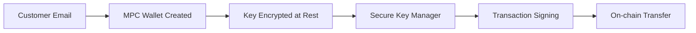

# Customer Wallets

Customer wallets are MPC-secured Solana wallets created and managed by ZendFi on behalf of your customers. Each wallet is tied to an email address and can be used for on-ramp flows, recurring payments, and checkout without requiring the customer to have an existing Solana wallet.

## Lookup by Email

```
GET /api/v1/customer-wallets/by-email/{email}
```

Returns the active customer wallet associated with the given email address.

<ParamField path="email" type="string" required>
  Customer email address.
</ParamField>

### Response

```json
{
  "id": "cwlt_abc123",
  "email": "customer@example.com",
  "wallet_address": "7xKXtg2CW87d97TXJSDpbD5jBkheTqA83TZRuJosgAsU",
  "created_at": "2026-03-01T12:00:00Z",
  "total_onramp_orders": 3
}
```

<CodeGroup>

```bash cURL
curl https://api.zendfi.tech/api/v1/customer-wallets/by-email/customer@example.com \
  -H "Authorization: Bearer zfi_test_your_key"
```

```typescript SDK
const wallet = await zendfi.getCustomerWalletByEmail('customer@example.com');
```

</CodeGroup>

---

## Lookup by Address

```
GET /api/v1/customer-wallets/by-address/{address}
```

Returns the customer wallet associated with a specific Solana address.

<ParamField path="address" type="string" required>
  Solana wallet address.
</ParamField>

```bash
curl https://api.zendfi.tech/api/v1/customer-wallets/by-address/7xKXtg2CW87d97TXJSDpbD5jBkheTqA83TZRuJosgAsU \
  -H "Authorization: Bearer zfi_test_your_key"
```

---

## Get or Create

```
POST /api/v1/customer-wallets/get-or-create
```

Returns an existing wallet for the given email, or creates a new MPC wallet if none exists. This is the recommended way to ensure every customer has a wallet -- it is idempotent by email.

<ParamField body="email" type="string" required>
  Customer email address.
</ParamField>

<CodeGroup>

```bash cURL
curl -X POST https://api.zendfi.tech/api/v1/customer-wallets/get-or-create \
  -H "Authorization: Bearer zfi_test_your_key" \
  -H "Content-Type: application/json" \
  -d '{"email": "new-customer@example.com"}'
```

```typescript SDK
const wallet = await zendfi.getOrCreateCustomerWallet('new-customer@example.com');
```

</CodeGroup>

### Response

```json
{
  "id": "cwlt_def456",
  "email": "new-customer@example.com",
  "wallet_address": "9zMZvh4EY09f19VZLFrDf7lDmjfvC95VCA1VvLuiCtW",
  "created_at": "2026-03-05T14:30:00Z",
  "total_onramp_orders": 0
}
```

---

## How MPC Wallets Work

Customer wallets use Multi-Party Computation (MPC) for key management. The private key is encrypted at rest and can only be reconstructed within ZendFi's secure key management layer during transaction signing.



This approach means:

- **Customers do not need a Solana wallet.** ZendFi creates one automatically.
- **Keys are never exposed.** All signing happens server-side in encrypted memory.
- **One wallet per email.** Calling get-or-create multiple times with the same email returns the same wallet.

## Use Cases

<CardGroup cols={2}>
  <Card title="Fiat On-ramp" icon="money-bill-transfer">
    Create wallets for customers who purchase crypto via fiat. Funds land in their managed wallet.
  </Card>
  <Card title="Non-crypto Customers" icon="user-plus">
    Accept payments from customers who do not have existing Solana wallets.
  </Card>
</CardGroup>
