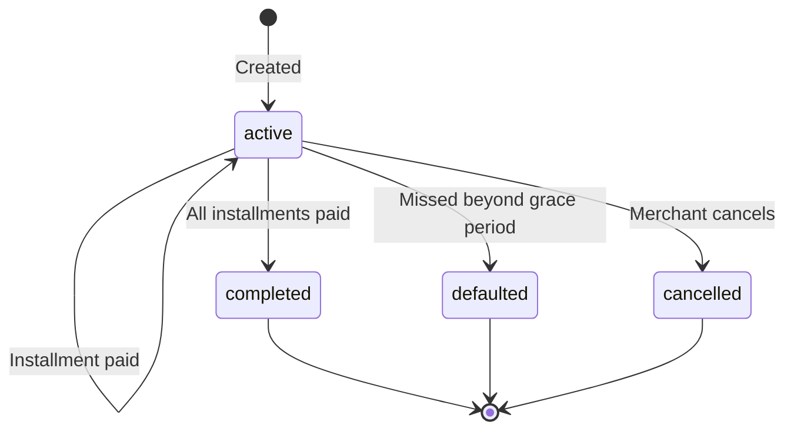

# Installment Plans

Installment plans let your customers pay in scheduled increments. You define the total amount, number of payments, and frequency -- ZendFi calculates the per-installment amount and generates a payment schedule automatically.

## Create an Installment Plan

```
POST /api/v1/installment-plans
```

<ParamField body="customer_wallet" type="string" required>
  Solana wallet address of the customer.
</ParamField>

<ParamField body="customer_email" type="string">
  Optional email for notifications.
</ParamField>

<ParamField body="total_amount" type="number" required>
  Total amount to be paid across all installments.
</ParamField>

<ParamField body="installment_count" type="integer" required>
  Number of installments to split the total into.
</ParamField>

<ParamField body="payment_frequency_days" type="integer" required>
  Days between each installment due date.
</ParamField>

<ParamField body="first_payment_date" type="string">
  ISO 8601 date for the first installment. Defaults to tomorrow.
</ParamField>

<ParamField body="description" type="string">
  Description of what this plan covers.
</ParamField>

<ParamField body="late_fee_amount" type="number">
  Fee charged for late payments.
</ParamField>

<ParamField body="grace_period_days" type="integer" default="7">
  Days after due date before an installment is considered late.
</ParamField>

<ParamField body="metadata" type="object">
  Arbitrary key-value pairs.
</ParamField>

### Example

<CodeGroup>

```bash cURL
curl -X POST https://api.zendfi.tech/api/v1/installment-plans \
  -H "Authorization: Bearer zfi_test_your_key" \
  -H "Content-Type: application/json" \
  -d '{
    "customer_wallet": "7xKXtg2CW87d97TXJSDpbD5jBkheTqA83TZRuJosgAsU",
    "customer_email": "buyer@example.com",
    "total_amount": 1200.00,
    "installment_count": 4,
    "payment_frequency_days": 30,
    "description": "Premium package - quarterly payments",
    "grace_period_days": 7
  }'
```

```typescript SDK
const plan = await zendfi.createInstallmentPlan({
  customer_wallet: '7xKXtg2CW87d97TXJSDpbD5jBkheTqA83TZRuJosgAsU',
  customer_email: 'buyer@example.com',
  total_amount: 1200.00,
  installment_count: 4,
  payment_frequency_days: 30,
  description: 'Premium package - quarterly payments',
  grace_period_days: 7,
});
```

</CodeGroup>

### Response

```json
{
  "id": "plan_test_abc123",
  "merchant_id": "merch_xyz789",
  "customer_wallet": "7xKXtg2CW87d97TXJSDpbD5jBkheTqA83TZRuJosgAsU",
  "customer_email": "buyer@example.com",
  "total_amount": 1200.00,
  "installment_count": 4,
  "amount_per_installment": 300.00,
  "paid_count": 0,
  "status": "active",
  "description": "Premium package - quarterly payments",
  "late_fee_amount": null,
  "grace_period_days": 7,
  "payment_schedule": [
    {
      "installment_number": 1,
      "due_date": "2026-04-01T00:00:00Z",
      "amount": 300.00,
      "status": "pending",
      "payment_id": null,
      "paid_at": null
    },
    {
      "installment_number": 2,
      "due_date": "2026-05-01T00:00:00Z",
      "amount": 300.00,
      "status": "pending",
      "payment_id": null,
      "paid_at": null
    }
  ],
  "created_at": "2026-03-01T12:00:00Z",
  "updated_at": "2026-03-01T12:00:00Z"
}
```

---

## List Merchant Installment Plans

```
GET /api/v1/installment-plans
```

Returns all installment plans created by the authenticated merchant.

<ParamField query="limit" type="integer" default="50">
  Maximum number of results.
</ParamField>

<ParamField query="offset" type="integer" default="0">
  Number of results to skip.
</ParamField>

```typescript
const plans = await zendfi.listInstallmentPlans();
```

---

## Get an Installment Plan

```
GET /api/v1/installment-plans/{plan_id}
```

<ParamField path="plan_id" type="string" required>
  Installment plan ID.
</ParamField>

```typescript
const plan = await zendfi.getInstallmentPlan('plan_test_abc123');
```

---

## List Customer Installment Plans

```
GET /api/v1/customers/{customer_wallet}/installment-plans
```

Returns all installment plans for a specific customer wallet.

<ParamField path="customer_wallet" type="string" required>
  Customer's Solana wallet address.
</ParamField>

```typescript
const customerPlans = await zendfi.listCustomerInstallmentPlans(
  '7xKXtg2CW87d97TXJSDpbD5jBkheTqA83TZRuJosgAsU'
);
```

---

## Get Next Due Installment

```
GET /api/v1/installment-plans/{plan_id}/next-due
```

Returns the next pending or late installment for a plan.

<ParamField path="plan_id" type="string" required>
  Installment plan ID.
</ParamField>

### Response

```json
{
  "installment_number": 2,
  "due_date": "2026-05-01T00:00:00Z",
  "amount": 300.00,
  "status": "pending",
  "payment_id": null,
  "paid_at": null
}
```

---

## Pay an Installment

```
POST /api/v1/installment-plans/{plan_id}/pay
```

Creates a payment for the next due installment. The payment follows the standard payment flow and settles to the merchant wallet.

<ParamField path="plan_id" type="string" required>
  Installment plan ID.
</ParamField>

<CodeGroup>

```bash cURL
curl -X POST https://api.zendfi.tech/api/v1/installment-plans/plan_test_abc123/pay \
  -H "Authorization: Bearer zfi_test_your_key"
```

```typescript SDK
const payment = await zendfi.payInstallment('plan_test_abc123');
```

</CodeGroup>

---

## Cancel an Installment Plan

```
POST /api/v1/installment-plans/{plan_id}/cancel
```

Cancels an active plan. Any remaining unpaid installments are voided.

<ParamField path="plan_id" type="string" required>
  Installment plan ID.
</ParamField>

```bash
curl -X POST https://api.zendfi.tech/api/v1/installment-plans/plan_test_abc123/cancel \
  -H "Authorization: Bearer zfi_test_your_key"
```

---

## Plan Lifecycle



## Status Reference

| Plan Status | Description |
|-------------|-------------|
| `active` | Plan is in progress with pending installments |
| `completed` | All installments have been paid |
| `defaulted` | Customer missed payments beyond the grace period |
| `cancelled` | Plan cancelled by merchant |

| Installment Status | Description |
|---------------------|-------------|
| `pending` | Not yet due or awaiting payment |
| `paid` | Payment confirmed on-chain |
| `late` | Past due date but within grace period |
