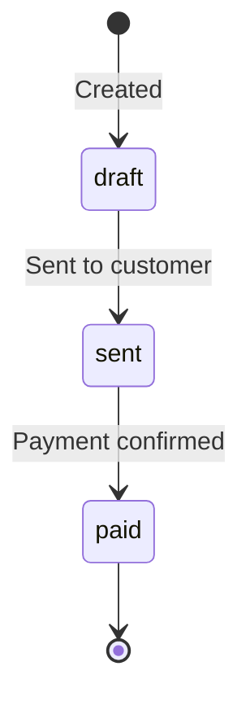

# Invoices

Invoices let you send professional billing documents to customers. Each invoice includes a payment link, optional line items, and due date tracking. When the customer pays, the invoice status updates automatically.

## Create an Invoice

```
POST /api/v1/invoices
```

<ParamField body="customer_email" type="string" required>
  Email address of the invoice recipient.
</ParamField>

<ParamField body="customer_name" type="string">
  Customer name displayed on the invoice.
</ParamField>

<ParamField body="amount" type="number" required>
  Total invoice amount.
</ParamField>

<ParamField body="token" type="string" default="USDC">
  Token to accept: `USDC`, `USDT`, `SOL`.
</ParamField>

<ParamField body="description" type="string" required>
  Invoice description or memo.
</ParamField>

<ParamField body="line_items" type="array">
  Itemized breakdown of the invoice.

  Each item has:
  - `description` (string, required): Item description
  - `quantity` (number, required): Quantity
  - `unit_price` (number, required): Price per unit
</ParamField>

<ParamField body="due_date" type="string">
  ISO 8601 date when payment is due.
</ParamField>

<ParamField body="metadata" type="object">
  Arbitrary key-value pairs.
</ParamField>

### Example

<CodeGroup>

```bash cURL
curl -X POST https://api.zendfi.tech/api/v1/invoices \
  -H "Authorization: Bearer zfi_test_your_key" \
  -H "Content-Type: application/json" \
  -d '{
    "customer_email": "client@company.com",
    "customer_name": "Acme Corp",
    "amount": 2500.00,
    "description": "Web Development - March 2026",
    "line_items": [
      {"description": "Frontend Development", "quantity": 40, "unit_price": 50},
      {"description": "Backend API Work", "quantity": 10, "unit_price": 50}
    ],
    "due_date": "2026-03-15T00:00:00Z"
  }'
```

```typescript SDK
const invoice = await zendfi.createInvoice({
  customer_email: 'client@company.com',
  customer_name: 'Acme Corp',
  amount: 2500.00,
  description: 'Web Development - March 2026',
  line_items: [
    { description: 'Frontend Development', quantity: 40, unit_price: 50 },
    { description: 'Backend API Work', quantity: 10, unit_price: 50 },
  ],
  due_date: '2026-03-15T00:00:00Z',
});
```

</CodeGroup>

### Response

```json
{
  "id": "inv_test_abc123",
  "invoice_number": "INV-2026-0042",
  "merchant_id": "merch_xyz789",
  "customer_email": "client@company.com",
  "customer_name": "Acme Corp",
  "amount_usd": 2500.00,
  "token": "USDC",
  "description": "Web Development - March 2026",
  "line_items": [
    {"description": "Frontend Development", "quantity": 40, "unit_price": 50},
    {"description": "Backend API Work", "quantity": 10, "unit_price": 50}
  ],
  "status": "draft",
  "due_date": "2026-03-15T00:00:00Z",
  "created_at": "2026-03-01T12:00:00Z"
}
```

---

## List Invoices

```
GET /api/v1/invoices
```

Returns all invoices for the authenticated merchant.

```typescript
const invoices = await zendfi.listInvoices();
```

---

## Get an Invoice

```
GET /api/v1/invoices/{id}
```

<ParamField path="id" type="string" required>
  Invoice ID (e.g., `inv_test_abc123`).
</ParamField>

```typescript
const invoice = await zendfi.getInvoice('inv_test_abc123');
```

---

## Send an Invoice

```
POST /api/v1/invoices/{id}/send
```

Sends the invoice to the customer via email. The email includes a payment link. The invoice status changes from `draft` to `sent`.

### Example

<CodeGroup>

```bash cURL
curl -X POST https://api.zendfi.tech/api/v1/invoices/inv_test_abc123/send \
  -H "Authorization: Bearer zfi_test_your_key"
```

```typescript SDK
const result = await zendfi.sendInvoice('inv_test_abc123');
console.log(result.payment_url); // URL included in the email
```

</CodeGroup>

### Response

```json
{
  "success": true,
  "invoice_id": "inv_test_abc123",
  "invoice_number": "INV-2026-0042",
  "sent_to": "client@company.com",
  "payment_url": "https://checkout.zendfi.tech/pay/pay_test_xyz",
  "status": "sent"
}
```

---

## Invoice Status Lifecycle



| Status | Description |
|--------|-------------|
| `draft` | Invoice created but not yet sent |
| `sent` | Invoice emailed to customer with payment link |
| `paid` | Customer payment confirmed on-chain |

## Webhook Events

| Event | When |
|-------|------|
| `InvoiceCreated` | Invoice created |
| `InvoiceSent` | Invoice emailed to customer |
| `InvoicePaid` | Invoice payment confirmed |
