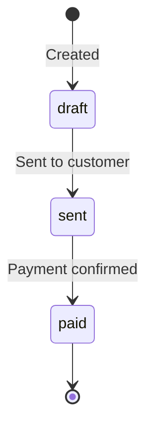

# Invoices

Invoices let you send professional billing documents to customers. Each invoice includes a payment link, optional line items, and due date tracking. When the customer pays, the invoice status updates automatically.

## Create an Invoice

```
POST /api/v1/invoices
```

<ParamField body="customer_email" type="string" required>
  Email address of the invoice recipient.
</ParamField>

<ParamField body="customer_name" type="string">
  Customer name displayed on the invoice.
</ParamField>

<ParamField body="amount" type="number" required>
  Total invoice amount.
</ParamField>

<ParamField body="token" type="string" default="USDC">
  Token to accept: `USDC`, `USDT`, `SOL`.
</ParamField>

<ParamField body="description" type="string" required>
  Invoice description or memo.
</ParamField>

<ParamField body="line_items" type="array">
  Itemized breakdown of the invoice.

  Each item has:
  - `description` (string, required): Item description
  - `quantity` (number, required): Quantity
  - `unit_price` (number, required): Price per unit
</ParamField>

<ParamField body="due_date" type="string">
  ISO 8601 date when payment is due.
</ParamField>

<ParamField body="metadata" type="object">
  Arbitrary key-value pairs.
</ParamField>

<ParamField body="onramp" type="boolean" default="false">
  When `true`, the payment link generated by **Send Invoice** will use the PAJ onramp flow (NGN bank transfer → USDC settlement) instead of a direct crypto payment. Ideal for customers who prefer to pay from a Nigerian bank account.
</ParamField>

<ParamField body="amount_ngn" type="number">
  Original NGN amount for exact PAJ conversion. Bypasses a live FX re-quote at checkout time. Only relevant when `onramp` is `true`.
</ParamField>

<ParamField body="payer_service_charge" type="boolean" default="false">
  When `true` (and `onramp` is `true`), a transparent service charge — `max(₦30, ceil(amount_ngn × 2.5%))` — is added on top and billed to the payer rather than absorbed by the merchant.
</ParamField>

<ParamField body="payment_link_max_uses" type="integer" default="1">
  Maximum number of times the generated payment link can be used. Defaults to `1` on send because invoices are targeted at a single customer. Set to a higher value (or omit for unlimited) only if you intentionally want the link reusable.
</ParamField>

<ParamField body="collect_customer_info" type="boolean" default="false">
  When `true`, the checkout page shows an expanded customer-details form (name, phone, company, billing address) before the payment step.
</ParamField>

### Examples

<CodeGroup>

```bash cURL — standard invoice
curl -X POST https://api.zendfi.tech/api/v1/invoices \
  -H "Authorization: Bearer zfi_test_your_key" \
  -H "Content-Type: application/json" \
  -d '{
    "customer_email": "client@company.com",
    "customer_name": "Acme Corp",
    "amount": 2500.00,
    "description": "Web Development - March 2026",
    "line_items": [
      {"description": "Frontend Development", "quantity": 40, "unit_price": 50},
      {"description": "Backend API Work", "quantity": 10, "unit_price": 50}
    ],
    "due_date": "2026-03-15T00:00:00Z"
  }'
```

```bash cURL — onramp invoice (NGN bank transfer)
curl -X POST https://api.zendfi.tech/api/v1/invoices \
  -H "Authorization: Bearer zfi_live_your_key" \
  -H "Content-Type: application/json" \
  -d '{
    "customer_email": "client@company.com",
    "customer_name": "Acme Corp",
    "amount": 25.00,
    "description": "Product Purchase — March 2026",
    "onramp": true,
    "amount_ngn": 42500,
    "payer_service_charge": true,
    "payment_link_max_uses": 1,
    "due_date": "2026-03-15T00:00:00Z"
  }'
```

```typescript SDK — standard invoice
const invoice = await zendfi.createInvoice({
  customer_email: 'client@company.com',
  customer_name: 'Acme Corp',
  amount: 2500.00,
  description: 'Web Development - March 2026',
  line_items: [
    { description: 'Frontend Development', quantity: 40, unit_price: 50 },
    { description: 'Backend API Work', quantity: 10, unit_price: 50 },
  ],
  due_date: '2026-03-15T00:00:00Z',
});
```

```typescript SDK — onramp invoice
const invoice = await zendfi.createInvoice({
  customer_email: 'client@company.com',
  customer_name: 'Acme Corp',
  amount: 25.00,
  description: 'Product Purchase — March 2026',
  onramp: true,               // payment link will use NGN bank transfer
  amount_ngn: 42500,          // exact NGN amount (bypasses live FX re-quote)
  payer_service_charge: true, // PAJ fee billed to the customer
  payment_link_max_uses: 1,   // single-use (default for invoices)
  due_date: '2026-03-15T00:00:00Z',
});

// Send it when ready — the payment link will have onramp=true
const result = await zendfi.sendInvoice(invoice.id);
console.log(result.payment_url); // https://checkout.zendfi.tech/checkout/…
console.log(result.onramp);      // true
console.log(result.max_uses);    // 1
```

</CodeGroup>

### Response

```json
{
  "id": "inv_test_abc123",
  "invoice_number": "INV-2026-0042",
  "customer_email": "client@company.com",
  "customer_name": "Acme Corp",
  "amount_usd": 2500.00,
  "currency": "USD",
  "token": "USDC",
  "description": "Web Development - March 2026",
  "line_items": [
    {"description": "Frontend Development", "quantity": 40, "unit_price": 50},
    {"description": "Backend API Work", "quantity": 10, "unit_price": 50}
  ],
  "status": "draft",
  "payment_url": null,
  "due_date": "2026-03-15T00:00:00Z",
  "sent_at": null,
  "paid_at": null,
  "created_at": "2026-03-01T12:00:00Z",
  "onramp": false,
  "payment_link_max_uses": null,
  "collect_customer_info": false,
  "payer_service_charge": false,
  "amount_ngn": null
}
```

---

## List Invoices

```
GET /api/v1/invoices
```

Returns all invoices for the authenticated merchant.

```typescript
const invoices = await zendfi.listInvoices();
```

---

## Get an Invoice

```
GET /api/v1/invoices/{id}
```

<ParamField path="id" type="string" required>
  Invoice ID (e.g., `inv_test_abc123`).
</ParamField>

```typescript
const invoice = await zendfi.getInvoice('inv_test_abc123');
```

---

## Send an Invoice

```
POST /api/v1/invoices/{id}/send
```

Sends the invoice to the customer via email with a payment link. The invoice status changes from `draft` to `sent`.

When `send` is called a payment link is created automatically using the invoice's settings:

- If `onramp` is `true` on the invoice, the payment link will use the PAJ onramp flow (NGN bank transfer).
- `max_uses` on the generated link defaults to `1` (the invoice's `payment_link_max_uses` value, or `1` if not set).
- `mode` (test vs live) is inherited from the API key or, for dashboard calls, from the `?mode` query parameter (default: `live`).

<ParamField query="mode" type="string" default="live">
  **Dashboard route only** (`/api/v1/merchants/me/invoices/:id/send`). Pass `?mode=test` to generate a devnet payment link instead of a mainnet one.
</ParamField>

### Example

<CodeGroup>

```bash cURL
curl -X POST https://api.zendfi.tech/api/v1/invoices/inv_test_abc123/send \
  -H "Authorization: Bearer zfi_test_your_key"
```

```typescript SDK
const result = await zendfi.sendInvoice('inv_test_abc123');
console.log(result.payment_url); // URL included in the email
console.log(result.onramp);      // true/false depending on invoice setting
console.log(result.max_uses);    // 1 (default)
```

</CodeGroup>

### Response

```json
{
  "success": true,
  "invoice_id": "inv_test_abc123",
  "invoice_number": "INV-2026-0042",
  "sent_to": "client@company.com",
  "payment_url": "https://checkout.zendfi.tech/checkout/abc123xyz",
  "status": "sent",
  "onramp": false,
  "max_uses": 1
}
```

---

---

## Dashboard Routes

The following routes are available when authenticated via a merchant session (dashboard cookie auth) rather than an API key. They are identical to the API-key routes but scoped under `/api/v1/merchants/me/invoices`.

| Method | Path | Description |
|--------|------|-------------|
| `POST` | `/api/v1/merchants/me/invoices` | Create invoice |
| `GET` | `/api/v1/merchants/me/invoices` | List invoices |
| `GET` | `/api/v1/merchants/me/invoices/:id` | Get invoice |
| `POST` | `/api/v1/merchants/me/invoices/:id/send` | Send invoice (`?mode=live\|test`) |

---

## Invoice Status Lifecycle



| Status | Description |
|--------|-------------|
| `draft` | Invoice created but not yet sent |
| `sent` | Invoice emailed to customer; payment link is active |
| `paid` | Customer payment confirmed on-chain |
| `overdue` | Due date passed without payment (auto-updated nightly) |
| `cancelled` | Invoice manually cancelled |

## Onramp Invoices — How It Works

When an invoice is created with `onramp: true` and then sent:

1. A payment link is created with `onramp: true`, `max_uses: 1` (or your configured value), and the PAJ metadata (`amount_ngn`, `payer_service_charge`).
2. The payment link URL is included in the invoice email.
3. The customer opens the link and sees the **Pay with Bank** flow — no crypto wallet needed.
4. They receive a virtual account number, transfer the NGN amount, and the conversion to USDC is settled to your merchant wallet automatically.

```
Invoice created (onramp=true)
        │
        ▼
sendInvoice() called
        │
        ├─ Creates payment_link (onramp=true, max_uses=1, mode=live)
        ├─ Emails customer with hosted checkout URL
        └─ Invoice status → "sent"
                │
                ▼
        Customer opens link
                │
                ▼
        PAJ onramp flow (bank transfer → USDC)
                │
                ▼
        Payment confirmed → Invoice status → "paid"
```

---

## Webhook Events

| Event | When |
|-------|------|
| `InvoiceCreated` | Invoice created |
| `InvoiceSent` | Invoice emailed to customer |
| `InvoicePaid` | Invoice payment confirmed |
