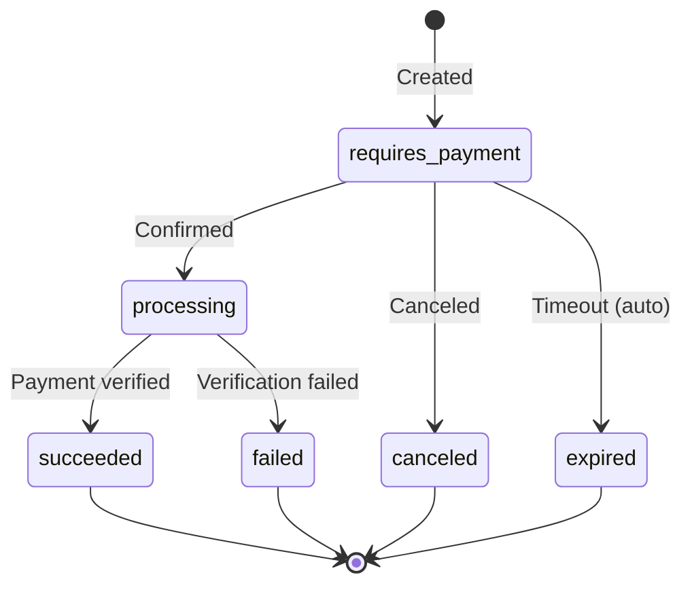

# Payment Intents

Payment intents provide a two-phase payment flow. You create an intent to declare the payment parameters, then confirm it when the customer is ready to pay. This is useful when you need to collect customer details or authorize a payment before processing it.

If you are coming from Stripe, this will feel familiar.

## Create a Payment Intent

```
POST /api/v1/payment-intents
```

<ParamField body="amount" type="number" required>
  Amount in USD.
</ParamField>

<ParamField body="currency" type="string" default="USD">
  Currency code.
</ParamField>

<ParamField body="description" type="string">
  Description of the payment.
</ParamField>

<ParamField body="capture_method" type="string" default="automatic">
  `automatic` to capture immediately on confirmation, or `manual` to authorize only.
</ParamField>

<ParamField body="expires_in_seconds" type="integer" default="86400">
  Time in seconds before the intent expires. Default is 24 hours.
</ParamField>

<ParamField body="metadata" type="object">
  Arbitrary key-value pairs attached to the intent.
</ParamField>

### Example

<CodeGroup>

```bash cURL
curl -X POST https://api.zendfi.tech/api/v1/payment-intents \
  -H "Authorization: Bearer zfi_test_your_key" \
  -H "Content-Type: application/json" \
  -d '{
    "amount": 99.99,
    "description": "Enterprise license",
    "capture_method": "automatic"
  }'
```

```typescript SDK
// Payment intents are managed directly via the API
const response = await fetch('https://api.zendfi.tech/api/v1/payment-intents', {
  method: 'POST',
  headers: {
    'Authorization': `Bearer ${process.env.ZENDFI_API_KEY}`,
    'Content-Type': 'application/json',
  },
  body: JSON.stringify({
    amount: 99.99,
    description: 'Enterprise license',
    capture_method: 'automatic',
  }),
});

const intent = await response.json();
```

```bash CLI
zendfi intents create --amount 99.99 --description "Enterprise license"
```

</CodeGroup>

### Response

```json
{
  "id": "pi_test_abc123",
  "client_secret": "pi_test_abc123_secret_xyz789",
  "amount": 99.99,
  "currency": "USD",
  "description": "Enterprise license",
  "status": "requires_payment",
  "capture_method": "automatic",
  "created_at": "2026-03-01T12:00:00Z",
  "expires_at": "2026-03-02T12:00:00Z"
}
```

<ResponseField name="client_secret" type="string">
  Secret used to confirm the intent from the client side. Pass this to your frontend.
</ResponseField>

<ResponseField name="status" type="string">
  Current intent status. See the state machine below.
</ResponseField>

---

## List Payment Intents

```
GET /api/v1/payment-intents
```

Returns all payment intents for the authenticated merchant.

### Query Parameters

<ParamField query="status" type="string">
  Filter by status: `requires_payment`, `processing`, `succeeded`, `canceled`, `failed`.
</ParamField>

<ParamField query="limit" type="integer" default="20">
  Number of results to return.
</ParamField>

---

## Get a Payment Intent

```
GET /api/v1/payment-intents/{id}
```

<ParamField path="id" type="string" required>
  The payment intent ID (e.g., `pi_test_abc123`).
</ParamField>

---

## Get Payment Intent Events

```
GET /api/v1/payment-intents/{id}/events
```

Returns the event history for a payment intent, useful for debugging the flow.

---

## Confirm a Payment Intent

```
POST /api/v1/payment-intents/{id}/confirm
```

Confirms the intent and triggers payment processing. The customer wallet must be provided at this stage.

<ParamField body="customer_wallet" type="string" required>
  The Solana wallet address of the customer making the payment.
</ParamField>

<ParamField body="client_secret" type="string" required>
  The client secret for verification. This must match the secret returned when the intent was created.
</ParamField>

<ParamField body="payment_type" type="string">
  Type of payment transaction (e.g., `direct`, `gasless`).
</ParamField>

<ParamField body="auto_gasless" type="boolean">
  When `true`, ZendFi sponsors the gas fees for this transaction.
</ParamField>

<ParamField body="metadata" type="object">
  Additional metadata to attach at confirmation time.
</ParamField>

### Example

<CodeGroup>

```bash cURL
curl -X POST https://api.zendfi.tech/api/v1/payment-intents/pi_test_abc123/confirm \
  -H "Authorization: Bearer zfi_test_your_key" \
  -H "Content-Type: application/json" \
  -d '{
    "customer_wallet": "7xKXtg2CW87d97TXJSDpbD5jBkheTqA83TZRuJosgAsU"
  }'
```

```bash CLI
zendfi intents confirm pi_test_abc123 --wallet 7xKXtg2CW87d97TXJSDpbD5jBkheTqA83TZRuJosgAsU
```

</CodeGroup>

---

## Cancel a Payment Intent

```
POST /api/v1/payment-intents/{id}/cancel
```

Cancels a payment intent that has not yet been confirmed. Once canceled, it cannot be reused.

---

## Intent Status Lifecycle



| Status | Description |
|--------|-------------|
| `requires_payment` | Intent created, waiting for confirmation |
| `processing` | Confirmed, payment being processed |
| `succeeded` | Payment completed successfully |
| `canceled` | Intent was canceled before confirmation |
| `failed` | Payment processing failed |
| `expired` | Intent expired (default: 24 hours) |

## When to Use Payment Intents

Use payment intents when you need:

- **Two-phase flow**: Separate intent creation (server-side) from confirmation (client-side).
- **Client secrets**: Securely pass payment parameters to the frontend without exposing your API key.
- **Manual capture**: Authorize a payment now, capture it later (e.g., after shipping).
- **Expiration control**: Set custom expiration windows for long-lived checkout sessions.

For simpler flows where you just need a payment and a URL, use the [Payments API](/api-reference/payments) directly.
