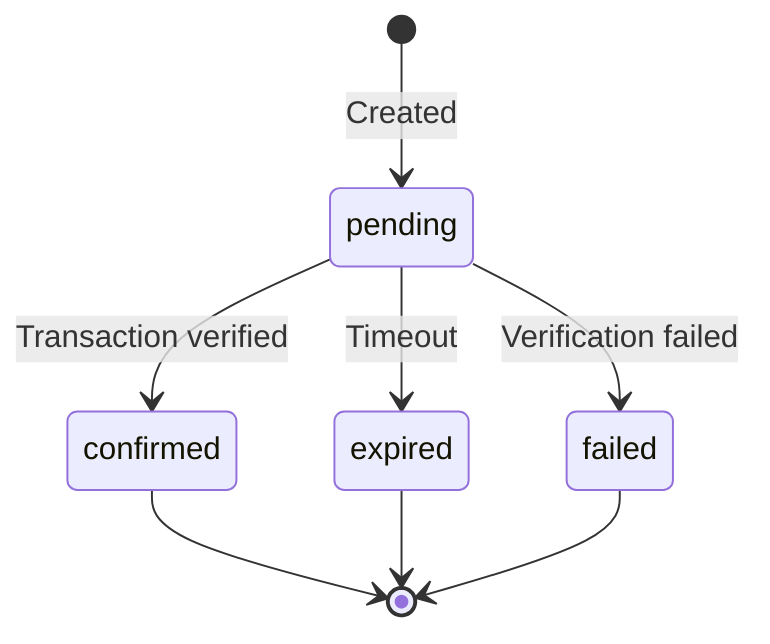

# Payments

Payments are the core resource in ZendFi. A payment represents a request for funds from a customer, tracked from creation through to on-chain confirmation or expiry.

## Create a Payment

<Note>
Requires authentication with a valid API key.
</Note>

```
POST /api/v1/payments
```

Creates a new payment and returns a checkout URL the customer can use to pay.

### Request Body

<ParamField body="amount" type="number" required>
  Payment amount in the specified currency. Must be greater than zero.
</ParamField>

<ParamField body="currency" type="string" default="USD">
  Currency code. Supported values: `USD`, `EUR`, `GBP`.
</ParamField>

<ParamField body="token" type="string" default="USDC">
  Solana token to accept. Supported values: `USDC`, `USDT`, `SOL`.
</ParamField>

<ParamField body="description" type="string">
  Description shown to the customer on the checkout page.
</ParamField>

<ParamField body="metadata" type="object">
  Arbitrary key-value pairs attached to the payment. Useful for storing order IDs or internal references.
</ParamField>

<ParamField body="webhook_url" type="string">
  Override the default webhook URL for this specific payment.
</ParamField>

<ParamField body="split_recipients" type="array">
  Optional array of recipients for payment splits. See [Payment Splits](/api-reference/splits) for details.
</ParamField>

### Example Request

<CodeGroup>

```bash cURL
curl -X POST https://api.zendfi.tech/api/v1/payments \
  -H "Authorization: Bearer zfi_test_your_key" \
  -H "Content-Type: application/json" \
  -d '{
    "amount": 49.99,
    "currency": "USD",
    "token": "USDC",
    "description": "Pro Plan - Monthly",
    "metadata": {
      "order_id": "order_12345",
      "plan": "pro"
    }
  }'
```

```typescript SDK
const payment = await zendfi.createPayment({
  amount: 49.99,
  description: 'Pro Plan - Monthly',
  metadata: {
    order_id: 'order_12345',
    plan: 'pro',
  },
});
```

</CodeGroup>

### Response

```json
{
  "id": "pay_test_abc123def456",
  "merchant_id": "merch_xyz789",
  "amount_usd": 49.99,
  "currency": "USD",
  "payment_token": "USDC",
  "status": "pending",
  "description": "Pro Plan - Monthly",
  "payment_url": "https://checkout.zendfi.tech/pay/pay_test_abc123def456",
  "qr_code": "solana:...",
  "expires_at": "2026-03-01T13:00:00Z",
  "metadata": {
    "order_id": "order_12345",
    "plan": "pro"
  },
  "mode": "test",
  "created_at": "2026-03-01T12:00:00Z"
}
```

<ResponseField name="id" type="string">
  Unique payment identifier. Prefixed with `pay_test_` or `pay_live_`.
</ResponseField>

<ResponseField name="status" type="string">
  Current payment status: `pending`, `confirmed`, `failed`, or `expired`.
</ResponseField>

<ResponseField name="payment_url" type="string">
  Hosted checkout URL. Redirect the customer here or embed it in an iframe.
</ResponseField>

<ResponseField name="qr_code" type="string">
  Solana Pay compatible URI for QR code generation.
</ResponseField>

<ResponseField name="expires_at" type="string">
  ISO 8601 timestamp after which the payment will be marked as expired if not confirmed.
</ResponseField>

---

## Get a Payment

```
GET /api/v1/payments/{id}
```

Retrieves full details of a specific payment. Requires authentication.

### Path Parameters

<ParamField path="id" type="string" required>
  The payment ID (e.g., `pay_test_abc123`).
</ParamField>

### Example

<CodeGroup>

```bash cURL
curl https://api.zendfi.tech/api/v1/payments/pay_test_abc123 \
  -H "Authorization: Bearer zfi_test_your_key"
```

```typescript SDK
const payment = await zendfi.getPayment('pay_test_abc123');
```

</CodeGroup>

### Response

Returns the full payment object as shown above, with additional fields if the payment has been confirmed:

```json
{
  "id": "pay_test_abc123def456",
  "status": "confirmed",
  "transaction_signature": "5UfDuX...abc",
  "confirmed_at": "2026-03-01T12:05:30Z",
  "customer_wallet": "7xKXtg...xyz"
}
```

<ResponseField name="transaction_signature" type="string">
  Solana transaction signature. Only present when status is `confirmed`.
</ResponseField>

<ResponseField name="confirmed_at" type="string">
  ISO 8601 timestamp of when the payment was confirmed on-chain.
</ResponseField>

<ResponseField name="customer_wallet" type="string">
  The Solana wallet address that sent the payment.
</ResponseField>

---

## Check Payment Status

```
GET /api/v1/payments/{id}/status
```

A lightweight endpoint that returns only the payment status. This endpoint is **public** -- it does not require authentication. Designed for client-side polling.

### Example

```bash
curl https://api.zendfi.tech/api/v1/payments/pay_test_abc123/status
```

### Response

```json
{
  "id": "pay_test_abc123",
  "status": "confirmed",
  "transaction_signature": "5UfDuX...abc"
}
```

---

## Payment Statuses



| Status | Description | Terminal |
|--------|-------------|---------|
| `pending` | Payment created, awaiting customer transaction | No |
| `confirmed` | Transaction verified on Solana. Funds settled. | Yes |
| `failed` | Transaction found but verification failed | Yes |
| `expired` | No valid transaction received before timeout | Yes |

---

## Refunds for Payments

Payments can be refunded when status is `confirmed`.

### Create Refund

```
POST /api/v1/payments/{payment_id}/refund
```

### List Refunds for a Payment

```
GET /api/v1/payments/{payment_id}/refunds
```

For full request/response details and merchant refund listing endpoints, see [Refunds](/api-reference/refunds).

---

## Checkout Flow

ZendFi provides several ways for customers to complete payment:

### Hosted Checkout

Redirect the customer to the `payment_url` returned in the create response. The hosted checkout page handles wallet connection, QR codes, and payment status automatically.

### Embedded Checkout

Use the [Embedded Checkout](/sdk/embedded-checkout) SDK component to render the checkout directly in your application without a redirect.

### Direct Transfer

Customers can send funds directly to the payment wallet address or scan the QR code with any Solana wallet app.

### Gasless Transactions

For a frictionless experience, use the transaction builder endpoints to create gasless transactions:

```
POST /api/v1/payments/{payment_id}/build-transaction
POST /api/v1/payments/{payment_id}/submit-gasless-transaction
```

The customer signs the transaction, and ZendFi sponsors the gas fees.

---

## Webhook Events

Payments trigger the following webhook events:

| Event | When |
|-------|------|
| `PaymentCreated` | Payment is created |
| `PaymentConfirmed` | Payment is confirmed on-chain |
| `PaymentFailed` | Payment verification failed |
| `PaymentExpired` | Payment window elapsed |

See [Webhooks](/api-reference/webhooks) for payload format and delivery details.
