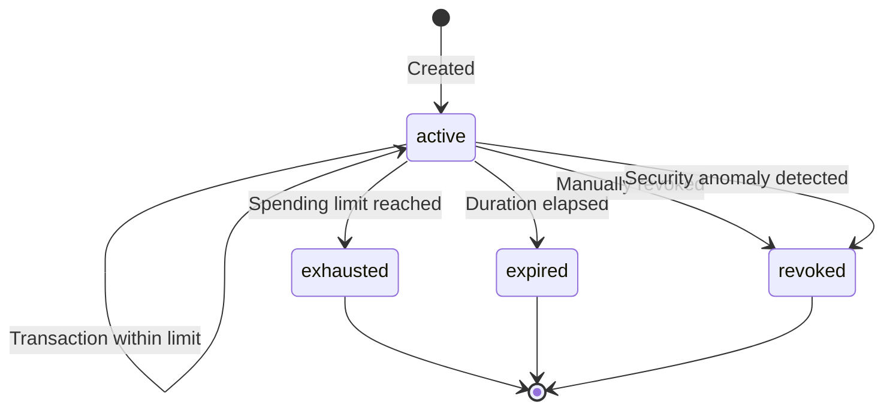

# Session Keys

Session keys are ephemeral signing keys with built-in spending limits and expiration times. They allow you to authorize automated transactions without exposing your primary credentials -- perfect for recurring billing, subscription renewals, and programmatic payments.

<Note>
  Session keys are only available for merchants using **MPC wallets**. If you are using an external wallet, you will need to migrate to MPC first.
</Note>

## Create a Session Key

```
POST /api/v1/merchants/{merchant_id}/session-keys
```

<ParamField path="merchant_id" type="string" required>
  Your merchant ID.
</ParamField>

<ParamField body="limit_usdc" type="number" required>
  Maximum spending limit for this session key in USDC. Must be between $1 and $1,000,000.
</ParamField>

<ParamField body="duration_days" type="integer" required>
  Number of days until the session key expires. Must be between 1 and 90.
</ParamField>

<ParamField body="passkey_signature" type="object">
  WebAuthn passkey authentication data. **Required in production** for security. In development/test mode, session keys can be created without passkey verification.

  Fields:
  - `credential_id` (string): WebAuthn credential ID
  - `authenticator_data` (string): Base64-encoded authenticator data
  - `signature` (string): Base64-encoded signature
  - `client_data_json` (string): Base64-encoded client data JSON
</ParamField>

### Example

<CodeGroup>

```bash cURL
curl -X POST https://api.zendfi.tech/api/v1/merchants/merch_xyz789/session-keys \
  -H "Authorization: Bearer zfi_test_your_key" \
  -H "Content-Type: application/json" \
  -d '{
    "limit_usdc": 5000.00,
    "duration_days": 30
  }'
```

```typescript SDK
const sessionKey = await zendfi.createSessionKey('merch_xyz789', {
  limit_usdc: 5000.00,
  duration_days: 30,
});
```

</CodeGroup>

### Response

```json
{
  "id": "sk_abc123",
  "limit_usdc": 5000.00,
  "used_amount_usdc": 0.00,
  "remaining_usdc": 5000.00,
  "expires_at": "2026-04-01T12:00:00Z",
  "is_active": true,
  "days_until_expiry": 30
}
```

---

## List Session Keys

```
GET /api/v1/merchants/{merchant_id}/session-keys
```

Returns all session keys for the specified merchant.

<ParamField path="merchant_id" type="string" required>
  Your merchant ID.
</ParamField>

```typescript
const keys = await zendfi.listSessionKeys('merch_xyz789');
```

---

## Get a Session Key

```
GET /api/v1/merchants/{merchant_id}/session-keys/{session_id}
```

<ParamField path="merchant_id" type="string" required>
  Merchant ID.
</ParamField>

<ParamField path="session_id" type="string" required>
  Session key ID.
</ParamField>

---

## Revoke a Session Key

```
DELETE /api/v1/merchants/{merchant_id}/session-keys/{session_id}
```

Immediately deactivates a session key. Any in-progress transactions using this key will fail.

<ParamField path="merchant_id" type="string" required>
  Merchant ID.
</ParamField>

<ParamField path="session_id" type="string" required>
  Session key ID to revoke.
</ParamField>

```bash
curl -X DELETE https://api.zendfi.tech/api/v1/merchants/merch_xyz789/session-keys/sk_abc123 \
  -H "Authorization: Bearer zfi_test_your_key"
```

---

## Security Features

Session keys include several built-in security mechanisms:

| Feature | Description |
|---------|-------------|
| **Spending Limit** | Maximum USDC that can be spent before the key is exhausted |
| **Time Expiry** | Automatic expiration after the configured duration |
| **Rate Limiting** | Maximum 10 transactions per minute per session key |
| **Device Fingerprinting** | Requests from a different device than the one that created the key are rejected |
| **Impossible Travel Detection** | Geolocation checks flag requests from implausible locations |
| **Anomaly Detection** | Unusual transaction patterns trigger automatic key revocation |

<Warning>
  **Production environments require passkey (WebAuthn) authentication** to create session keys. This prevents unauthorized session key creation even if your API key is compromised.
</Warning>

## Lifecycle


