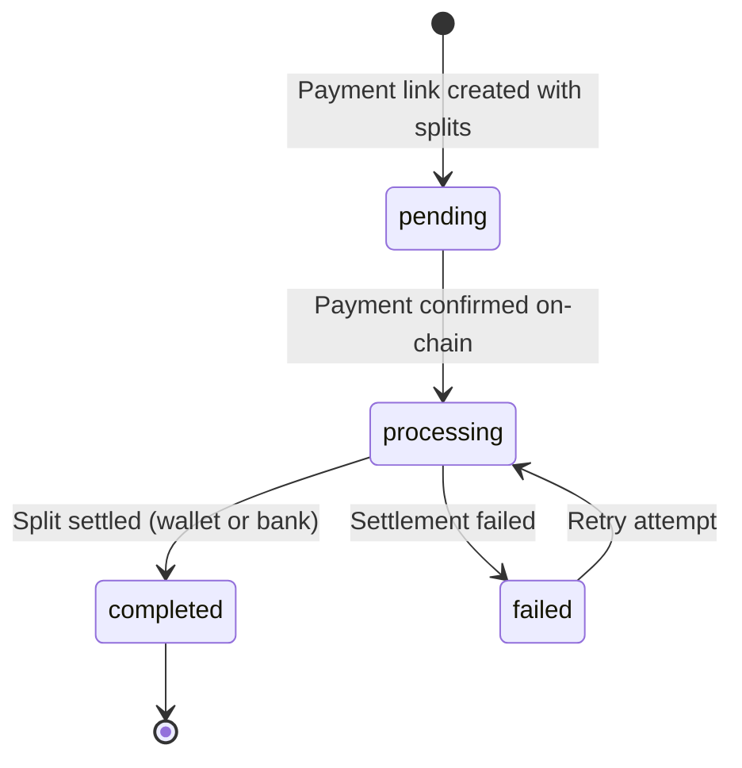

# Payment Splits

Payment splits let you route portions of a payment to multiple recipients in a single transaction. Recipients can be either crypto wallets (for on-chain distribution) or bank accounts (for direct bank deposits). Define each recipient with either a percentage or a fixed amount, and ZendFi handles the atomic distribution after the payment confirms.

Splits are configured when creating a **payment link** using the `split_recipients` field. All payment link features — onramp, customer collection, usage limits, expiration — are automatically inherited by split payments.

<Note>
Splits are applied at the payment level. When a payment is created from a link with splits, all split recipients are atomically added to the payment and processed sequentially after confirmation.
</Note>

---

## Configuring Splits on Payment Links

When creating a payment link, include the `split_recipients` array with your recipient definitions:

<CodeGroup>

```bash cURL — multi-wallet split
curl -X POST https://api.zendfi.tech/api/v1/payment-links \
  -H "Authorization: Bearer zfi_test_your_key" \
  -H "Content-Type: application/json" \
  -d '{
    "amount": 100.00,
    "description": "Marketplace order",
    "split_recipients": [
      {
        "recipient_type": "wallet",
        "recipient_wallet": "7xKXtg2CW87d97TXJSDpbD5jBkheTqA83TZRuJosgAsU",
        "recipient_name": "Seller A",
        "percentage": 85.0,
        "split_order": 1
      },
      {
        "recipient_type": "wallet",
        "recipient_wallet": "8yLYug3DX98e08UYKEqCe6kClieuqB84UB0TuKthBtV",
        "recipient_name": "Platform Fee",
        "percentage": 15.0,
        "split_order": 2
      }
    ]
  }'
```

```bash cURL — mixed wallet & bank split
curl -X POST https://api.zendfi.tech/api/v1/payment-links \
  -H "Authorization: Bearer zfi_test_your_key" \
  -H "Content-Type: application/json" \
  -d '{
    "amount": 100.00,
    "description": "Vendor payout",
    "onramp": true,
    "split_recipients": [
      {
        "recipient_type": "wallet",
        "recipient_wallet": "7xKXtg2CW87d97TXJSDpbD5jBkheTqA83TZRuJosgAsU",
        "recipient_name": "Crypto payment",
        "fixed_amount_usd": 60.00,
        "split_order": 1
      },
      {
        "recipient_type": "bank_account",
        "recipient_account_name": "Acme Corp",
        "recipient_bank_account": "1234567890",
        "recipient_bank_id": "GTB",
        "recipient_email": "payments@acme.com",
        "fixed_amount_usd": 40.00,
        "split_order": 2
      }
    ]
  }'
```

```bash cURL — fund a sub-account directly
curl -X POST https://api.zendfi.tech/api/v1/payment-links \
  -H "Authorization: Bearer zfi_test_your_key" \
  -H "Content-Type: application/json" \
  -d '{
    "amount": 100.00,
    "description": "Fund treasury sub-account",
    "split_recipients": [
      {
        "recipient_type": "wallet",
        "sub_account_id": "sa_7b1w9j2k4m8p"
      }
    ]
  }'
```

```typescript SDK
const link = await zendfi.createPaymentLink({
  amount: 100.00,
  description: 'Marketplace order',
  split_recipients: [
    {
      recipient_type: 'wallet',
      recipient_wallet: '7xKXtg2CW87d97TXJSDpbD5jBkheTqA83TZRuJosgAsU',
      recipient_name: 'Seller A',
      percentage: 85.0,
      split_order: 1,
    },
    {
      recipient_type: 'wallet',
      recipient_wallet: '8yLYug3DX98e08UYKEqCe6kClieuqB84UB0TuKthBtV',
      recipient_name: 'Platform Fee',
      percentage: 15.0,
      split_order: 2,
    },
  ],
});
```

</CodeGroup>

---

## Split Recipient Fields

<ParamField body="recipient_type" type="enum" required>
  Type of recipient: `wallet` or `bank_account`.
</ParamField>

### For Wallet Recipients (`recipient_type: "wallet"`)

<ParamField body="recipient_wallet" type="string">
  Solana wallet address to receive on-chain funds. Required when `sub_account_id` is not provided.
</ParamField>

<ParamField body="sub_account_id" type="string">
  Sub-account external ID or UUID. When set, ZendFi resolves and uses the sub-account wallet internally.
</ParamField>

<ParamField body="recipient_sub_account" type="string">
  Alias for `sub_account_id`.
</ParamField>

<ParamField body="recipient_name" type="string">
  Human-readable label for the recipient (e.g., "Seller A").
</ParamField>

<ParamField body="percentage" type="number">
  Percentage of the payment amount (e.g., `85.0` for 85%). Use either `percentage` or `fixed_amount_usd`, not both.
</ParamField>

<ParamField body="fixed_amount_usd" type="number">
  Fixed dollar amount to route. Use either `percentage` or `fixed_amount_usd`, not both.
</ParamField>

<Note>
If the split has a single recipient and both `percentage` and `fixed_amount_usd` are omitted, ZendFi defaults that recipient to 100%.
</Note>

<ParamField body="split_order" type="integer" default="0">
  Processing order for this split (lower numbers process first).
</ParamField>

### For Bank Account Recipients (`recipient_type: "bank_account"`)

<ParamField body="recipient_account_name" type="string" required>
  Account holder name as registered with their bank.
</ParamField>

<ParamField body="recipient_bank_account" type="string" required>
  Bank account number.
</ParamField>

<ParamField body="recipient_bank_id" type="string" required>
  Bank identifier (PAJ bank id, bank code, or bank name). Example values: `GTB`, `Access Bank`, `9PSB7A2A2LJZ3H6Q4G8XJ6A4`.
</ParamField>

<ParamField body="recipient_bank / bank_identifier / bank_code" type="string">
  Optional aliases accepted by the API and SDK; normalized internally to `recipient_bank_id`.
</ParamField>

<ParamField body="recipient_email" type="string">
  Email address for the recipient (optional, used for notifications).
</ParamField>

<ParamField body="percentage" type="number">
  Percentage of the payment amount. Use either `percentage` or `fixed_amount_usd`, not both.
</ParamField>

<ParamField body="fixed_amount_usd" type="number">
  Fixed dollar amount to route. Use either `percentage` or `fixed_amount_usd`, not both.
</ParamField>

<ParamField body="split_order" type="integer" default="0">
  Processing order for this split.
</ParamField>

---

## Validation & Processing

When you create a payment link with splits:

1. **Link Creation**: Split recipients are validated for:
   - Correct structure and required fields
   - No duplicate wallet addresses (for wallet type)
   - No duplicate bank accounts (for bank type)
   - Valid Solana addresses (for wallet type)

2. **Payment Initiation**: When a customer creates a payment from a link with bank account splits:
   - Each bank account is validated with PAJ to confirm it exists
   - If validation fails, payment creation returns a `400 Bad Request` error
   - Wallet-type recipients do not require pre-validation

3. **Payment Confirmation**: After the customer's payment is confirmed on-chain:
   - Wallet recipients: Funds transferred directly from merchant escrow to wallet
   - Bank recipients: PAJ offramp order created with USDC sent to PAJ deposit address; PAJ converts and deposits to bank account

---

## Get Payment Link with Splits

```
GET /api/v1/payment-links/{link_id}
```

<ParamField path="link_id" type="string" required>
  Payment link ID.
</ParamField>

### Response

The response includes the full `split_recipients` array:

```json
{
  "id": "link_abc123",
  "amount": 100.00,
  "currency": "USD",
  "token": "USDC",
  "description": "Marketplace order",
  "status": "active",
  "split_recipients": [
    {
      "recipient_type": "wallet",
      "recipient_wallet": "7xKXtg2CW87d97TXJSDpbD5jBkheTqA83TZRuJosgAsU",
      "recipient_name": "Seller A",
      "percentage": 85.0,
      "fixed_amount_usd": null,
      "split_order": 1
    },
    {
      "recipient_type": "wallet",
      "recipient_wallet": "8yLYug3DX98e08UYKEqCe6kClieuqB84UB0TuKthBtV",
      "recipient_name": "Platform Fee",
      "percentage": 15.0,
      "fixed_amount_usd": null,
      "split_order": 2
    }
  ],
  "created_at": "2026-03-01T10:00:00Z",
  "updated_at": "2026-03-01T10:00:00Z"
}
```

---

## Get Payment Splits

```
GET /api/v1/payments/{payment_id}/splits
```

Returns all splits associated with a payment, including settlement status.

<ParamField path="payment_id" type="string" required>
  Payment ID.
</ParamField>

### Response

```json
[
  {
    "id": "split_abc123",
    "payment_id": "pay_test_xyz789",
    "recipient_wallet": "7xKXtg2CW87d97TXJSDpbD5jBkheTqA83TZRuJosgAsU",
    "recipient_name": "Seller A",
    "percentage": 85.0,
    "fixed_amount_usd": null,
    "split_order": 1,
    "status": "completed",
    "transaction_signature": "5UfDu...kXy",
    "settled_amount_usd": 85.00,
    "settled_amount_crypto": 85.00,
    "settled_currency": "USDC",
    "settled_at": "2026-03-01T12:05:00Z",
    "failure_reason": null,
    "retry_count": 0,
    "created_at": "2026-03-01T12:00:00Z",
    "updated_at": "2026-03-01T12:05:00Z"
  },
  {
    "id": "split_def456",
    "payment_id": "pay_test_xyz789",
    "recipient_wallet": "8yLYug3DX98e08UYKEqCe6kClieuqB84UB0TuKthBtV",
    "recipient_name": "Platform Fee",
    "percentage": 15.0,
    "fixed_amount_usd": null,
    "split_order": 2,
    "status": "completed",
    "transaction_signature": "3RmEp...qWz",
    "settled_amount_usd": 15.00,
    "settled_amount_crypto": 15.00,
    "settled_currency": "USDC",
    "settled_at": "2026-03-01T12:05:02Z",
    "failure_reason": null,
    "retry_count": 0,
    "created_at": "2026-03-01T12:00:00Z",
    "updated_at": "2026-03-01T12:05:02Z"
  }
]
```

---

## Get a Single Split

```
GET /api/v1/splits/{split_id}
```

<ParamField path="split_id" type="string" required>
  Split ID.
</ParamField>

---

## Split Status Lifecycle



| Status | Description |
|--------|-------------|
| `pending` | Split created with payment link, awaiting payment confirmation |
| `processing` | Payment confirmed, settlement in progress |
| `completed` | Funds successfully settled (on-chain or bank deposit) |
| `failed` | Settlement failed, may be retried |
| `refunded` | Split was refunded |

---

## Recipient Type Behavior

### Wallet Recipients

- **Settlement**: Direct on-chain transfer from merchant escrow to recipient wallet
- **Speed**: Immediate (settlement upon payment confirmation)
- **Token**: Inherits payment link token (USDC, USDT, or SOL)
- **Validation**: Solana address format verified at link creation
- **Confirmation**: On-chain transaction signature returned

### Bank Account Recipients

- **Settlement**: PAJ offramp (USDC → NGN → bank deposit)
- **Speed**: Asynchronous (PAJ converts and deposits within minutes to hours)
- **Token**: USDC only (converted to fiat by PAJ)
- **Validation**: Bank account verified with PAJ at payment creation
- **Confirmation**: PAJ order ID and on-chain deposit signature returned

---

## Validation Rules

### Split Configuration Validation

<Warning>
The following rules are enforced at payment link creation:

- At least one split recipient must be defined
- No duplicate wallet addresses (for wallet type)
- No duplicate bank accounts (for bank type)
- Each recipient must have exactly one of: `percentage` or `fixed_amount_usd`
- Wallet-type recipients must have `recipient_wallet` or `sub_account_id`
- Bank-type recipients must have `recipient_account_name`, `recipient_bank_account`, and a bank identifier (`recipient_bank_id` or alias fields)
</Warning>

### Amount Validation

- **Percentage-based**: Sum of all percentages across wallet+bank recipients must **equal 100%**
- **Fixed-amount-based**: Total of all fixed amounts must **not exceed** the payment amount
- **Mixed**: When mixing percentages and fixed amounts, percentages are calculated first, then fixed amounts are deducted from the remainder

### Bank Account Validation (Payment Time)

When a customer initiates payment with bank account splits:

- Each bank account is validated with PAJ
- If validation fails, payment creation returns `400 Bad Request` with error details
- Validation confirms:
  - Account exists
  - Account is active
  - Account holder name matches (or is similar to) the provided name

---

## Use Cases

<CardGroup cols={2}>
  <Card title="Marketplace Payments" icon="shop">
    Route seller commission, platform fee, and service tax in a single checkout. Supports both crypto wallets and bank payouts.
  </Card>
  <Card title="Revenue Sharing" icon="chart-pie">
    Automatically distribute royalties, affiliate commissions, or revenue splits across multiple partners with a single unified payment.
  </Card>
  <Card title="Multi-Vendor Orders" icon="people">
    Accept one payment from a customer and atomically split across multiple supplier bank accounts and crypto wallets.
  </Card>
  <Card title="Tiered Payouts" icon="layer-group">
    Create flexible payout tiers: platform retains percentage, send fixed amount to supplier, route remainder to sub-contractor.
  </Card>
  <Card title="NGN Bank Integration" icon="landmark">
    Route USDC payments directly to Nigerian bank accounts via PAJ, eliminating manual reconciliation for bank-account recipients.
  </Card>
  <Card title="Onramp + Splits" icon="arrow-up-right-dots">
    Combine onramp (fiat-to-crypto) with splits to accept bank transfers from anywhere and automatically distribute globally.
  </Card>
</CardGroup>

---

## Error Handling

Split validation errors occur at two stages:

### Link Creation Errors

```json
{
  "error": "invalid_split_configuration",
  "message": "Split percentages exceed 100%: 105.00%",
  "status": 400
}
```

Common link creation errors:
- Duplicate wallet addresses
- Invalid Solana address format
- Missing required bank fields
- Percentage sum exceeds 100%

### Payment Creation Errors

```json
{
  "error": "bank_account_validation_failed",
  "message": "Bank account 1234567890 not found for bank gt_bank",
  "status": 400
}
```

Common payment creation errors:
- Bank account does not exist
- Account name mismatch
- Invalid bank ID

---

## Retry Logic

Splits use automatic retry for transient failures:

- **Wallet transfers**: Up to 3 retry attempts on blockchain failures
- **Bank transfers**: Up to 3 retry attempts on PAJ integration failures
- **Retry interval**: Exponential backoff starting at 5 minutes
- **Max retry time**: Splits are marked failed after 3 attempts

When a split fails permanently, the merchant receives an email notification with failure details.
