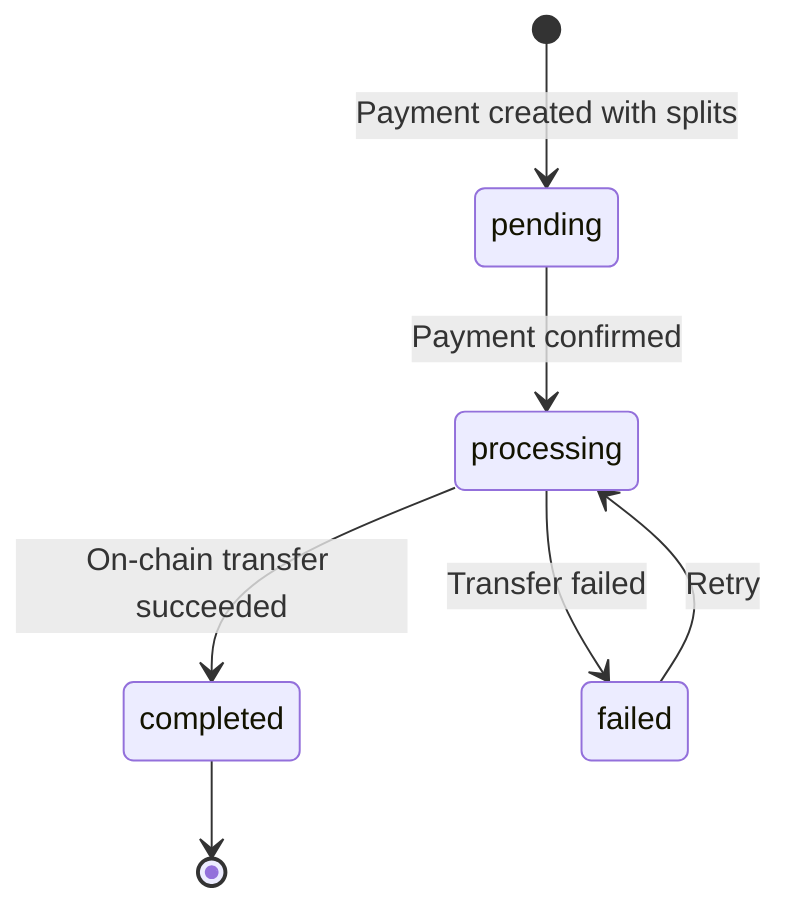

# Payment Splits

Payment splits let you route portions of a payment to multiple wallets in a single transaction. Define recipients with either a percentage or a fixed amount, and ZendFi handles the on-chain distribution after the payment confirms.

Splits are configured when creating a payment using the `split_recipients` field.

## Configuring Splits

When creating a payment, include the `split_recipients` array:

<CodeGroup>

```bash cURL
curl -X POST https://api.zendfi.tech/api/v1/payments \
  -H "Authorization: Bearer zfi_test_your_key" \
  -H "Content-Type: application/json" \
  -d '{
    "amount": 100.00,
    "description": "Marketplace order",
    "split_recipients": [
      {
        "recipient_wallet": "7xKXtg2CW87d97TXJSDpbD5jBkheTqA83TZRuJosgAsU",
        "recipient_name": "Seller A",
        "percentage": 70.0,
        "split_order": 1
      },
      {
        "recipient_wallet": "8yLYug3DX98e08UYKEqCe6kClieuqB84UB0TuKthBtV",
        "recipient_name": "Platform Fee",
        "percentage": 30.0,
        "split_order": 2
      }
    ]
  }'
```

```typescript SDK
const payment = await zendfi.createPayment({
  amount: 100.00,
  description: 'Marketplace order',
  split_recipients: [
    {
      recipient_wallet: '7xKXtg2CW87d97TXJSDpbD5jBkheTqA83TZRuJosgAsU',
      recipient_name: 'Seller A',
      percentage: 70.0,
      split_order: 1,
    },
    {
      recipient_wallet: '8yLYug3DX98e08UYKEqCe6kClieuqB84UB0TuKthBtV',
      recipient_name: 'Platform Fee',
      percentage: 30.0,
      split_order: 2,
    },
  ],
});
```

</CodeGroup>

### Split Recipient Fields

<ParamField body="recipient_wallet" type="string" required>
  Solana wallet address to receive funds.
</ParamField>

<ParamField body="recipient_name" type="string">
  Human-readable label for the recipient.
</ParamField>

<ParamField body="percentage" type="number">
  Percentage of the payment to route (e.g., `70.0` for 70%). Use either `percentage` or `fixed_amount_usd`, not both.
</ParamField>

<ParamField body="fixed_amount_usd" type="number">
  Fixed dollar amount to route. Use either `percentage` or `fixed_amount_usd`, not both.
</ParamField>

<ParamField body="split_order" type="integer" default="0">
  Order in which splits are processed.
</ParamField>

<Warning>
  When using percentages, all percentages across recipients must sum to **exactly 100%**. When using fixed amounts, the total must not exceed the payment amount.
</Warning>

---

## Get Payment Splits

```
GET /api/v1/payments/{payment_id}/splits
```

Returns all split records for a given payment.

<ParamField path="payment_id" type="string" required>
  Payment ID.
</ParamField>

### Response

```json
[
  {
    "id": "split_abc123",
    "payment_id": "pay_test_xyz789",
    "recipient_wallet": "7xKXtg2CW87d97TXJSDpbD5jBkheTqA83TZRuJosgAsU",
    "recipient_name": "Seller A",
    "percentage": 70.0,
    "fixed_amount_usd": null,
    "split_order": 1,
    "status": "completed",
    "transaction_signature": "5UfDu...kXy",
    "settled_amount_usd": 70.00,
    "settled_amount_crypto": 70.00,
    "settled_currency": "USDC",
    "settled_at": "2026-03-01T12:05:00Z",
    "failure_reason": null,
    "retry_count": 0,
    "created_at": "2026-03-01T12:00:00Z",
    "updated_at": "2026-03-01T12:05:00Z"
  },
  {
    "id": "split_def456",
    "payment_id": "pay_test_xyz789",
    "recipient_wallet": "8yLYug3DX98e08UYKEqCe6kClieuqB84UB0TuKthBtV",
    "recipient_name": "Platform Fee",
    "percentage": 30.0,
    "fixed_amount_usd": null,
    "split_order": 2,
    "status": "completed",
    "transaction_signature": "3RmEp...qWz",
    "settled_amount_usd": 30.00,
    "settled_amount_crypto": 30.00,
    "settled_currency": "USDC",
    "settled_at": "2026-03-01T12:05:02Z",
    "failure_reason": null,
    "retry_count": 0,
    "created_at": "2026-03-01T12:00:00Z",
    "updated_at": "2026-03-01T12:05:02Z"
  }
]
```

---

## Get a Single Split

```
GET /api/v1/splits/{split_id}
```

<ParamField path="split_id" type="string" required>
  Split ID.
</ParamField>

---

## Split Status Lifecycle



| Status | Description |
|--------|-------------|
| `pending` | Split created, awaiting payment confirmation |
| `processing` | Payment confirmed, on-chain transfer in progress |
| `completed` | Funds successfully delivered to recipient |
| `failed` | Transfer failed, may be retried |
| `refunded` | Split was refunded |

## Use Cases

<CardGroup cols={2}>
  <Card title="Marketplace" icon="shop">
    Route the seller's share and your platform fee in a single payment.
  </Card>
  <Card title="Revenue Sharing" icon="chart-pie">
    Automatically distribute royalties or commissions to partners.
  </Card>
  <Card title="Multi-vendor Orders" icon="users">
    Split a single checkout across multiple suppliers.
  </Card>
  <Card title="Tip + Service" icon="hand-holding-dollar">
    Separate the base payment from gratuities or service fees.
  </Card>
</CardGroup>
