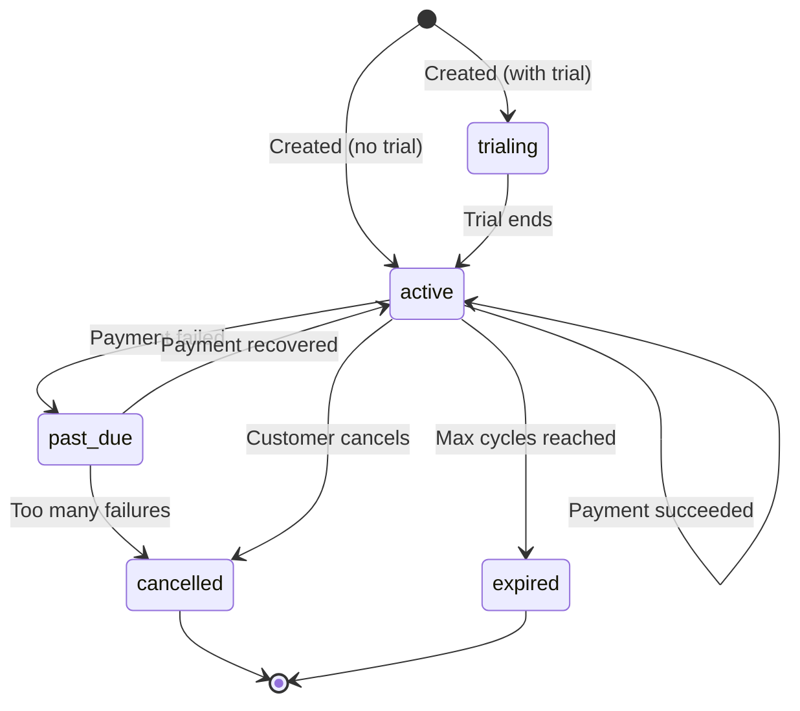

# Subscriptions

Subscriptions let you set up recurring billing. You define a plan with an amount and interval, then customers subscribe to it. ZendFi automatically creates payments when they are due and sends webhook events so you can track the lifecycle.

## Subscription Plans

### Create a Subscription Plan

```
POST /api/v1/subscription-plans
```

<ParamField body="name" type="string" required>
  Plan name shown to customers.
</ParamField>

<ParamField body="description" type="string">
  Plan description.
</ParamField>

<ParamField body="amount" type="number" required>
  Recurring amount per billing cycle.
</ParamField>

<ParamField body="currency" type="string" default="USD">
  Currency code.
</ParamField>

<ParamField body="billing_interval" type="string" required>
  Billing interval: `daily`, `weekly`, `monthly`, `yearly`.
</ParamField>

<ParamField body="interval_count" type="integer" default="1">
  Number of intervals between billings. For example, `billing_interval: "monthly"` with `interval_count: 3` bills quarterly.
</ParamField>

<ParamField body="trial_days" type="integer" default="0">
  Number of trial days before the first billing.
</ParamField>

<ParamField body="max_cycles" type="integer">
  Maximum number of billing cycles. Omit for unlimited.
</ParamField>

<ParamField body="metadata" type="object">
  Arbitrary key-value pairs.
</ParamField>

#### Example

<CodeGroup>

```bash cURL
curl -X POST https://api.zendfi.tech/api/v1/subscription-plans \
  -H "Authorization: Bearer zfi_test_your_key" \
  -H "Content-Type: application/json" \
  -d '{
    "name": "Pro Plan",
    "description": "Full access to all features",
    "amount": 29.99,
    "billing_interval": "monthly",
    "trial_days": 14
  }'
```

```typescript SDK
const plan = await zendfi.createSubscriptionPlan({
  name: 'Pro Plan',
  description: 'Full access to all features',
  amount: 29.99,
  interval: 'monthly', // SDK uses 'interval', mapped to 'billing_interval' in API
  trial_days: 14,
});
```

</CodeGroup>

#### Response

```json
{
  "id": "plan_test_abc123",
  "merchant_id": "merch_xyz789",
  "name": "Pro Plan",
  "description": "Full access to all features",
  "amount": 29.99,
  "currency": "USD",
  "billing_interval": "monthly",
  "interval_count": 1,
  "trial_days": 14,
  "max_cycles": null,
  "is_active": true,
  "created_at": "2026-03-01T12:00:00Z",
  "subscription_url": "https://checkout.zendfi.tech/subscription/plan_test_abc123"
}
```

### List Subscription Plans

```
GET /api/v1/subscription-plans
```

Returns all plans for the authenticated merchant.

### Get a Subscription Plan

```
GET /api/v1/subscription-plans/{plan_id}
```

This endpoint is **public** -- no authentication required. This allows customers to view plan details before subscribing.

---

## Customer Subscriptions

### Create a Subscription

```
POST /api/v1/subscriptions
```

Subscribes a customer to a plan.

<ParamField body="plan_id" type="string" required>
  The subscription plan ID (UUID).
</ParamField>

<ParamField body="customer_wallet" type="string" required>
  Customer's Solana wallet address.
</ParamField>

<ParamField body="customer_email" type="string">
  Customer email for notifications and receipts.
</ParamField>

<ParamField body="metadata" type="object">
  Arbitrary key-value pairs.
</ParamField>

#### Example

<CodeGroup>

```bash cURL
curl -X POST https://api.zendfi.tech/api/v1/subscriptions \
  -H "Content-Type: application/json" \
  -d '{
    "plan_id": "plan_test_abc123",
    "customer_wallet": "7xKXtg2CW87d97TXJSDpbD5jBkheTqA83TZRuJosgAsU",
    "customer_email": "customer@example.com"
  }'
```

```typescript SDK
const subscription = await zendfi.createSubscription({
  plan_id: 'plan_test_abc123',
  customer_email: 'customer@example.com',
  customer_wallet: '7xKXtg2CW87d97TXJSDpbD5jBkheTqA83TZRuJosgAsU',
});
```

</CodeGroup>

### Get a Subscription

```
GET /api/v1/subscriptions/{id}
```

Returns subscription details including current period and status.

### Cancel a Subscription

```
POST /api/v1/subscriptions/{id}/cancel
```

Cancels the subscription. The customer retains access until the end of the current billing period.

### Pay a Subscription

```
POST /api/v1/subscriptions/{id}/pay
```

Creates a payment for the current billing period. ZendFi calls this automatically, but you can trigger it manually if needed.

---

## Subscription Lifecycle



| Status | Description |
|--------|-------------|
| `active` | Subscription is active and billing normally |
| `trialing` | Subscription is in its trial period |
| `past_due` | Most recent payment failed, retrying |
| `paused` | Temporarily paused |
| `cancelled` | Subscription has been cancelled |
| `expired` | Subscription has expired |

## Webhook Events

| Event | When |
|-------|------|
| `SubscriptionCreated` | New subscription created |
| `SubscriptionRenewed` | Subscription renewed for next billing period |
| `SubscriptionCancelled` | Subscription cancelled |
| `SubscriptionPaymentFailed` | Recurring payment attempt failed |

See the [Subscriptions guide](/guides/subscriptions) for an end-to-end implementation walkthrough.
