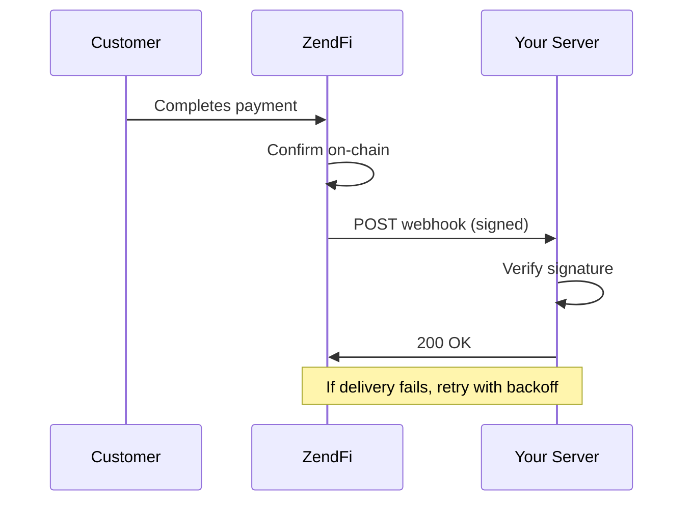

# Webhooks

Webhooks push event notifications to your server as payments move through their lifecycle. ZendFi signs every webhook delivery with HMAC-SHA256 so you can verify authenticity, and retries failed deliveries with exponential backoff.

## How It Works



## Webhook Configuration

Set your webhook URL in the [ZendFi Dashboard](https://dashboard.zendfi.tech) or during `zendfi init` with the CLI. Every webhook registered under your merchant account receives all event types.

---

## Event Types

All events your webhook endpoint can receive:

### Payment Events

| Event | Description |
|-------|-------------|
| `PaymentCreated` | A new payment has been created |
| `PaymentConfirmed` | Payment confirmed on-chain |
| `PaymentFailed` | Payment failed or was rejected |
| `PaymentExpired` | Payment expired before completion |
| `FraudFlagRaised` | Payment flagged by fraud controls |
| `FraudPaymentBlocked` | Payment blocked by fraud controls |

### Refund Events

| Event | Description |
|-------|-------------|
| `RefundInitiated` | Refund request created |
| `RefundCompleted` | Refund transfer completed |
| `RefundFailed` | Refund transfer failed |

### Dispute Events

| Event | Description |
|-------|-------------|
| `DisputeOpened` | Customer opened a dispute |
| `DisputeResponded` | Merchant submitted a dispute response |
| `DisputeResolved` | Dispute resolved by merchant/admin action |

### Payment Intent Events

| Event | Description |
|-------|-------------|
| `PaymentIntentCreated` | Payment intent created |
| `PaymentIntentRequiresPayment` | Intent awaiting customer payment |
| `PaymentIntentSucceeded` | Intent completed successfully |
| `PaymentIntentCanceled` | Intent was cancelled |
| `PaymentIntentFailed` | Intent failed |

### Settlement Events

| Event | Description |
|-------|-------------|
| `SettlementCompleted` | Funds settled to merchant wallet |
| `SettlementFailed` | Settlement transfer failed |

### Withdrawal Events

| Event | Description |
|-------|-------------|
| `WithdrawalInitiated` | Withdrawal request submitted |
| `WithdrawalCompleted` | Withdrawal confirmed on-chain |
| `WithdrawalFailed` | Withdrawal failed |

### Sub-Account Lifecycle Events

| Event | Description |
|-------|-------------|
| `SubAccountCreated` | A sub-account was created |
| `SubAccountDelegationTokenMinted` | Delegation token minted for a sub-account |
| `SubAccountFrozen` | Sub-account was frozen |
| `SubAccountUnfrozen` | Sub-account was unfrozen and reactivated |
| `SubAccountClosed` | Sub-account was closed |

### Subscription Events

| Event | Description |
|-------|-------------|
| `SubscriptionCreated` | New subscription started |
| `SubscriptionCancelled` | Subscription cancelled |
| `SubscriptionRenewed` | Subscription successfully renewed |
| `SubscriptionPaymentFailed` | Subscription renewal payment failed |

### Installment Events

| Event | Description |
|-------|-------------|
| `InstallmentPaid` | Installment payment confirmed |
| `InstallmentLate` | Installment past due date |
| `InstallmentDefaulted` | Installment defaulted (past grace period) |
| `InstallmentPlanCompleted` | All installments paid |

### Payment Link Events

| Event | Description |
|-------|-------------|
| `PaymentLinkCreated` | Payment link generated |
| `PaymentLinkUsed` | Customer paid via payment link |

### Invoice Events

| Event | Description |
|-------|-------------|
| `InvoiceCreated` | Invoice created |
| `InvoiceSent` | Invoice emailed to customer |
| `InvoicePaid` | Invoice payment confirmed |

---

## Webhook Payload Structure

Every webhook delivery is an HTTP POST with a JSON body:

```json
{
  "event": "PaymentConfirmed",
  "payment": {
    "id": "pay_test_abc123",
    "merchant_id": "merch_xyz789",
    "amount_usd": 49.99,
    "status": "confirmed",
    "transaction_signature": "5UfDuKxNgqH...",
    "customer_wallet": "7xKXtg2CW87d97TXJSDpbD5jBkheTqA83TZRuJosgAsU",
    "payment_token": "USDC",
    "mode": "test",
    "description": "Order #1234",
    "metadata": {"order_id": "1234"},
    "splits": null,
    "created_at": "2026-03-01T12:00:00Z",
    "expires_at": "2026-03-01T12:15:00Z"
  },
  "settlement": null,
  "withdrawal": null,
  "refund": null,
  "dispute": null,
  "fraud": null,
  "timestamp": "2026-03-01T12:05:00Z"
}
```

### Payload Fields

<ResponseField name="event" type="string">
  The event type (see table above).
</ResponseField>

<ResponseField name="payment" type="object">
  Payment data. Present for payment, payment link, installment, and subscription events.

  Key fields: `id`, `merchant_id`, `amount_usd`, `status`, `transaction_signature`, `customer_wallet`, `payment_token`, `mode`, `description`, `metadata`, `splits`, `created_at`, `expires_at`.
</ResponseField>

<ResponseField name="settlement" type="object">
  Settlement data. Present for `SettlementCompleted` and `SettlementFailed`.

  Key fields: `id`, `payment_id`, `merchant_id`, `amount_usd`, `settlement_token`, `settlement_amount`, `transaction_signature`, `merchant_wallet`, `status`.
</ResponseField>

<ResponseField name="withdrawal" type="object">
  Withdrawal data. Present for withdrawal events.

  Key fields: `id`, `merchant_id`, `sub_account_id`, `delegation_token_id`, `automation_token_id`, `signing_grant_id`, `auth_mode`, `to_address`, `from_address`, `amount`, `token`, `transaction_signature`, `status`, `is_bank_withdrawal`, `offramp_order_id`, `paj_order_id`, `bank_account_number`, `bank_name`.
</ResponseField>

<ResponseField name="sub_account" type="object">
  Sub-account lifecycle payload. Present for `SubAccountCreated`, `SubAccountDelegationTokenMinted`, `SubAccountFrozen`, and `SubAccountClosed`.

  Key fields: `id`, `external_id`, `merchant_id`, `label`, `wallet_address`, `created_at`, `reference_id`, `metadata`.
</ResponseField>

<ResponseField name="refund" type="object">
  Refund data. Present for `RefundInitiated`, `RefundCompleted`, `RefundFailed`.

  Key fields: `id`, `payment_id`, `merchant_id`, `amount_usd`, `status`, `reason`, `initiated_by`, `transaction_signature`, `customer_wallet`, `customer_email`, `created_at`, `completed_at`.
</ResponseField>

<ResponseField name="dispute" type="object">
  Dispute data. Present for `DisputeOpened`, `DisputeResponded`, `DisputeResolved`.

  Key fields: `id`, `payment_id`, `refund_id`, `merchant_id`, `customer_email`, `customer_wallet`, `dispute_type`, `status`, `description`, `opened_at`, `resolved_at`.
</ResponseField>

<ResponseField name="fraud" type="object">
  Fraud data. Present for fraud events.

  Key fields: `payment_id`, `merchant_id`, `fraud_score`, `blocked`, `flags`.
</ResponseField>

<ResponseField name="timestamp" type="string">
  ISO 8601 timestamp of when the event was generated.
</ResponseField>

---

## Signature Verification

Every webhook includes a `x-zendfi-signature` header with the format:

```
t=1709294700,v1=5d41402abc4b2a76b9719d911017c592...
```

The signature is computed as:

1. Create the signed payload: `{timestamp}.{json_body}`
2. Compute HMAC-SHA256 using your webhook secret
3. Compare the hex-encoded result to the `v1=` value

### Verification Examples

<CodeGroup>

```typescript Node.js
import crypto from 'crypto';

function verifyWebhook(payload: string, signature: string, secret: string): boolean {
  const parts = signature.split(',');
  if (parts.length !== 2) return false;

  const timestamp = parts[0].replace('t=', '');
  const providedSig = parts[1].replace('v1=', '');

  // Reject signatures older than 5 minutes
  const age = Math.floor(Date.now() / 1000) - parseInt(timestamp);
  if (age > 300 || age < -60) return false;

  const signedPayload = `${timestamp}.${payload}`;
  const expectedSig = crypto
    .createHmac('sha256', secret)
    .update(signedPayload)
    .digest('hex');

  return crypto.timingSafeEqual(
    Buffer.from(expectedSig),
    Buffer.from(providedSig)
  );
}
```

```python Python
import hmac, hashlib, time

def verify_webhook(payload: str, signature: str, secret: str) -> bool:
    parts = signature.split(",")
    if len(parts) != 2:
        return False

    timestamp = parts[0].replace("t=", "")
    provided_sig = parts[1].replace("v1=", "")

    age = int(time.time()) - int(timestamp)
    if age > 300 or age < -60:
        return False

    signed_payload = f"{timestamp}.{payload}"
    expected_sig = hmac.new(
        secret.encode(), signed_payload.encode(), hashlib.sha256
    ).hexdigest()

    return hmac.compare_digest(expected_sig, provided_sig)
```

</CodeGroup>

### Using the SDK

The SDK provides built-in verification:

```typescript
import { ZendFiClient } from '@zendfi/sdk';

const zendfi = new ZendFiClient({ apiKey: 'zfi_test_...' });

const isValid = zendfi.verifyWebhook(rawBody, signatureHeader);
```

Or use the framework-specific handlers:

<Tabs>
  <Tab title="Express">
    ```typescript
    import { createExpressWebhookHandler } from '@zendfi/sdk/webhooks/express';

    app.post('/webhooks/zendfi',
      express.raw({ type: 'application/json' }),
      createExpressWebhookHandler({
        secret: process.env.ZENDFI_WEBHOOK_SECRET!,
        onPaymentConfirmed: (payment) => {
          console.log('Payment confirmed:', payment.id);
        },
        onPaymentFailed: (payment) => {
          console.log('Payment failed:', payment.id);
        },
      })
    );
    ```
  </Tab>
  <Tab title="Next.js">
    ```typescript
    import { createNextJsWebhookHandler } from '@zendfi/sdk/webhooks/nextjs';

    export const POST = createNextJsWebhookHandler({
      secret: process.env.ZENDFI_WEBHOOK_SECRET!,
      onPaymentConfirmed: (payment) => {
        // Fulfill the order
      },
    });
    ```
  </Tab>
</Tabs>

---

## Delivery and Retries

ZendFi uses exponential backoff for failed webhook deliveries:

| Attempt | Delay | Total Elapsed |
|---------|-------|---------------|
| 1 | Immediate | 0s |
| 2 | 30 seconds | 30s |
| 3 | 2 minutes | ~2.5 min |
| 4 | 10 minutes | ~12.5 min |
| 5 | 1 hour | ~1 hour |

After all retry attempts are exhausted, the webhook is marked as `exhausted` and moved to the dead letter queue. You will receive an email alert if you have notifications enabled.

### Webhook Statuses

| Status | Description |
|--------|-------------|
| `pending` | Queued for delivery |
| `delivered` | Successfully delivered (received 2xx response) |
| `failed` | Delivery attempt failed, will retry |
| `exhausted` | All retry attempts failed |

---

## List Webhook Events

```
GET /api/v1/webhooks
```

Returns all webhook events for the authenticated merchant.

```typescript
const events = await zendfi.listWebhookEvents();
```

---

## Retry a Webhook

```
POST /api/v1/webhooks/{id}/retry
```

Manually retry a failed or exhausted webhook delivery.

<ParamField path="id" type="string" required>
  Webhook event ID.
</ParamField>

```bash
curl -X POST https://api.zendfi.tech/api/v1/webhooks/wh_abc123/retry \
  -H "Authorization: Bearer zfi_test_your_key"
```

---

## Verify Webhook Configuration

```
POST /api/v1/webhooks/verify
```

Test your webhook signature verification by sending a payload and signature. Returns whether the signature is valid. Useful during development.

<ParamField body="payload" type="string" required>
  The raw webhook payload body.
</ParamField>

<ParamField body="signature" type="string" required>
  The signature string to verify (`t=...,v1=...`).
</ParamField>

### Response

```json
{
  "valid": true,
  "message": "Webhook signature is valid",
  "timestamp_age_seconds": 12
}
```

---

## Best Practices

<AccordionGroup>
  <Accordion title="Always verify signatures">
    Never trust webhook payloads without verifying the HMAC signature. This prevents spoofed events from triggering actions in your system.
  </Accordion>
  <Accordion title="Return 200 quickly">
    Process webhook data asynchronously. Return a 200 response immediately and handle the business logic in a background job. ZendFi interprets slow responses as failures.
  </Accordion>
  <Accordion title="Handle duplicate deliveries">
    Webhooks may be delivered more than once. Use the `payment.id` or event ID for idempotency checks before processing.
  </Accordion>
  <Accordion title="Use raw body for verification">
    Parse the JSON body only after verifying the signature against the raw string. Parsing and re-serializing can change whitespace and break the signature check.
  </Accordion>
</AccordionGroup>
