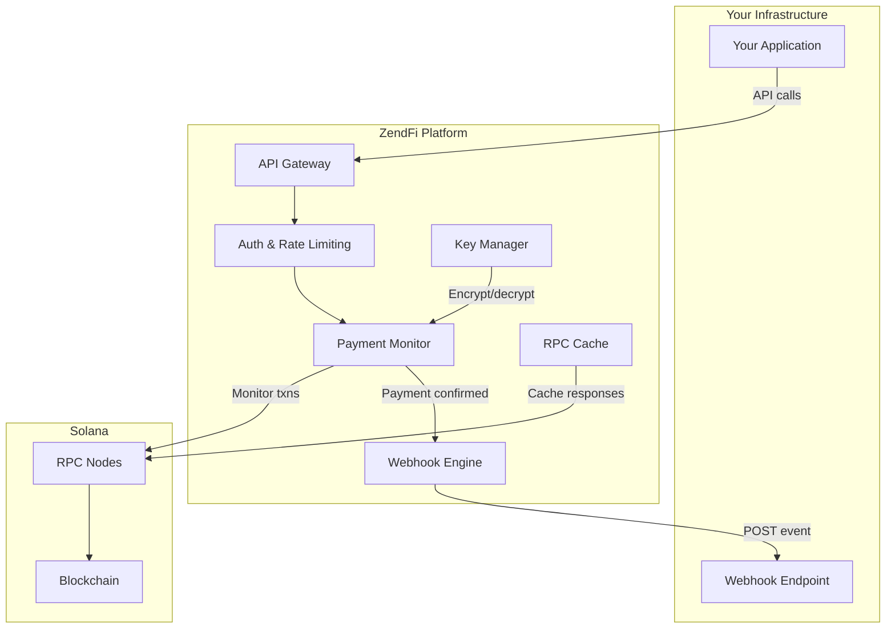
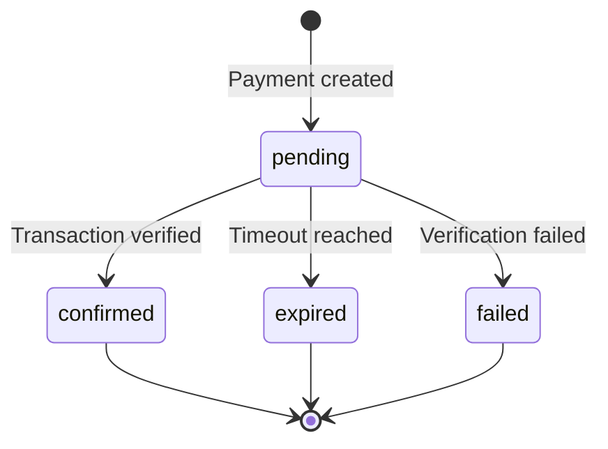
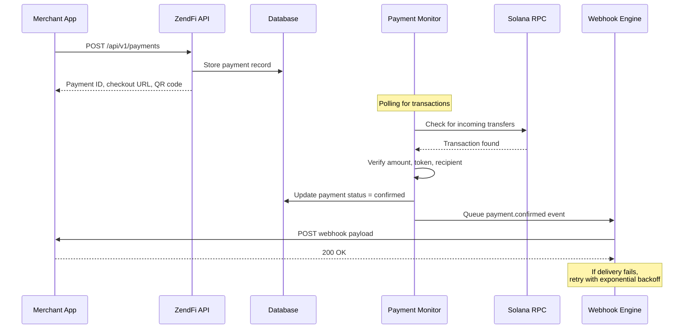
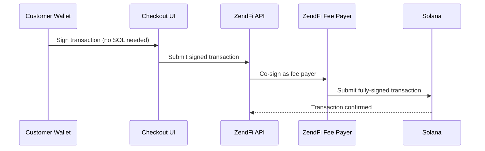
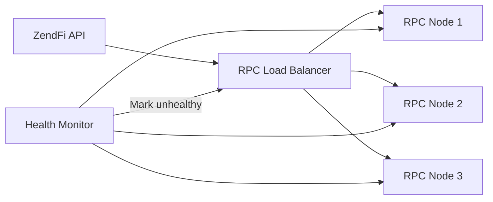
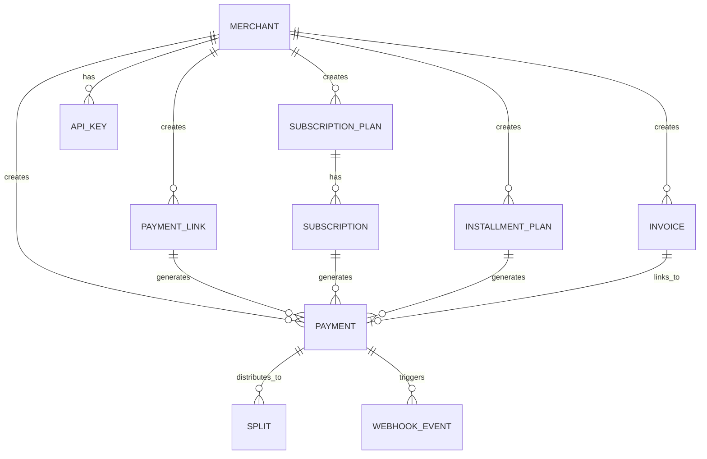

# Architecture

This page explains how ZendFi's payment infrastructure works under the hood. Understanding the architecture is optional for integration, but it helps when debugging, optimizing, or building advanced flows.

## System Overview

## Payment Lifecycle

Every payment moves through a well-defined state machine:

### States

| State | Description |
|-------|-------------|
| `pending` | Payment created, waiting for customer transaction |
| `confirmed` | Transaction found on-chain and verified. Funds settled to merchant wallet. |
| `failed` | Transaction detected but verification failed (wrong amount, wrong token, etc.) |
| `expired` | Payment window elapsed with no valid transaction |

## Transaction Flow

Here is the full lifecycle of a typical payment:

## Gasless Transactions

ZendFi supports gasless payments where the customer does not need SOL for transaction fees. This removes a major friction point in crypto payments.

The fee payer keypairs are separate for test and live modes:
- **Test mode**: Uses a devnet fee payer
- **Live mode**: Uses a mainnet fee payer with funded SOL balance

## Key Management

ZendFi uses a layered key management system:

| Layer | Purpose |
|-------|---------|
| **Master Encryption Key** | Encrypts all stored keypairs at rest |
| **Merchant Keypairs** | Per-merchant wallet keys, encrypted in the database |
| **Fee Payer Keypairs** | Separate devnet/mainnet keys for sponsoring gas |
| **MPC Wallets** | Optional multi-party computation wallets using Lit Protocol |
| **Session Keys** | Time-limited, budget-capped keys for delegated operations |

All private keys are encrypted with AES-256 before storage. The master encryption key is loaded from the environment and never persisted to disk.

## Resilient RPC Infrastructure

ZendFi does not rely on a single Solana RPC node. The system includes:

- **Multiple RPC endpoints** with automatic failover
- **Health monitoring** that continuously checks endpoint availability
- **Response caching** to reduce RPC load and improve latency
- **Endpoint rotation** that shifts traffic away from degraded nodes

## Webhook Delivery

Webhook reliability is critical. ZendFi's webhook engine includes:

- **Automatic retries** with exponential backoff on delivery failure
- **Dead letter queue** for webhooks that exhaust all retry attempts
- **HMAC-SHA256 signatures** on every payload for verification
- **Deduplication** by event ID to prevent double-processing
- **Correlation IDs** on every request for end-to-end tracing

See the [Webhook Security](/security/webhooks) page for implementation details.

## Background Workers

ZendFi runs several background processes that maintain system health:

| Worker | Interval | Purpose |
|--------|----------|---------|
| Payment Monitor | Continuous | Watches Solana for incoming transactions |
| Subscription Processor | Periodic | Creates payments for due subscriptions |
| Installment Monitor | Periodic | Checks for due installment payments |
| Split Processor | Periodic | Processes pending payment split distributions |
| Webhook Retry Worker | Continuous | Retries failed webhook deliveries |
| Session Key Cleanup | Hourly | Revokes expired session keys |
| Payment Intent Expiry | 5 minutes | Expires stale payment intents |
| Uptime Monitor | Continuous | Tracks system and RPC health |
| Cache Warming | 45 minutes | Pre-warms MPC wallet caches |

## Data Model

The core entities and their relationships:

## Network Configuration

| Property | Test (Devnet) | Live (Mainnet) |
|----------|---------------|----------------|
| USDC Mint | Devnet USDC | `EPjFWdd5AufqSSqeM2qN1xzybapC8G4wEGGkZwyTDt1v` |
| Explorer | Solscan (devnet) | Solscan (mainnet) |
| Confirmation | `confirmed` | `confirmed` |
| Fee payer | Devnet keypair | Mainnet keypair |
