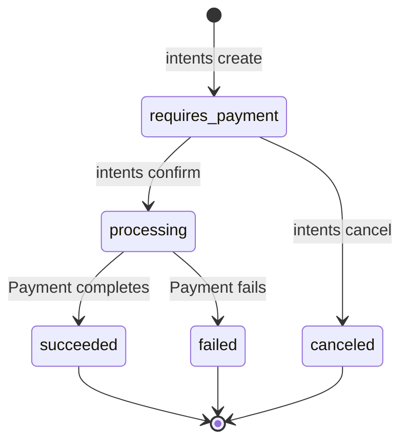

These commands cover two advanced features: the two-phase payment intent flow and international pricing with Purchasing Power Parity.

## Payment Intents

Payment intents give you a two-phase payment flow -- create an intent, then confirm it separately. This is useful for AI agent transactions, cart-based checkouts, and any flow where the payment amount is known before the customer's wallet is available.

### intents create

Create a new payment intent.

```bash
zendfi intents create [options]
```

#### Options

| Flag | Description | Default |
|---|---|---|
| `--amount <amount>` | Amount in USD | Interactive prompt |
| `--currency <currency>` | Currency code | `USD` |
| `--description <text>` | Payment description | Interactive prompt |
| `--capture <method>` | `automatic` or `manual` | Interactive prompt |

#### Capture Methods

| Method | Behavior |
|---|---|
| `automatic` | Captures the payment immediately when confirmed |
| `manual` | Authorizes only; you capture later via the API |

#### Example

```bash
$ zendfi intents create --amount 99.99

Create Payment Intent

? Description (optional): Annual subscription
? Capture method: Automatic - Capture immediately on confirm

✓ Payment intent created!

  Intent Details:
  ID:            pi_test_abc123
  Amount:        $99.99
  Status:        REQUIRES PAYMENT
  Capture:       automatic
  Expires:       12/16/2024, 2:30:00 PM

  Client Secret (for frontend):
  pi_test_abc123_secret_xyz789

  Confirm with:
  zendfi intents confirm pi_test_abc123 --wallet <customer_wallet>
```

The client secret is used on the frontend to confirm the payment without exposing your API key. Pass it to your checkout page or SDK instance.

---

### intents list

List all payment intents for your account.

```bash
zendfi intents list
```

Displays each intent with its ID, amount, status, and creation date in a formatted table.

---

### intents get

Get detailed information about a specific payment intent.

```bash
zendfi intents get <intent-id>
```

#### Arguments

| Argument | Description | Required |
|---|---|---|
| `intent-id` | The payment intent ID (e.g., `pi_test_abc123`) | Yes |

Shows the full intent details including status, amount, capture method, associated payment ID (if confirmed), and timestamps.

---

### intents confirm

Confirm a payment intent with a customer's wallet address.

```bash
zendfi intents confirm <intent-id> [options]
```

#### Arguments

| Argument | Description | Required |
|---|---|---|
| `intent-id` | The payment intent ID to confirm | Yes |

#### Options

| Flag | Description | Default |
|---|---|---|
| `--wallet <address>` | Customer's Solana wallet address | Interactive prompt |
| `--client-secret <secret>` | Client secret for verification | Interactive prompt |

#### Example

```bash
$ zendfi intents confirm pi_test_abc123 --wallet 7xKX...9mRq

✓ Payment intent confirmed!

  Status:     PROCESSING
  Payment ID: pay_test_def456
```

---

### intents cancel

Cancel a payment intent that has not yet been confirmed.

```bash
zendfi intents cancel <intent-id>
```

#### Arguments

| Argument | Description | Required |
|---|---|---|
| `intent-id` | The payment intent ID to cancel | Yes |

```bash
$ zendfi intents cancel pi_test_abc123

✓ Payment intent canceled
```

### Intent Lifecycle



---

## PPP Pricing

Purchasing Power Parity (PPP) lets you offer fair, localized pricing based on a customer's country. The CLI provides tools to look up PPP factors, list all supported countries, and calculate adjusted prices.

### ppp check

Look up the PPP factor for a specific country.

```bash
zendfi ppp check <country> [options]
```

#### Arguments

| Argument | Description | Required |
|---|---|---|
| `country` | 2-letter ISO country code (e.g., `BR`, `IN`, `NG`) | Yes |

#### Options

| Flag | Description | Default |
|---|---|---|
| `--price <price>` | Calculate the localized price for this amount | -- |

#### Example

```bash
$ zendfi ppp check BR --price 99.99

PPP Factor Lookup

✓ PPP factor loaded!

  Brazil (BR)

  PPP Factor:       0.35
  Discount:         65%
  Local Currency:   BRL

  Price Calculation:
  Original:    $99.99
  Localized:   $35.00
  Savings:     $64.99
```

Without `--price`, the command shows the factor and an example calculation for $100.

---

### ppp factors

List PPP factors for all supported countries.

```bash
zendfi ppp factors [options]
```

#### Options

| Flag | Description | Default |
|---|---|---|
| `--sort <sort>` | Sort by `discount` or `country` | `country` (alphabetical) |

#### Example

```bash
$ zendfi ppp factors --sort discount

PPP Factors - All Countries

✓ Loaded 45 countries

  Country              Factor    Discount    $100 →
  ─────────────────────────────────────────────────
  Egypt                  0.15       85%      $15
  Pakistan               0.22       78%      $22
  India                  0.25       75%      $25
  Nigeria                0.28       72%      $28
  Vietnam                0.30       70%      $30
  ...
```

---

### ppp calculate

Calculate a localized price for a specific country.

```bash
zendfi ppp calculate --price <price> --country <country>
```

Both `--price` and `--country` are required.

#### Options

| Flag | Description | Required |
|---|---|---|
| `--price <price>` | Original price in USD | Yes |
| `--country <country>` | 2-letter ISO country code | Yes |

#### Example

```bash
$ zendfi ppp calculate --price 49.99 --country IN

PPP Price Calculator

✓ Price calculated!

  India

  ┌─────────────────────────────────────┐
  │  Original Price:          $49.99    │
  │  PPP Factor:                0.25    │
  │─────────────────────────────────────│
  │  Localized Price:         $12.50    │
  │  Customer Saves:          $37.49    │
  └─────────────────────────────────────┘

  Discount: 75% off for India customers
```

### Supported Countries

The PPP system covers 45+ countries across all major regions. Some notable flags:

| Code | Country | Typical Discount Range |
|---|---|---|
| AR | Argentina | 60-70% |
| BR | Brazil | 60-65% |
| EG | Egypt | 80-85% |
| IN | India | 70-75% |
| MX | Mexico | 40-50% |
| NG | Nigeria | 70-75% |
| PK | Pakistan | 75-80% |
| PH | Philippines | 55-65% |
| TR | Turkey | 55-65% |
| VN | Vietnam | 65-70% |

Use `zendfi ppp factors` for the complete, up-to-date list.

### Use Cases

**SaaS pricing pages:** Run `zendfi ppp check` for your target markets during planning to set tier-specific pricing.

**Dynamic checkout:** Use the [PPP API endpoint](/api-reference/overview) server-side to adjust prices at checkout based on the customer's IP-derived country code.

**Market analysis:** Run `zendfi ppp factors --sort discount` to identify markets where aggressive pricing could drive adoption.
