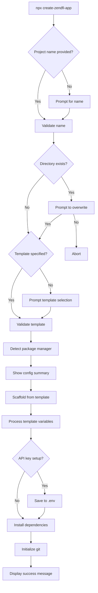

The CLI provides two ways to get started: add ZendFi to a project you already have, or create a brand new project from a template.

## zendfi init

Adds ZendFi to your current project with automatic framework detection, SDK installation, and file generation.

```bash
zendfi init [options]
```

### Options

| Flag | Description | Default |
|---|---|---|
| `--framework <name>` | Override framework detection | Auto-detected |
| `--skip-install` | Skip `@zendfi/sdk` installation | `false` |
| `-y, --yes` | Skip all confirmation prompts | `false` |

### What It Does

<Steps>

<Step title="Detect your framework">
The CLI inspects your `package.json` and project structure to identify your framework:

| Framework | Detection Method |
|---|---|
| Next.js (App Router) | `next` dependency + `app/` directory + version >= 13 |
| Next.js (Pages Router) | `next` dependency without App Router |
| Express.js | `express` dependency |
| React | `react` dependency without `next` |
| Vue.js | `vue` dependency |
| SvelteKit | `@sveltejs/kit` dependency |
| Node.js | Fallback for any `package.json` project |

It also detects your package manager from lock files (bun.lockb, pnpm-lock.yaml, yarn.lock, or npm) and checks for TypeScript support.
</Step>

<Step title="Install the SDK">
Runs the appropriate install command for your package manager:

```bash
# npm
npm install @zendfi/sdk

# yarn
yarn add @zendfi/sdk

# pnpm
pnpm add @zendfi/sdk

# bun
bun add @zendfi/sdk
```

Skip this step with `--skip-install` if you want to handle installation yourself.
</Step>

<Step title="Generate project files">
Creates framework-specific files tailored to your project:

**Next.js (App Router):**
| File | Purpose |
|---|---|
| `lib/zendfi.ts` | Pre-configured ZendFi client instance |
| `app/api/webhooks/zendfi/route.ts` | Webhook handler route |
| `.env.local` | Environment variables template |

**Next.js (Pages Router):**
| File | Purpose |
|---|---|
| `lib/zendfi.ts` | Pre-configured ZendFi client instance |
| `pages/api/webhooks/zendfi.ts` | Webhook handler API route |
| `.env.local` | Environment variables template |

**Express.js:**
| File | Purpose |
|---|---|
| `src/lib/zendfi.ts` | Pre-configured ZendFi client instance |
| `src/routes/webhooks.ts` | Webhook handler route |
| `.env` | Environment variables template |

**Other frameworks:**
| File | Purpose |
|---|---|
| `src/lib/zendfi.ts` | Pre-configured ZendFi client instance |
| `src/webhooks.ts` | Webhook handler |
| `.env` | Environment variables template |

Existing files are never overwritten. If a file already exists, the CLI skips it and lets you know.
</Step>

<Step title="Display next steps">
Shows framework-specific code examples for creating your first payment and wiring up webhooks.
</Step>

</Steps>

### Example

```bash
$ cd my-nextjs-app
$ zendfi init

Initializing ZendFi in your project...

✓ Detected: Next.js (App Router)

  Project Information:
  Framework:       Next.js (App Router)
  Version:         14.0.0
  TypeScript:      Yes
  Package Manager: npm

? Continue with ZendFi setup? Yes
✓ Installed @zendfi/sdk
✓ Created lib/zendfi.ts
✓ Created app/api/webhooks/zendfi/route.ts
✓ Created .env.local

ZendFi setup complete!

Next steps:

  1. Add your API key to .env.local
  2. Create a payment in your app
  3. Implement webhook handlers
  4. Test your integration
```

### Non-Interactive Mode

For CI/CD pipelines or scripts, use the `-y` flag to skip all prompts:

```bash
zendfi init -y --skip-install
```

---

## create-zendfi-app

Create a complete ZendFi project from a pre-built template. This is a standalone package that wraps the `create` command with an interactive wizard.

```bash
npx create-zendfi-app [project-name] [options]
```

### Options

| Flag | Description | Default |
|---|---|---|
| `--template <name>` | Template to use | Interactive selection |
| `--env <environment>` | Environment (`development` or `production`) | `development` |
| `-y, --yes` | Skip confirmation prompts | `false` |
| `--skip-install` | Skip dependency installation | `false` |
| `--skip-git` | Skip git initialization | `false` |

### Templates

<AccordionGroup>

<Accordion title="nextjs-ecommerce -- Next.js E-commerce">

A full-featured online store built with Next.js 14 App Router.

**Features:**
- Product catalog page
- Shopping cart
- Checkout with ZendFi payment integration
- Order confirmation page
- Webhook handler for payment events
- Embedded admin dashboard

```bash
npx create-zendfi-app my-store --template nextjs-ecommerce
```
</Accordion>

<Accordion title="nextjs-saas -- Next.js SaaS">

A subscription-based SaaS application with Next.js 14 App Router.

**Features:**
- Subscription plans page
- User authentication
- Customer portal
- Webhook handler for subscription events
- Usage tracking
- Payment history

```bash
npx create-zendfi-app my-saas --template nextjs-saas
```
</Accordion>

<Accordion title="express-api -- Express API">

A backend API server with pre-configured payment endpoints.

**Features:**
- Payment creation endpoint
- Webhook handler
- CORS configuration
- Environment variable setup
- TypeScript support

```bash
npx create-zendfi-app my-api --template express-api
```
</Accordion>

</AccordionGroup>

### Scaffolding Flow



### Template Variables

Templates support these placeholder variables that are replaced during scaffolding:

| Variable | Replaced With |
|---|---|
| `{{PROJECT_NAME}}` | Your chosen project name |
| `{{API_KEY}}` | Your API key (if provided during setup) |
| `{{WEBHOOK_SECRET}}` | Your webhook secret (if provided) |
| `{{ENVIRONMENT}}` | Selected environment (`development` or `production`) |

### Example

```bash
$ npx create-zendfi-app my-store

 Project Configuration:
  Name:            my-store
  Template:        Next.js E-commerce
  Framework:       Next.js 14 (App Router)
  Environment:     development
  Package Manager: npm

? Continue with this configuration? Yes
✓ Project directory created
✓ Project scaffolded successfully!
✓ API key saved to .env file
✓ Dependencies installed
✓ Git initialized

  Your ZendFi project is ready!

  cd my-store
  npm run dev
```

## Package Manager Detection

Both `zendfi init` and `create-zendfi-app` automatically detect your preferred package manager:

| Lock File | Package Manager |
|---|---|
| `bun.lockb` | bun |
| `pnpm-lock.yaml` | pnpm |
| `yarn.lock` | yarn |
| *(none)* | npm |

Detection checks for lock files in order of priority, with npm as the fallback.
