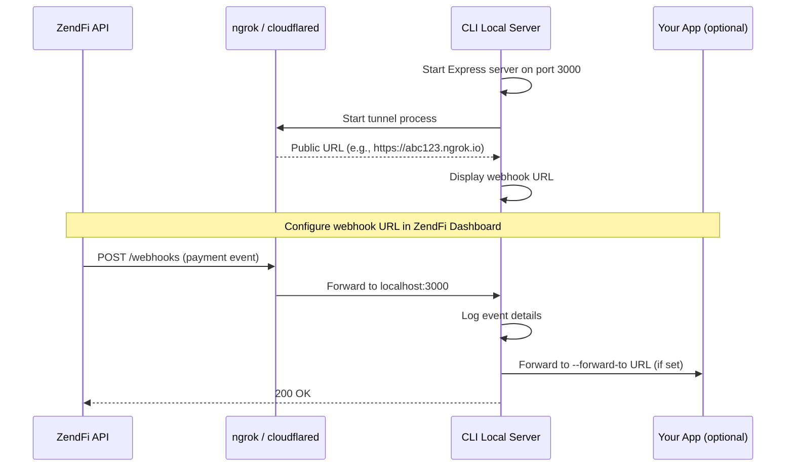

The webhooks command starts a local server and creates a public tunnel so ZendFi can deliver webhook events to your machine during development.

## zendfi webhooks

```bash
zendfi webhooks [options]
```

Aliases: `zendfi listen`

### Options

| Flag | Description | Default |
|---|---|---|
| `--port <port>` | Local port to listen on | `3000` |
| `--forward-to <url>` | Forward received webhooks to another local URL | -- |

## How It Works



<Steps>

<Step title="Start local server">
The CLI starts an Express server on the specified port (default 3000) with two endpoints:

| Endpoint | Method | Purpose |
|---|---|---|
| `/webhooks` | POST | Receives webhook events from ZendFi |
| `/health` | GET | Health check returning `{ status: "ok", webhooksReceived: N }` |
</Step>

<Step title="Detect tunnel service">
The CLI checks for `ngrok` and `cloudflared` on your system. If both are available, it prompts you to choose. If neither is installed, it shows installation links:

- **ngrok:** [ngrok.com/download](https://ngrok.com/download)
- **cloudflared:** [Cloudflare Tunnel docs](https://developers.cloudflare.com/cloudflare-one/connections/connect-apps/install-and-setup/installation/)
</Step>

<Step title="Create tunnel">
Launches the selected tunnel service pointing to your local port. The CLI waits up to 30 seconds for the tunnel URL to become available.
</Step>

<Step title="Display configuration">
Shows the public webhook URL and setup instructions:

```
✓ Local server started on port 3000
✓ Tunnel active: https://abc123.ngrok.io

Configuration:
  Webhook URL: https://abc123.ngrok.io/webhooks
  Health:      https://abc123.ngrok.io/health

Setup Instructions:
  1. Copy the webhook URL above
  2. Go to ZendFi Dashboard → Settings → Webhooks
  3. Add the webhook URL
  4. Create a test payment to trigger webhooks

Listening for webhooks... (Press Ctrl+C to stop)
```
</Step>

<Step title="Log incoming events">
Each webhook event is logged with a timestamp, event counter, event type, payment ID, status, and amount:

```
[2:30:15 PM] Webhook #1 received
  Event:   payment.confirmed
  Payment: pay_test_7f3k9x2m
  Status:  ✓ CONFIRMED
  Amount:  $50 USD

[2:31:02 PM] Webhook #2 received
  Event:   settlement.completed
  Payment: pay_test_7f3k9x2m
  Status:  ✓ CONFIRMED
  Amount:  $50 USD
```
</Step>

</Steps>

## Forwarding

Use `--forward-to` to relay webhook payloads to your application's actual webhook endpoint. This lets you test your real webhook handler while still seeing events in the CLI:

```bash
zendfi webhooks --port 4000 --forward-to http://localhost:3000/api/webhooks/zendfi
```

The CLI receives the webhook on port 4000, logs it, and then forwards the full payload to your app at `localhost:3000/api/webhooks/zendfi`.

## Tunnel Services

### ngrok

The most popular option. The CLI reads the tunnel URL from ngrok's stdout output. Free tier supports one tunnel at a time.

```bash
# Install ngrok
brew install ngrok  # macOS
# or download from https://ngrok.com/download
```

### Cloudflare Tunnel (cloudflared)

Free, no-signup alternative. Creates a `*.trycloudflare.com` URL automatically.

```bash
# Install cloudflared
brew install cloudflare/cloudflare/cloudflared  # macOS
# or download from https://developers.cloudflare.com/cloudflare-one/connections/connect-apps/install-and-setup/installation/
```

## Shutdown

Press `Ctrl+C` to gracefully shut down. The CLI closes the local server, kills the tunnel process, and shows the total number of webhooks received during the session.

```
Shutting down...
✓ Received 5 webhooks total
```

## Testing Workflow

A typical local webhook testing session:

```bash
# Terminal 1: Start your app
npm run dev

# Terminal 2: Start the webhook listener
zendfi webhooks --forward-to http://localhost:3000/api/webhooks/zendfi

# Terminal 3: Create a test payment to trigger events
zendfi payment create --amount 25 --watch
```

This creates a payment, which triggers `payment.created` and `payment.confirmed` webhooks. The CLI logs them, forwards them to your app, and your webhook handler processes them as it would in production.
