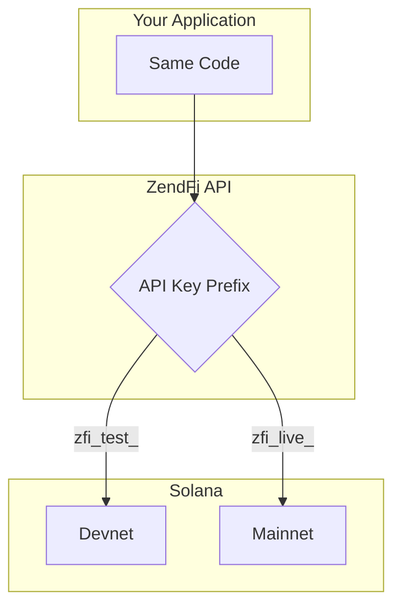

# Test and Live Modes

ZendFi uses a dual-mode architecture. Your API key prefix determines which Solana network processes the transaction. The code is identical in both modes -- you only change the key.

## How Modes Work



| | Test Mode | Live Mode |
|---|-----------|-----------|
| **Key prefix** | `zfi_test_` | `zfi_live_` |
| **Network** | Solana Devnet | Solana Mainnet |
| **Tokens** | Devnet USDC/SOL | Real USDC/USDT/SOL |
| **Transactions** | Free (no real value) | Real funds |
| **Webhooks** | Fully functional | Fully functional |
| **Rate limits** | Same as live | Same as test |
| **API base URL** | `https://api.zendfi.tech` | `https://api.zendfi.tech` |

<Note>
Both modes use the same API base URL. The backend inspects your API key to route the request to the correct network. You never need to change URLs when going live.
</Note>

## SDK Mode Detection

The SDK automatically detects the mode from your API key:

```typescript
import { ZendFiClient } from '@zendfi/sdk';

// Test mode -- routes to devnet
const testClient = new ZendFiClient({
  apiKey: 'zfi_test_abc123',
});

// Live mode -- routes to mainnet
const liveClient = new ZendFiClient({
  apiKey: 'zfi_live_xyz789',
});
```

When using the zero-config singleton, it reads `ZENDFI_API_KEY` from the environment:

```typescript
import { zendfi } from '@zendfi/sdk';

// Mode is determined by the key in process.env.ZENDFI_API_KEY
const payment = await zendfi.createPayment({ amount: 50 });
```

## Response Headers

Every API response includes a mode header so you can confirm which network processed the request:

```
X-ZendFi-Mode: test
```

or

```
X-ZendFi-Mode: live
```

## Development Workflow

A typical workflow:

<Steps>
  <Step title="Develop with test keys">
    Use `zfi_test_` keys during development. All transactions happen on Solana devnet with no real funds at risk.
  </Step>
  <Step title="Test webhooks locally">
    Use `zendfi webhooks --port 3000` to tunnel webhooks to your local machine. Webhook payloads are identical between modes.
  </Step>
  <Step title="Deploy to staging">
    Deploy your app with test keys to a staging environment. Verify the full flow end-to-end.
  </Step>
  <Step title="Switch to live">
    Replace `zfi_test_` with `zfi_live_` in your production environment variables. No code changes required.
  </Step>
</Steps>

## Environment Variable Patterns

<Tabs>
  <Tab title="Single Key">
    Use a single environment variable and swap it per environment:

    ```bash .env.development
    ZENDFI_API_KEY=zfi_test_abc123
    ```

    ```bash .env.production
    ZENDFI_API_KEY=zfi_live_xyz789
    ```
  </Tab>
  <Tab title="Dual Keys">
    Keep both keys available and select based on context:

    ```bash .env
    ZENDFI_TEST_API_KEY=zfi_test_abc123
    ZENDFI_LIVE_API_KEY=zfi_live_xyz789
    ```

    ```typescript
    const apiKey = process.env.NODE_ENV === 'production'
      ? process.env.ZENDFI_LIVE_API_KEY
      : process.env.ZENDFI_TEST_API_KEY;

    const client = new ZendFiClient({ apiKey });
    ```
  </Tab>
</Tabs>

## Safety Warnings

The SDK includes built-in safety checks:

- Using a **live key in development** logs a warning: real mainnet transactions will occur.
- Using a **test key in production** logs a warning: only devnet transactions will be created.

These warnings appear in your server console to help catch environment misconfigurations before they become costly mistakes.

## Testing with Devnet Funds

To complete test payments, you need devnet tokens:

1. **Devnet SOL**: Use the [Solana faucet](https://faucet.solana.com) to airdrop devnet SOL to your wallet.
2. **Devnet USDC**: Swap devnet SOL for USDC using a devnet-compatible DEX, or use the devnet USDC faucet if available.
3. **Wallet setup**: Configure Phantom, Solflare, or Backpack to use Solana devnet in settings.

<Tip>
ZendFi supports gasless transactions in both modes. Customers do not need SOL for gas fees -- ZendFi sponsors the transaction costs.
</Tip>
