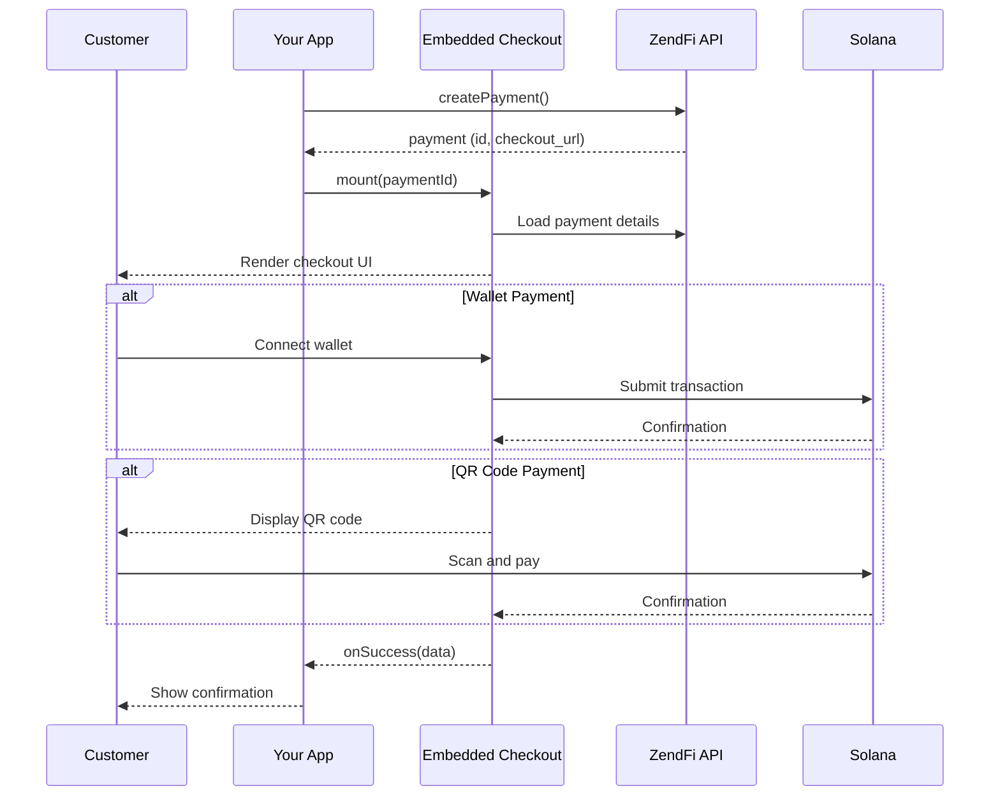
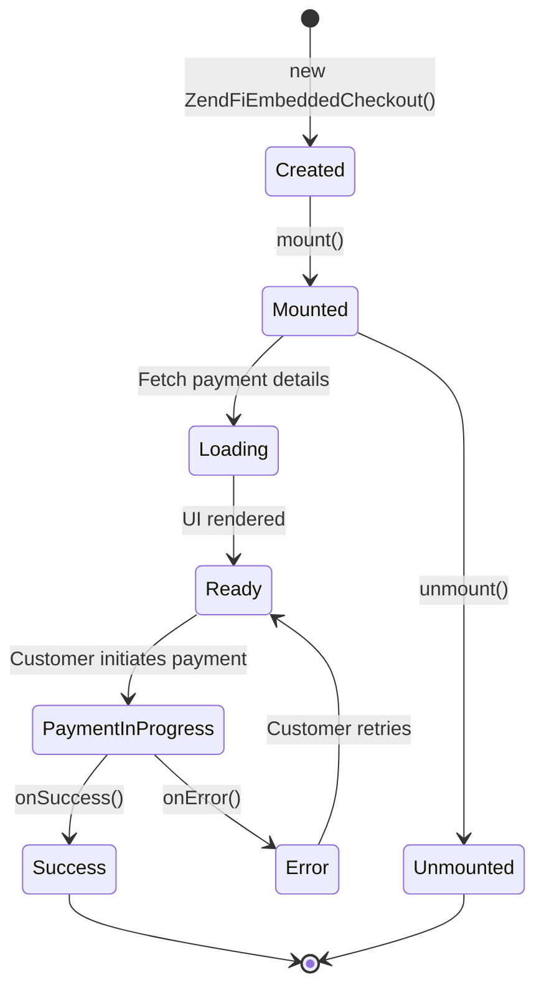

Embedded Checkout renders a full checkout interface inside your application -- no redirects, no pop-ups. Customers complete payment without ever leaving your site.

## Overview



## Quick Start

<Steps>

<Step title="Create a payment on the server">

```typescript
// Server-side (Next.js Server Action, Express route, etc.)
const payment = await zendfi.createPayment({
  amount: 49.99,
  currency: 'USD',
  description: 'Pro Plan - Monthly',
});

// Pass payment.id to the client
```
</Step>

<Step title="Mount the checkout on the client">

```typescript
import { ZendFiEmbeddedCheckout } from '@zendfi/sdk';

const checkout = new ZendFiEmbeddedCheckout({
  paymentId: 'pay_test_abc123',
  containerId: 'checkout-container',
  onSuccess: (data) => {
    console.log('Paid!', data.paymentId);
    window.location.href = `/order/${data.paymentId}`;
  },
  onError: (error) => {
    console.error('Checkout error:', error.message);
  },
});

checkout.mount();
```

Add a container element to your HTML:

```html
<div id="checkout-container"></div>
```
</Step>

</Steps>

## Configuration

The `ZendFiEmbeddedCheckout` constructor accepts a configuration object with these properties:

### Required

| Property | Type | Description |
|---|---|---|
| `paymentId` | `string` | The payment ID from `createPayment()` |
| `containerId` | `string` | DOM element ID to render the checkout into |

### Callbacks

| Property | Type | Description |
|---|---|---|
| `onSuccess` | `(data: PaymentSuccessData) => void` | Called when payment completes successfully |
| `onError` | `(error: CheckoutError) => void` | Called on any error during checkout |
| `onLoad` | `() => void` | Called when the checkout UI finishes loading |

### PaymentSuccessData

```typescript
interface PaymentSuccessData {
  paymentId: string;
  transactionSignature: string;
  amount: number;
  token: string;
  merchantName: string;
}
```

### CheckoutError

```typescript
interface CheckoutError {
  code: string;
  message: string;
  details?: Record<string, unknown>;
}
```

## Theming

Customize the checkout appearance to match your brand:

```typescript
const checkout = new ZendFiEmbeddedCheckout({
  paymentId: 'pay_test_abc123',
  containerId: 'checkout-container',
  theme: {
    primaryColor: '#667eea',
    backgroundColor: '#ffffff',
    textColor: '#1a1a2e',
    borderRadius: '12px',
    fontFamily: 'Inter, system-ui, sans-serif',
  },
  onSuccess: (data) => { /* ... */ },
});
```

### Theme Properties

| Property | Type | Default | Description |
|---|---|---|---|
| `primaryColor` | `string` | `#667eea` | Buttons, links, and accent elements |
| `backgroundColor` | `string` | `#ffffff` | Checkout background |
| `textColor` | `string` | `#1a1a2e` | Primary text color |
| `borderRadius` | `string` | `8px` | Corner radius for cards and buttons |
| `fontFamily` | `string` | `system-ui` | Font stack |

### Dark Mode

```typescript
theme: {
  primaryColor: '#818cf8',
  backgroundColor: '#0f172a',
  textColor: '#e2e8f0',
  borderRadius: '12px',
  fontFamily: 'Inter, system-ui, sans-serif',
}
```

## Payment Methods

The Embedded Checkout supports multiple payment methods. Customers can switch between them during checkout.

<AccordionGroup>

<Accordion title="Wallet Connect">
Connects the customer's browser wallet (Phantom, Solflare, Backpack, etc.) to sign and submit the transaction directly. This is the fastest payment method -- one click after wallet connection.
</Accordion>

<Accordion title="QR Code">
Displays a Solana Pay QR code. The customer scans it with any Solana-compatible mobile wallet. The checkout polls for confirmation and updates automatically.
</Accordion>

<Accordion title="Manual Transfer">
Shows the merchant's wallet address and the exact token amount. The customer sends the payment from any wallet. The checkout monitors for the incoming transaction.
</Accordion>

<Accordion title="Bank / Fiat On-ramp">
For payment links with on-ramp enabled, customers can pay with a credit card or bank transfer. The fiat is converted to crypto and settled to the merchant. Available when the payment link is configured with `onramp: true`.
</Accordion>

</AccordionGroup>

## React Integration

```tsx
'use client';

import { useEffect, useRef } from 'react';
import { ZendFiEmbeddedCheckout } from '@zendfi/sdk';

interface CheckoutProps {
  paymentId: string;
  onComplete: (paymentId: string) => void;
}

export function Checkout({ paymentId, onComplete }: CheckoutProps) {
  const containerRef = useRef<HTMLDivElement>(null);
  const checkoutRef = useRef<ZendFiEmbeddedCheckout | null>(null);

  useEffect(() => {
    if (!containerRef.current || checkoutRef.current) return;

    const checkout = new ZendFiEmbeddedCheckout({
      paymentId,
      containerId: 'zendfi-checkout',
      theme: {
        primaryColor: '#667eea',
        borderRadius: '12px',
      },
      onSuccess: (data) => {
        onComplete(data.paymentId);
      },
      onError: (error) => {
        console.error('Checkout error:', error);
      },
    });

    checkout.mount();
    checkoutRef.current = checkout;

    return () => {
      checkout.unmount();
      checkoutRef.current = null;
    };
  }, [paymentId, onComplete]);

  return (
    <div
      id="zendfi-checkout"
      ref={containerRef}
      style={{ minHeight: '400px' }}
    />
  );
}
```

## CDN Usage

If you are not using a bundler, load the checkout from the CDN:

```html
<script src="https://cdn.zendfi.tech/checkout/v1/embedded.js"></script>

<div id="checkout-container"></div>

<script>
  const checkout = new ZendFiEmbeddedCheckout({
    paymentId: 'pay_test_abc123',
    containerId: 'checkout-container',
    onSuccess: function(data) {
      alert('Payment complete: ' + data.paymentId);
    },
  });

  checkout.mount();
</script>
```

## Lifecycle



### Methods

| Method | Description |
|---|---|
| `mount()` | Renders the checkout UI into the container element |
| `unmount()` | Removes the checkout UI and cleans up event listeners |

Always call `unmount()` when the component is removed from the page (e.g., in a React `useEffect` cleanup function) to prevent memory leaks.

## Error Handling

```typescript
const checkout = new ZendFiEmbeddedCheckout({
  paymentId: 'pay_test_abc123',
  containerId: 'checkout-container',
  onError: (error) => {
    switch (error.code) {
      case 'PAYMENT_NOT_FOUND':
        // Invalid or expired payment ID
        showError('This payment link has expired.');
        break;
      case 'WALLET_CONNECTION_FAILED':
        // Customer denied wallet connection
        showError('Please connect your wallet to continue.');
        break;
      case 'TRANSACTION_FAILED':
        // On-chain transaction failed
        showError('Transaction failed. Please try again.');
        break;
      case 'NETWORK_ERROR':
        // Connection issue
        showError('Connection lost. Please check your internet.');
        break;
      default:
        showError('Something went wrong. Please try again.');
    }
  },
  onSuccess: (data) => { /* ... */ },
});
```

## Sizing and Layout

The checkout adapts to its container. Set a minimum height to prevent layout shifts:

```css
#checkout-container {
  min-height: 400px;
  max-width: 480px;
  margin: 0 auto;
}
```

The checkout is responsive and works on mobile screens. On narrow viewports, it stacks payment methods vertically and adjusts button sizes for touch targets.
