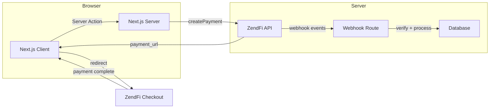

This guide walks through a full ZendFi integration in a Next.js 14+ application using the App Router. By the end, you will have server-side payment creation, a checkout redirect flow, webhook handling, and order confirmation.

## Prerequisites

- Next.js 14+ with App Router
- Node.js 18+
- A ZendFi account with test API keys

## Project Setup

<Steps>

<Step title="Install the SDK">

```bash
npm install @zendfi/sdk
```

Or use the CLI to set everything up automatically:

```bash
npx @zendfi/cli init
```
</Step>

<Step title="Configure environment variables">

Create a `.env.local` file in your project root:

```bash .env.local
ZENDFI_API_KEY=zfi_test_your_key_here
ZENDFI_WEBHOOK_SECRET=whsec_your_secret_here
```

<Note>
Next.js automatically loads `.env.local` and keeps these variables server-side only (no `NEXT_PUBLIC_` prefix means they are never exposed to the browser).
</Note>
</Step>

<Step title="Create the ZendFi client">

```typescript lib/zendfi.ts
import { ZendFiClient } from '@zendfi/sdk';

export const zendfi = new ZendFiClient();
```

The client auto-detects `ZENDFI_API_KEY` from your environment. No configuration needed.
</Step>

</Steps>

## Create a Payment

Build a Server Action that creates a payment and redirects to checkout:

```typescript app/actions/checkout.ts
'use server';

import { redirect } from 'next/navigation';
import { zendfi } from '@/lib/zendfi';

export async function createCheckout(formData: FormData) {
  const amount = parseFloat(formData.get('amount') as string);
  const description = formData.get('description') as string;
  const email = formData.get('email') as string;

  const payment = await zendfi.createPayment({
    amount,
    currency: 'USD',
    description,
    customer_email: email,
    metadata: {
      source: 'nextjs-app',
    },
  });

  redirect(payment.checkout_url);
}
```

Use it in a client component:

```tsx app/checkout/page.tsx
import { createCheckout } from '@/app/actions/checkout';

export default function CheckoutPage() {
  return (
    <form action={createCheckout}>
      <input type="hidden" name="amount" value="50" />
      <input type="hidden" name="description" value="Pro Plan" />
      <input type="email" name="email" placeholder="you@example.com" required />
      <button type="submit">
        Pay $50
      </button>
    </form>
  );
}
```

## Handle Webhooks

Create a webhook handler route to process payment events:

```typescript app/api/webhooks/zendfi/route.ts
import { createNextWebhookHandler } from '@zendfi/sdk/nextjs';

export const POST = createNextWebhookHandler({
  secret: process.env.ZENDFI_WEBHOOK_SECRET!,
  handlers: {
    'payment.confirmed': async (payment) => {
      console.log('Payment confirmed:', payment.id);

      // Update your database
      // await db.orders.update({
      //   where: { paymentId: payment.id },
      //   data: { status: 'paid' },
      // });
    },

    'payment.failed': async (payment) => {
      console.log('Payment failed:', payment.id);
    },
  },
});
```

<Warning>
Do not add `export const runtime = 'edge'` to this route. The webhook handler needs the Node.js runtime for crypto operations used in signature verification.
</Warning>

## Order Confirmation Page

Create a page to show after successful payment:

```tsx app/order/[paymentId]/page.tsx
import { zendfi } from '@/lib/zendfi';
import { notFound } from 'next/navigation';

interface Props {
  params: { paymentId: string };
}

export default async function OrderPage({ params }: Props) {
  try {
    const payment = await zendfi.getPayment(params.paymentId);

    return (
      <div>
        <h1>Order Confirmed</h1>
        <p>Payment ID: {payment.id}</p>
        <p>Amount: ${payment.amount} {payment.currency}</p>
        <p>Status: {payment.status}</p>
        {payment.transaction_signature && (
          <a
            href={`https://solscan.io/tx/${payment.transaction_signature}`}
            target="_blank"
            rel="noopener noreferrer"
          >
            View on Solscan
          </a>
        )}
      </div>
    );
  } catch {
    notFound();
  }
}
```

## Payment Links (Alternative)

If you prefer a no-code approach, create a payment link and share it:

```typescript app/actions/payment-link.ts
'use server';

import { zendfi } from '@/lib/zendfi';

export async function createPaymentLink() {
  const link = await zendfi.createPaymentLink({
    amount: 29.99,
    currency: 'USD',
    description: 'Monthly subscription to the Starter plan',
  });

  return link.url;
}
```

## Embedded Checkout

For an inline checkout experience without redirects, use the Embedded Checkout component:

```tsx app/checkout/embedded/page.tsx
'use client';

import { useEffect, useRef } from 'react';
import { ZendFiEmbeddedCheckout } from '@zendfi/sdk';

export default function EmbeddedCheckoutPage() {
  const containerRef = useRef<HTMLDivElement>(null);

  useEffect(() => {
    if (!containerRef.current) return;

    const checkout = new ZendFiEmbeddedCheckout({
      paymentId: 'pay_test_abc123', // Get this from your server
      containerId: 'checkout-container',
      theme: {
        primaryColor: '#667eea',
        borderRadius: '12px',
        fontFamily: 'Inter, system-ui, sans-serif',
      },
      onSuccess: (data) => {
        console.log('Payment successful:', data);
        window.location.href = `/order/${data.paymentId}`;
      },
      onError: (error) => {
        console.error('Payment error:', error);
      },
    });

    checkout.mount();

    return () => checkout.unmount();
  }, []);

  return <div id="checkout-container" ref={containerRef} />;
}
```

See the [Embedded Checkout guide](/guides/embedded-checkout) for the full implementation.

## Middleware (Optional)

Protect your checkout routes with Next.js middleware:

```typescript middleware.ts
import { NextResponse } from 'next/server';
import type { NextRequest } from 'next/server';

export function middleware(request: NextRequest) {
  // Example: require authentication for checkout
  const session = request.cookies.get('session');

  if (request.nextUrl.pathname.startsWith('/checkout') && !session) {
    return NextResponse.redirect(new URL('/login', request.url));
  }

  return NextResponse.next();
}

export const config = {
  matcher: ['/checkout/:path*'],
};
```

## Architecture Overview



## Testing

Use your test API key and the CLI to verify everything works:

```bash
# Start your dev server
npm run dev

# In another terminal, listen for webhooks
zendfi webhooks --forward-to http://localhost:3000/api/webhooks/zendfi

# Create a test payment
zendfi payment create --amount 50 --watch
```
