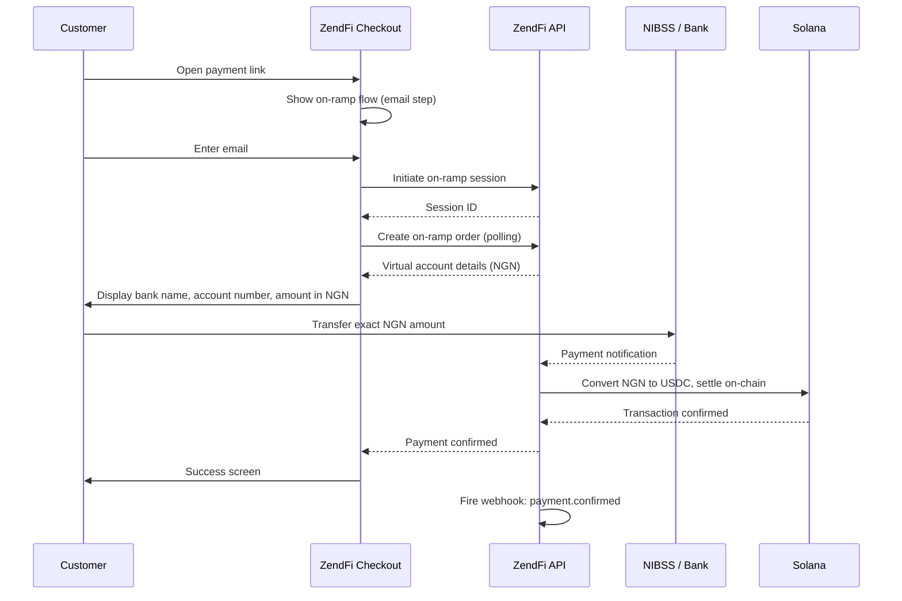
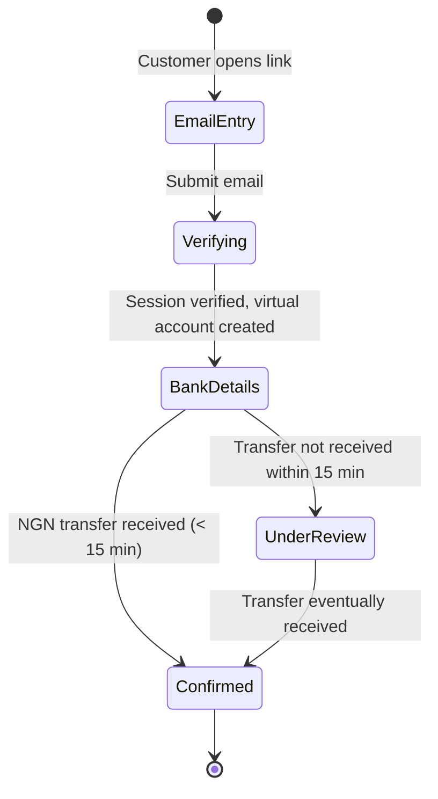

The fiat on-ramp lets customers who do not hold cryptocurrency pay using Nigerian bank transfers (NIBSS). When on-ramp is enabled on a payment link, the checkout flow **defaults to the on-ramp experience** -- customers enter their email, receive a dynamically generated virtual bank account, and complete payment by transferring Naira. ZendFi converts the NGN to crypto and settles to the merchant's wallet.

<Note>
The on-ramp currently supports NIBSS-based bank transfers for Nigerian payers (NGN) only. Support for additional currencies and payment methods is coming soon.
</Note>

## How It Works



## On-Ramp Checkout Flow

When `onramp` is set to `true` on a payment link, the checkout **replaces the standard crypto checkout** with a dedicated on-ramp flow. The customer does not see wallet connect, QR codes, or manual transfer options -- the entire experience is optimized for bank transfers.

### Step-by-Step

<Steps>

<Step title="Email and customer details">
The customer enters their email address. If `collect_customer_info` is enabled on the payment link (via the REST API), additional fields are shown: name, phone, company, and an optional billing address.
</Step>

<Step title="Session initiation and verification">
ZendFi initiates an on-ramp session and performs background OTP verification. The customer stays on the email screen with a loading indicator while this happens (typically a few seconds).
</Step>

<Step title="Bank transfer details">
Once verified, the customer sees a virtual bank account with:
- **Bank name** -- the receiving bank
- **Account name** -- the virtual account holder name
- **Account number** -- a unique account number for this transaction
- **Amount in NGN** -- the exact Naira amount to transfer (including any service charges)

The customer transfers the exact amount using their bank app, USSD, or internet banking. The virtual account expires after 30 minutes.
</Step>

<Step title="Payment confirmation">
ZendFi polls for the incoming bank transfer. Once the NIBSS payment is confirmed, the checkout shows a success screen. If the transfer takes longer than 15 minutes, the checkout moves to an "Under Review" state where the customer is assured their payment is being processed and given support contact details.
</Step>

</Steps>

## Enable On-Ramp

Set `onramp: true` when creating a payment link:

```typescript
const link = await zendfi.createPaymentLink({
  amount: 49.99,
  currency: 'USD',
  description: '12 months of Pro features',
  onramp: true,
});

console.log('Payment link:', link.url);
// Checkout defaults to the NGN bank transfer flow
```

When a customer opens this link, they go straight into the on-ramp flow -- no crypto wallet required.

## Supported Payment Method

| Method | Network | Coverage |
|---|---|---|
| Bank Transfer | NIBSS | All major Nigerian banks |

Customers can pay from any Nigerian bank that supports NIBSS transfers, which covers virtually all commercial banks in Nigeria.

## Currency and Conversion

| Detail | Value |
|---|---|
| Customer pays in | NGN (Nigerian Naira) |
| Amount displayed as | NGN with service charge breakdown |
| Merchant receives | USDC (on Solana) |
| Exchange rate | Market rate at time of payment |

The checkout displays the total amount in Naira, including any applicable service charges. If a service charge applies, the breakdown is shown:

```
₦75,000
₦73,500 + ₦1,500 service fee
```

## Customer Info Collection

When `collect_customer_info` is enabled on the payment link via the REST API, the email step expands to collect additional details:

| Field | Required | Description |
|---|---|---|
| Email | Yes | Receipt and verification |
| Full name | No | Customer's name |
| Phone number | No | Contact number |
| Company | No | Business name |
| Billing address | No | Street, city, state, postal code, country |

This information is submitted to the ZendFi API once the payment is created, and is available in the payment details and webhooks.

## Payment Link Configuration

```typescript
const link = await zendfi.createPaymentLink({
  amount: 99.99,
  currency: 'USD',
  description: 'One-time license purchase',
  onramp: true,
  metadata: {
    product_id: 'prod_enterprise',
    license_type: 'perpetual',
  },
});
```

### Options

| Field | Type | Required | Description |
|---|---|---|---|
| `amount` | `number` | Yes | Payment amount in USD |
| `currency` | `string` | No | Currency code (defaults to USD) |
| `description` | `string` | No | Description shown on checkout |
| `onramp` | `boolean` | No | Enable the on-ramp flow (defaults checkout to bank transfer) |
| `metadata` | `object` | No | Custom key-value metadata |

<Note>
The REST API also supports `collect_customer_info` (boolean) to collect additional customer details (name, phone, address). This field is not available in the SDK type but can be passed via direct API calls.
</Note>

## Webhook Handling

On-ramp payments fire the same webhook events as crypto payments. Your webhook handler does not need any special logic:

```typescript
handlers: {
  'payment.confirmed': async (payment) => {
    // This fires for both crypto and on-ramp payments
    console.log('Payment confirmed:', payment.id);

    // The settlement is always in crypto regardless of payment method
    await fulfillOrder(payment.id);
  },
}
```

## Settlement

Regardless of whether the customer paid with crypto or via the on-ramp, the merchant always receives crypto:

| Customer Pays | Merchant Receives |
|---|---|
| USDC (directly) | USDC |
| NGN bank transfer (via on-ramp) | USDC |
| SOL (directly) | SOL |

The on-ramp handles the NGN-to-USDC conversion. From the merchant's perspective, all payments settle identically.

## API Endpoint

Create payment links with on-ramp enabled via the REST API:

```bash
curl -X POST https://api.zendfi.tech/api/v1/payment-links \
  -H "Authorization: Bearer zfi_test_your_key" \
  -H "Content-Type: application/json" \
  -d '{
    "amount": 49.99,
    "currency": "USD",
    "description": "Pro Plan",
    "onramp": true
  }'
```

## Payment Lifecycle



### Under Review State

If the bank transfer is not confirmed within 15 minutes, the checkout transitions to an "Under Review" screen. This is not a failure -- Nigerian bank transfers can sometimes take longer to process. The screen explains what is happening and provides a support email (dispute@zendfi.tech) with the payment reference pre-filled.

The payment will still be confirmed automatically once the transfer clears. The customer does not need to take any additional action.

## Testing

In test mode (`zfi_test_` key), on-ramp payments use sandbox credentials. No real Naira is transferred.

```bash
# Create a payment link with on-ramp
curl -X POST https://api.zendfi.tech/api/v1/payment-links \
  -H "Authorization: Bearer zfi_test_your_key" \
  -H "Content-Type: application/json" \
  -d '{"amount": 25, "currency": "USD", "description": "Test On-Ramp", "onramp": true}'

# Open the returned URL
# Enter a test email and complete the flow
# The test environment simulates the bank transfer confirmation
```

## Use Cases

### Nigerian SaaS customers

Many Nigerian users do not hold crypto. Enable on-ramp so they can pay with their regular bank account while you still receive USDC settlement:

```typescript
const link = await zendfi.createPaymentLink({
  amount: 29.99,
  currency: 'USD',
  description: 'Pro Plan - Monthly',
  onramp: true,
});
```

### E-commerce for Nigerian buyers

Accept payments from Nigerian customers using the payment method they are most familiar with -- bank transfers:

```typescript
const link = await zendfi.createPaymentLink({
  amount: 15.00,
  currency: 'USD',
  description: 'Order #1234 - Wireless earbuds',
  onramp: true,
});
```

### Donation and fundraising

Accept donations from Nigerian supporters without requiring them to have a crypto wallet:

```typescript
const link = await zendfi.createPaymentLink({
  amount: 10,
  currency: 'USD',
  description: 'Support Our Project - One-time donation',
  onramp: true,
});
```

## Coming Soon

The on-ramp is expanding beyond Nigeria. Planned additions include:

- Additional African currencies (GHS, KES, ZAR)
- Card payments (Visa, Mastercard)
- Mobile money (M-Pesa, MTN MoMo)
- SEPA transfers (EUR)

Check the [changelog](https://docs.zendfi.tech) for updates as new payment methods go live.
