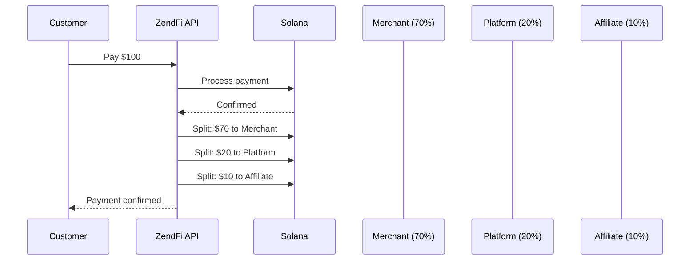

Payment splits let you distribute a single payment across multiple wallets. This is essential for marketplaces, platforms with revenue sharing, and any application where funds need to go to more than one party.

## How Splits Work



When a payment with splits is confirmed, ZendFi automatically distributes the funds to each recipient's wallet according to the split configuration.

## Create a Payment with Splits

Include a `split_recipients` array when creating a payment:

```typescript
const payment = await zendfi.createPayment({
  amount: 100,
  currency: 'USD',
  description: 'Marketplace order #1234',
  split_recipients: [
    {
      recipient_wallet: 'SellerWalletAddress111111111111111111111',
      recipient_name: 'Seller payout',
      percentage: 70,
    },
    {
      recipient_wallet: 'PlatformWalletAddress11111111111111111',
      recipient_name: 'Platform fee',
      percentage: 20,
    },
    {
      recipient_wallet: 'AffiliateWalletAddress1111111111111111',
      recipient_name: 'Affiliate commission',
      percentage: 10,
    },
  ],
});
```

## Split Types

<Tabs>

<Tab title="Percentage">
Each recipient gets a percentage of the total payment. All percentages must sum to 100.

```typescript
split_recipients: [
  { recipient_wallet: '...', recipient_name: 'Seller', percentage: 80 },
  { recipient_wallet: '...', recipient_name: 'Platform', percentage: 20 },
]
```
</Tab>

<Tab title="Fixed Amount">
Each recipient gets a fixed USD amount. The total of all fixed amounts must not exceed the payment amount.

```typescript
split_recipients: [
  { recipient_wallet: '...', recipient_name: 'Platform fee', fixed_amount_usd: 5.00 },
  { recipient_wallet: '...', recipient_name: 'Referral bonus', fixed_amount_usd: 2.50 },
  // Remaining $92.50 goes to the merchant's default wallet
]
```
</Tab>

</Tabs>

## Split Recipient Configuration

Each recipient in the `split_recipients` array accepts:

| Field | Type | Description |
|---|---|---|
| `recipient_wallet` | `string` | Solana wallet address to receive funds (required unless `sub_account_id` is provided) |
| `sub_account_id` | `string` | Sub-account external ID or UUID (routes payout to that sub-account wallet) |
| `recipient_sub_account` | `string` | Alias for `sub_account_id` |
| `recipient_name` | `string` | (Optional) Human-readable label for this recipient |
| `percentage` | `number` | (Optional) Percentage of the payment (0-100) |
| `fixed_amount_usd` | `number` | (Optional) Fixed amount in USD |
| `split_order` | `number` | (Optional) Order in which splits are executed |

If you provide a single split recipient and omit both `percentage` and `fixed_amount_usd`, ZendFi defaults that recipient to 100%.

## Retrieve Splits

### Get all splits for a payment

```typescript
const response = await fetch(
  'https://api.zendfi.tech/api/v1/payments/pay_test_abc123/splits',
  { headers: { Authorization: `Bearer ${apiKey}` } }
);

const splits = await response.json();
```

Response:

```json
{
  "data": [
    {
      "id": "split_abc123",
      "payment_id": "pay_test_abc123",
      "wallet_address": "SellerWallet...",
      "type": "percentage",
      "value": 70,
      "amount": 70.00,
      "label": "Seller payout",
      "status": "completed",
      "transaction_signature": "5K7x..."
    },
    {
      "id": "split_def456",
      "payment_id": "pay_test_abc123",
      "wallet_address": "PlatformWallet...",
      "type": "percentage",
      "value": 20,
      "amount": 20.00,
      "label": "Platform fee",
      "status": "completed",
      "transaction_signature": "8M2n..."
    }
  ]
}
```

### Split Statuses

| Status | Description |
|---|---|
| `pending` | Split is queued, waiting for payment confirmation |
| `processing` | Funds are being transferred to the recipient |
| `completed` | Funds have been delivered to the recipient's wallet |
| `failed` | Split transfer failed (will be retried) |

## Marketplace Example

A complete marketplace flow where sellers list products and the platform takes a commission:

```typescript
// Server-side: create payment when customer checks out
app.post('/api/checkout', async (req, res) => {
  const { productId, sellerId } = req.body;

  // Look up product and seller
  const product = await db.products.findUnique({ where: { id: productId } });
  const seller = await db.sellers.findUnique({ where: { id: sellerId } });

  const PLATFORM_FEE_PERCENT = 15;

  const payment = await zendfi.createPayment({
    amount: product.price,
    currency: 'USD',
    description: `Order: ${product.name}`,
    customer_email: req.user.email,
    split_recipients: [
      {
        recipient_wallet: seller.walletAddress,
        recipient_name: `Seller: ${seller.name}`,
        percentage: 100 - PLATFORM_FEE_PERCENT,
      },
      {
        recipient_wallet: process.env.PLATFORM_WALLET!,
        recipient_name: 'Platform commission',
        percentage: PLATFORM_FEE_PERCENT,
      },
    ],
    metadata: {
      product_id: productId,
      seller_id: sellerId,
      order_type: 'marketplace',
    },
  });

  res.json({ checkout_url: payment.checkout_url });
});
```

## Webhook Events for Splits

When splits are processed, you receive webhook events. Use the `handlers` map:

```typescript
handlers: {
  'split.completed': async (data) => {
    console.log(`Split completed for payment ${data.payment_id}`);
    console.log(`Amount: $${data.amount} to ${data.wallet_address}`);

    // Notify the seller
    await notifySeller(data.wallet_address, {
      amount: data.amount,
      paymentId: data.payment_id,
    });
  },
}
```

## Validation Rules

- **Percentage splits** must sum to exactly 100%.
- **Fixed amount splits** must not exceed the payment amount.
- You can mix percentage and fixed amount splits, but the fixed amounts are deducted first, and the percentage splits are applied to the remainder.
- Each payment can have up to 10 split recipients.
- All wallet addresses must be valid Solana addresses.
- Splits cannot be modified after payment creation.

## Multi-Vendor Cart

For shopping carts with items from multiple sellers:

```typescript
function buildSplits(cartItems: CartItem[], platformFee: number) {
  // Group items by seller
  const sellerTotals = new Map<string, { wallet: string; total: number; name: string }>();

  for (const item of cartItems) {
    const existing = sellerTotals.get(item.sellerId);
    if (existing) {
      existing.total += item.price * item.quantity;
    } else {
      sellerTotals.set(item.sellerId, {
        wallet: item.sellerWallet,
        total: item.price * item.quantity,
        name: item.sellerName,
      });
    }
  }

  const cartTotal = cartItems.reduce((sum, i) => sum + i.price * i.quantity, 0);
  const splits = [];

  // Platform fee as fixed amount
  splits.push({
    recipient_wallet: process.env.PLATFORM_WALLET!,
    recipient_name: 'Platform fee',
    fixed_amount_usd: cartTotal * (platformFee / 100),
  });

  // Each seller gets their portion as fixed amount
  for (const [, seller] of sellerTotals) {
    splits.push({
      recipient_wallet: seller.wallet,
      recipient_name: `Payout: ${seller.name}`,
      fixed_amount_usd: seller.total * (1 - platformFee / 100),
    });
  }

  return splits;
}
```

## Testing Splits

Use the CLI to verify split behavior:

```bash
# Create a test payment (splits are configured via the API, not the CLI)
zendfi payment create --amount 100

# After payment confirmation, check the payment details
zendfi payment status pay_test_abc123
# The output includes split_ids when splits are configured
```

In test mode, splits go to Devnet wallets. Use a Solana explorer like [Solscan](https://solscan.io/?cluster=devnet) (set to Devnet) to verify each split transaction.
