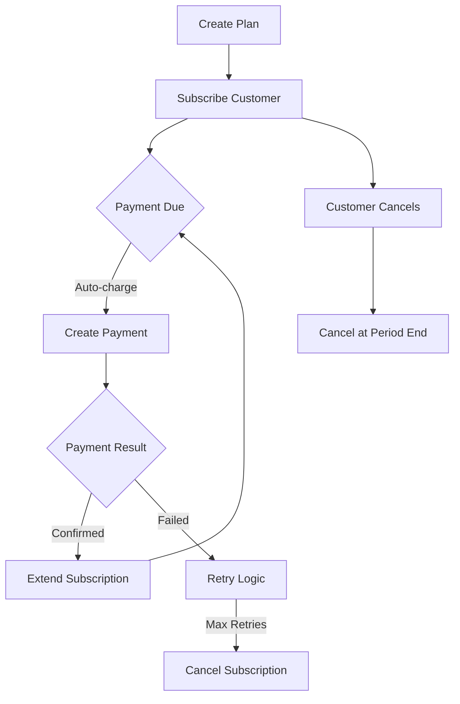
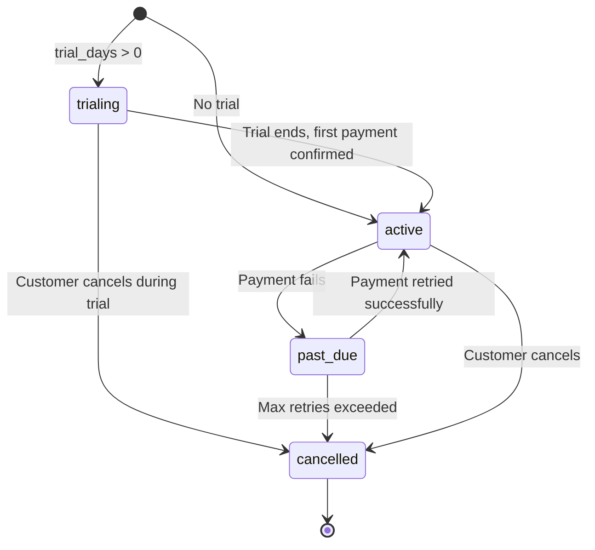

This guide walks through implementing subscription billing with ZendFi. You will create plans, subscribe customers, handle lifecycle events, and manage cancellations.

## Subscription Architecture



## Create a Subscription Plan

Plans define the pricing, billing interval, and trial period. Create them once and reuse for all subscribers.

```typescript
const plan = await zendfi.createSubscriptionPlan({
  name: 'Pro Plan',
  amount: 29.99,
  currency: 'USD',
  interval: 'monthly',
  trial_days: 14,
  metadata: {
    features: 'unlimited-projects,priority-support,api-access',
  },
});

console.log('Plan created:', plan.id);
// plan_test_abc123
```

### Plan Intervals

| Interval | Billing Frequency |
|---|---|
| `daily` | Every day |
| `weekly` | Every 7 days |
| `monthly` | Every calendar month |
| `yearly` | Every 12 months |

### Trial Periods

Set `trial_days` to give customers free access before the first charge:

```typescript
const plan = await zendfi.createSubscriptionPlan({
  name: 'Enterprise',
  amount: 99.99,
  currency: 'USD',
  interval: 'monthly',
  trial_days: 30, // 30-day free trial
});
```

During the trial, the subscription status is `trialing`. No charges are made. When the trial ends, the first payment is created automatically.

## Subscribe a Customer

```typescript
const subscription = await zendfi.createSubscription({
  plan_id: plan.id,
  customer_email: 'alice@example.com',
  metadata: {
    user_id: 'usr_123',
    tier: 'pro',
  },
});

console.log('Subscription:', subscription.id);
console.log('Status:', subscription.status); // 'trialing' or 'active'
```

## Handle Subscription Webhooks

Subscription lifecycle events are delivered via webhooks. Set up handlers for each event to keep your system in sync.

<Tabs>

<Tab title="Next.js">
```typescript app/api/webhooks/zendfi/route.ts
import { createNextWebhookHandler } from '@zendfi/sdk/nextjs';

export const POST = createNextWebhookHandler({
  secret: process.env.ZENDFI_WEBHOOK_SECRET!,
  handlers: {
    'subscription.created': async (data) => {
      await db.users.update({
        where: { email: data.customer_email },
        data: {
          subscriptionId: data.id,
          plan: data.plan_id,
          status: 'active',
        },
      });
    },

    'subscription.canceled': async (data) => {
      await db.users.update({
        where: { subscriptionId: data.id },
        data: { status: 'cancelled', accessUntil: data.current_period_end },
      });
    },

    'payment.confirmed': async (payment) => {
      // Renewal payment confirmed
      if (payment.metadata?.subscription_id) {
        await db.subscriptions.update({
          where: { id: payment.metadata.subscription_id },
          data: { lastPaymentAt: new Date() },
        });
      }
    },

    'payment.failed': async (payment) => {
      // Renewal payment failed
      if (payment.metadata?.subscription_id) {
        await notifyCustomer(payment.customer_email, {
          subject: 'Payment failed - please update your payment method',
          subscriptionId: payment.metadata.subscription_id,
        });
      }
    },
  },
});
```
</Tab>

<Tab title="Express">
```typescript src/routes/webhooks.ts
import { createExpressWebhookHandler } from '@zendfi/sdk/express';

app.post('/api/webhooks/zendfi',
  createExpressWebhookHandler({
    secret: process.env.ZENDFI_WEBHOOK_SECRET!,
    handlers: {
      'subscription.created': async (data) => {
        await db.users.update({
          where: { email: data.customer_email },
          data: { subscriptionId: data.id, status: 'active' },
        });
      },

      'subscription.canceled': async (data) => {
        await db.users.update({
          where: { subscriptionId: data.id },
          data: { status: 'cancelled' },
        });
      },
    },
  })
);
```
</Tab>

</Tabs>

## Subscription Lifecycle



### Status Reference

| Status | Description |
|---|---|
| `trialing` | Customer is in a free trial period |
| `active` | Subscription is active with a valid payment |
| `past_due` | Most recent payment failed, retries pending |
| `cancelled` | Subscription has been cancelled |

## Cancellation

### Cancel immediately

```typescript
const cancelled = await zendfi.cancelSubscription(subscription.id);
console.log('Cancelled:', cancelled.status); // 'cancelled'
```

### Cancel at period end

To let the customer keep access until the end of their current billing period, handle this in your application logic:

```typescript
// Mark for cancellation but keep active until period ends
await db.subscriptions.update({
  where: { id: subscription.id },
  data: {
    cancelAtPeriodEnd: true,
  },
});

// In your cron job or webhook handler, cancel when period ends
if (subscription.cancelAtPeriodEnd && new Date() >= subscription.currentPeriodEnd) {
  await zendfi.cancelSubscription(subscription.id);
}
```

## Access Control Middleware

Gate features based on subscription status:

<Tabs>

<Tab title="Next.js Middleware">
```typescript middleware.ts
import { NextResponse } from 'next/server';
import type { NextRequest } from 'next/server';

export function middleware(request: NextRequest) {
  const subscription = JSON.parse(
    request.cookies.get('subscription')?.value || '{}'
  );

  if (request.nextUrl.pathname.startsWith('/dashboard')) {
    if (!subscription.active) {
      return NextResponse.redirect(new URL('/pricing', request.url));
    }
  }

  return NextResponse.next();
}
```
</Tab>

<Tab title="Express Middleware">
```typescript
function requireSubscription(req, res, next) {
  const user = req.user;

  if (!user?.subscriptionId || user.status !== 'active') {
    return res.status(403).json({
      error: 'subscription_required',
      message: 'An active subscription is required',
      upgrade_url: '/pricing',
    });
  }

  next();
}

// Apply to protected routes
app.use('/api/pro-features', requireSubscription);
```
</Tab>

</Tabs>

## Pricing Page Example

Build a pricing page that links to subscription checkout:

```tsx
const plans = [
  { id: 'plan_starter', name: 'Starter', price: 9.99, features: ['5 projects', 'Email support'] },
  { id: 'plan_pro', name: 'Pro', price: 29.99, features: ['Unlimited projects', 'Priority support', 'API access'] },
  { id: 'plan_enterprise', name: 'Enterprise', price: 99.99, features: ['Everything in Pro', 'SSO', 'Dedicated account manager'] },
];

export default function PricingPage() {
  return (
    <div className="grid grid-cols-3 gap-8">
      {plans.map((plan) => (
        <div key={plan.id} className="border rounded-xl p-6">
          <h3>{plan.name}</h3>
          <p className="text-3xl font-bold">${plan.price}/mo</p>
          <ul>
            {plan.features.map((f) => (
              <li key={f}>{f}</li>
            ))}
          </ul>
          <form action={`/api/subscribe`} method="POST">
            <input type="hidden" name="plan_id" value={plan.id} />
            <button type="submit">Subscribe</button>
          </form>
        </div>
      ))}
    </div>
  );
}
```

## Testing

```bash
# Create a test subscription plan
zendfi intents create --amount 29.99 --description "Pro Plan Test"

# Start webhook listener
zendfi webhooks --forward-to http://localhost:3000/api/webhooks/zendfi

# Monitor events in real time
```

Use test mode (`zfi_test_` key) to simulate the full subscription lifecycle without real charges. Test keys work against Solana Devnet where transactions are free.
