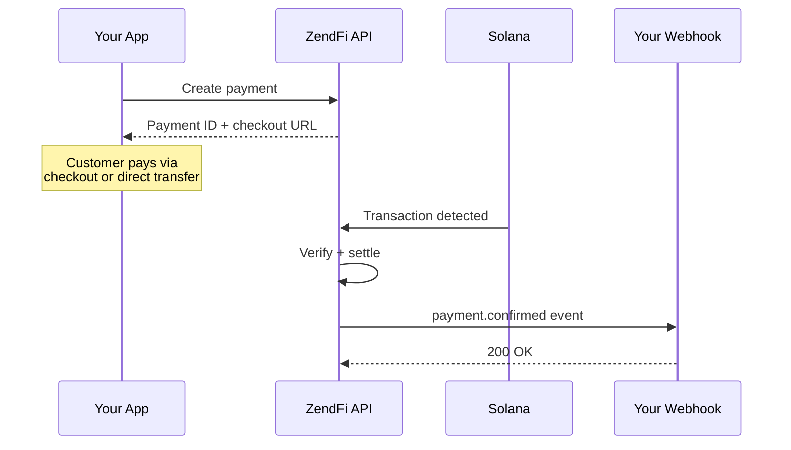

# Welcome to ZendFi

ZendFi is a payment infrastructure platform built on Solana. It gives you everything you need to accept stablecoin and token payments -- subscriptions, invoices, installment plans, payment links, embedded checkout, and more -- through a single, clean API.

No wallet custody. No smart contract deployments. No blockchain plumbing.

You write `createPayment({ amount: 50 })`, and ZendFi handles the rest.

<CardGroup cols={2}>
  <Card title="Quickstart" icon="bolt" href="/quickstart">
    Go from zero to accepting payments in under five minutes.
  </Card>
  <Card title="API Reference" icon="code" href="/api-reference/overview">
    Full endpoint documentation with request/response examples.
  </Card>
  <Card title="SDK Reference" icon="cube" href="/sdk/overview">
    TypeScript SDK with zero-config setup and type-safe helpers.
  </Card>
  <Card title="CLI" icon="terminal" href="/cli/overview">
    Scaffold projects, test payments, and manage keys from your terminal.
  </Card>
</CardGroup>

## What You Can Build

<CardGroup cols={3}>
  <Card title="One-Time Payments" icon="credit-card">
    Accept USDC, USDT, or SOL with automatic settlement to your wallet.
  </Card>
  <Card title="Subscriptions" icon="rotate">
    Recurring billing with configurable intervals, trial periods, and automated collection.
  </Card>
  <Card title="Payment Links" icon="link">
    Shareable checkout URLs with hosted pages -- no frontend required.
  </Card>
  <Card title="Invoices" icon="file-invoice">
    Professional invoicing with email delivery and payment tracking.
  </Card>
  <Card title="Installment Plans" icon="calendar-check">
    Split purchases into scheduled payments with automatic reminders.
  </Card>
  <Card title="Payment Splits" icon="arrows-split-up-and-left">
    Route funds to multiple recipients in a single transaction. Perfect for marketplaces.
  </Card>
</CardGroup>

## How It Works

At a high level, every ZendFi payment follows this flow:



1. Your application creates a payment through the API or SDK.
2. The customer completes payment via the hosted checkout, embedded checkout, or a direct Solana transfer.
3. ZendFi monitors the blockchain, verifies the transaction, and settles funds to your merchant wallet.
4. Your webhook endpoint receives a `payment.confirmed` event so you can fulfill the order.

## Core Principles

**Non-custodial by default.** ZendFi never holds your funds. Payments settle directly to your Solana wallet. You maintain full control of your keys.

**Test and live modes.** Every API key is scoped to either `test` (Solana devnet) or `live` (Solana mainnet). Switch between them by swapping your API key -- the code stays the same.

**Gasless transactions.** Customers can pay without holding SOL for gas fees. ZendFi sponsors the transaction fees so your checkout flow is frictionless.

**Idempotent by design.** The SDK automatically generates idempotency keys for write operations. Retries are safe by default.

## Quick Example

<CodeGroup>

```typescript Next.js
import { zendfi } from '@zendfi/sdk';

const payment = await zendfi.createPayment({
  amount: 50,
  description: 'Pro Plan - Monthly',
  customer_email: 'customer@example.com',
});

// Redirect to hosted checkout
redirect(payment.payment_url);
```

```typescript Express
import { zendfi } from '@zendfi/sdk';

app.post('/api/checkout', async (req, res) => {
  const payment = await zendfi.createPayment({
    amount: req.body.amount,
    description: req.body.description,
  });

  res.json({ checkout_url: payment.payment_url });
});
```

```bash cURL
curl -X POST https://api.zendfi.tech/api/v1/payments \
  -H "Authorization: Bearer zfi_test_your_key" \
  -H "Content-Type: application/json" \
  -d '{
    "amount": 50,
    "currency": "USD",
    "description": "Pro Plan - Monthly"
  }'
```

</CodeGroup>

## Next Steps

<Steps>
  <Step title="Get your API keys">
    Sign up at [dashboard.zendfi.tech](https://dashboard.zendfi.tech) and grab your test key. It starts with `zfi_test_`.
  </Step>
  <Step title="Follow the quickstart">
    The [Quickstart guide](/quickstart) walks you through a complete integration in under five minutes.
  </Step>
  <Step title="Set up webhooks">
    Configure a webhook endpoint to receive real-time payment notifications. See the [Webhooks guide](/api-reference/webhooks).
  </Step>
  <Step title="Go live">
    Swap your test key for a live key (`zfi_live_`), and you are processing real payments on Solana mainnet.
  </Step>
</Steps>
