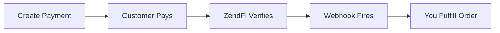

# Quickstart

This guide takes you from zero to a working payment integration. By the end, you will have created a test payment and received a webhook confirmation.

## Prerequisites

- Node.js 18 or later
- A ZendFi account ([sign up here](https://dashboard.zendfi.tech))
- Your test API key (starts with `zfi_test_`)

## Option A: Add to an Existing Project

If you already have a Next.js or Express project, the fastest path is the CLI:

```bash
npx @zendfi/cli init
```

This auto-detects your framework, installs the SDK, and scaffolds the necessary files. Skip to [Step 3](#step-3-create-a-payment) if you go this route.

## Option B: Start from Scratch

### Step 1: Create a New Project

<CodeGroup>

```bash Next.js E-commerce
npx create-zendfi-app my-store --template nextjs-ecommerce
cd my-store
```

```bash Next.js SaaS
npx create-zendfi-app my-saas --template nextjs-saas
cd my-saas
```

```bash Express API
npx create-zendfi-app my-api --template express-api
cd my-api
```

</CodeGroup>

### Step 2: Configure Your API Key

Add your test API key to the `.env` file:

```bash .env
ZENDFI_API_KEY=zfi_test_your_key_here
ZENDFI_WEBHOOK_SECRET=your_webhook_secret_here
```

<Note>
Test keys route all transactions to Solana devnet. No real money is involved. You can generate a test key from your [dashboard](https://dashboard.zendfi.tech).
</Note>

### Step 3: Create a Payment

<Tabs>
  <Tab title="TypeScript (SDK)">
    ```typescript
    import { ZendFiClient } from '@zendfi/sdk';

    const zendfi = new ZendFiClient({
      apiKey: process.env.ZENDFI_API_KEY,
    });

    const payment = await zendfi.createPayment({
      amount: 25.00,
      description: 'Quickstart test payment',
      customer_email: 'test@example.com',
    });

    console.log('Payment ID:', payment.id);
    console.log('Checkout URL:', payment.payment_url);
    ```
  </Tab>
  <Tab title="cURL">
    ```bash
    curl -X POST https://api.zendfi.tech/api/v1/payments \
      -H "Authorization: Bearer zfi_test_your_key" \
      -H "Content-Type: application/json" \
      -d '{
        "amount": 25.00,
        "currency": "USD",
        "description": "Quickstart test payment",
        "customer_email": "test@example.com"
      }'
    ```
  </Tab>
  <Tab title="CLI">
    ```bash
    export ZENDFI_API_KEY=zfi_test_your_key
    npx @zendfi/cli payment create --amount 25 --description "Quickstart test"
    ```
  </Tab>
</Tabs>

The response includes a `payment_url` -- open it in your browser to see the hosted checkout page.

### Step 4: Complete the Payment

Open the checkout URL in your browser. You will see ZendFi's hosted checkout page with:

- The payment amount and description
- A QR code for Solana wallet apps
- A wallet address for direct transfers
- A countdown timer showing when the payment expires

Connect a devnet-funded wallet (like Phantom set to devnet) and complete the payment.

<Tip>
Need devnet SOL or USDC? Use the [Solana faucet](https://faucet.solana.com) for SOL, then swap for devnet USDC.
</Tip>

### Step 5: Handle Webhooks

When the payment confirms on-chain, ZendFi sends a webhook to your configured endpoint.

<Tabs>
  <Tab title="Next.js (App Router)">
    ```typescript app/api/webhooks/zendfi/route.ts
    import { createNextWebhookHandler } from '@zendfi/sdk/nextjs';

    export const POST = createNextWebhookHandler({
      secret: process.env.ZENDFI_WEBHOOK_SECRET!,
      handlers: {
        'payment.confirmed': async (payment) => {
          console.log('Payment confirmed:', payment.id);
          // Fulfill the order, send confirmation email, etc.
        },
        'payment.failed': async (payment) => {
          console.log('Payment failed:', payment.id);
        },
      },
    });
    ```
  </Tab>
  <Tab title="Express">
    ```typescript src/routes/webhooks.ts
    import express from 'express';
    import { createExpressWebhookHandler } from '@zendfi/sdk/express';

    const router = express.Router();

    router.post('/zendfi',
      express.raw({ type: 'application/json' }),
      createExpressWebhookHandler({
        secret: process.env.ZENDFI_WEBHOOK_SECRET!,
        handlers: {
          'payment.confirmed': async (payment) => {
            console.log('Payment confirmed:', payment.id);
          },
          'payment.failed': async (payment) => {
            console.log('Payment failed:', payment.id);
          },
        },
      })
    );

    export default router;
    ```
  </Tab>
</Tabs>

### Step 6: Test Webhooks Locally

Use the CLI to create a tunnel and forward webhooks to your local server:

```bash
npx @zendfi/cli webhooks --port 3000
```

This starts a local server, creates a public tunnel (via ngrok or Cloudflare), and gives you a URL to configure as your webhook endpoint in the dashboard.

## What Happens Next



Once you are comfortable with test mode:

1. [Set up webhook security](/security/webhooks) to verify signatures in production.
2. [Switch to live mode](/environments) by using a `zfi_live_` API key.
3. Explore [subscriptions](/api-reference/subscriptions), [invoices](/api-reference/invoices), and [payment links](/api-reference/payment-links) for more advanced flows.

## Explore Further

<CardGroup cols={2}>
  <Card title="Full API Reference" icon="code" href="/api-reference/overview">
    Every endpoint, parameter, and response field documented.
  </Card>
  <Card title="SDK Reference" icon="cube" href="/sdk/overview">
    Type-safe client with auto-retries, interceptors, and embedded checkout.
  </Card>
  <Card title="Next.js Guide" icon="react" href="/guides/nextjs">
    Complete integration walkthrough for Next.js App Router.
  </Card>
  <Card title="Express Guide" icon="node-js" href="/guides/express">
    Build a payment API with Express and the ZendFi SDK.
  </Card>
</CardGroup>
