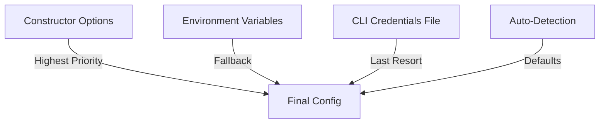

# Configuration

The SDK uses a layered configuration system that prioritizes explicit options, falls back to environment variables, and auto-detects everything it can.

## Configuration Hierarchy



## Environment Variables

| Variable | Description |
|----------|-------------|
| `ZENDFI_API_KEY` | Primary API key (server-side) |
| `NEXT_PUBLIC_ZENDFI_API_KEY` | Next.js public API key |
| `REACT_APP_ZENDFI_API_KEY` | Create React App API key |
| `ZENDFI_API_URL` | Custom API base URL |
| `ZENDFI_ENVIRONMENT` | Force environment (`development` / `staging` / `production`) |
| `NEXT_PUBLIC_ZENDFI_ENVIRONMENT` | Next.js environment override |

## Auto-Detection

### Mode Detection

Mode is determined from the API key prefix:

```typescript
'zfi_test_...' → mode: 'test' → Solana Devnet
'zfi_live_...' → mode: 'live' → Solana Mainnet
```

### Environment Detection

The SDK checks these signals in order:

1. `ZENDFI_ENVIRONMENT` env var
2. `NODE_ENV` value (`production` / `staging` / `development`)
3. Browser hostname (`localhost` = development, `.vercel.app` = staging)
4. Falls back to `development`

### Safety Warnings

The SDK prints warnings for dangerous mode/environment mismatches:

```
Warning: Using a live API key (zfi_live_) in development environment. 
This will create real mainnet transactions.

Warning: Using a test API key (zfi_test_) in production environment. 
This will create devnet transactions only.
```

## CLI Credentials

If you ran `zendfi init`, the SDK loads your key from `~/.zendfi/credentials.json`:

```json
{
  "apiKey": "zfi_test_abc123...",
  "merchantId": "merch_xyz789"
}
```

This means you can use the SDK without any configuration in projects that have been initialized with the CLI:

```typescript
import { zendfi } from '@zendfi/sdk';

// Just works, no apiKey needed
const payment = await zendfi.createPayment({ amount: 10 });
```

## Full Config Reference

```typescript
const zendfi = new ZendFiClient({
  // Authentication
  apiKey: 'zfi_test_...',

  // API endpoint
  baseURL: 'https://api.zendfi.tech',

  // Environment
  environment: 'production',
  mode: 'live',

  // HTTP behavior
  timeout: 30000,           // 30 seconds
  retries: 3,               // retry 5xx errors
  idempotencyEnabled: true, // auto-generate idempotency keys

  // Debug
  debug: false,             // log all requests
});
```

## Default Values

| Option | Default | Source |
|--------|---------|--------|
| `apiKey` | - | Env var or CLI config |
| `baseURL` | `https://api.zendfi.tech` | `ZENDFI_API_URL` or hardcoded |
| `environment` | Auto-detected | `NODE_ENV` or hostname |
| `mode` | Auto-detected | API key prefix |
| `timeout` | `30000` | Hardcoded |
| `retries` | `3` | Hardcoded |
| `idempotencyEnabled` | `true` | Hardcoded |
| `debug` | `false` | Hardcoded |
