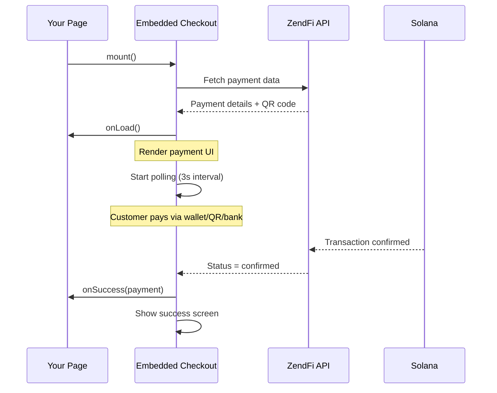

# Embedded Checkout

`ZendFiEmbeddedCheckout` renders a complete payment flow directly inside your page. It supports wallet connect (Phantom, Solflare, Backpack), QR code payments, and fiat bank transfers. No iframe, no redirect -- it is a native DOM component.

## Quick Start

```typescript
import { ZendFiEmbeddedCheckout } from '@zendfi/sdk';

const checkout = new ZendFiEmbeddedCheckout({
  linkCode: 'abc123xyz',
  containerId: 'checkout-container',
  mode: 'test',
  onSuccess: (payment) => {
    console.log('Paid!', payment.transactionSignature);
  },
  onError: (error) => {
    console.error('Failed:', error.message);
  },
});

checkout.mount();
```

```html
<div id="checkout-container"></div>
```

## Configuration

### EmbeddedCheckoutConfig

<ParamField body="linkCode" type="string">
  Payment link code. Either `linkCode` or `paymentId` is required.
</ParamField>

<ParamField body="paymentId" type="string">
  Payment ID. Either `linkCode` or `paymentId` is required.
</ParamField>

<ParamField body="containerId" type="string" required>
  ID of the HTML element where the checkout will be mounted.
</ParamField>

<ParamField body="mode" type="string" default="test">
  `test` (Devnet) or `live` (Mainnet).
</ParamField>

<ParamField body="apiUrl" type="string" default="https://api.zendfi.tech">
  Custom API URL. Defaults to localhost:8080 in development.
</ParamField>

<ParamField body="onSuccess" type="function">
  Called when the payment is confirmed on-chain.

  ```typescript
  onSuccess: (payment: PaymentSuccessData) => void
  ```
</ParamField>

<ParamField body="onError" type="function">
  Called when any error occurs during checkout.

  ```typescript
  onError: (error: CheckoutError) => void
  ```
</ParamField>

<ParamField body="onLoad" type="function">
  Called when the checkout UI is fully loaded.
</ParamField>

<ParamField body="theme" type="CheckoutTheme">
  Custom theme overrides.
</ParamField>

<ParamField body="allowCustomAmount" type="boolean" default="false">
  Enable "Pay What You Want" mode.
</ParamField>

<ParamField body="paymentMethods" type="object">
  Show or hide specific payment methods.

  ```typescript
  paymentMethods: {
    walletConnect: true,   // Phantom, Solflare, etc.
    qrCode: true,          // Solana Pay QR code
    solanaWallet: true,     // Manual address entry
    bank: true,             // Fiat bank transfer (NGN)
  }
  ```
</ParamField>

---

## Theming

Customize the look and feel:

```typescript
const checkout = new ZendFiEmbeddedCheckout({
  linkCode: 'abc123xyz',
  containerId: 'checkout',
  theme: {
    primaryColor: '#667eea',
    backgroundColor: '#ffffff',
    borderRadius: '12px',
    fontFamily: 'Inter, sans-serif',
    textColor: '#1a1a1a',
    buttonStyle: 'solid', // 'solid' | 'outlined' | 'minimal'
  },
});
```

### CheckoutTheme

| Property | Type | Default |
|----------|------|---------|
| `primaryColor` | `string` | `#667eea` |
| `backgroundColor` | `string` | `#ffffff` |
| `borderRadius` | `string` | `12px` |
| `fontFamily` | `string` | System font stack |
| `textColor` | `string` | `#1a1a1a` |
| `buttonStyle` | `string` | `solid` |

---

## Callback Data

### PaymentSuccessData

```typescript
interface PaymentSuccessData {
  paymentId: string;
  transactionSignature: string;
  amount: number;
  token: string;
  merchantName: string;
}
```

### CheckoutError

```typescript
interface CheckoutError {
  code: string;
  message: string;
  details?: any;
}
```

---

## Methods

### mount()

Renders the checkout UI into the container element. Fetches payment data, renders the form, and starts polling for payment confirmation.

```typescript
await checkout.mount();
```

### unmount()

Removes the checkout UI and stops all polling.

```typescript
checkout.unmount();
```

---

## Payment Flow



## Payment Methods

The checkout automatically detects available payment methods:

<CardGroup cols={2}>
  <Card title="Wallet Connect" icon="wallet">
    Auto-detects Phantom, Solflare, Backpack, Coinbase, and Trust wallet extensions.
  </Card>
  <Card title="QR Code" icon="qrcode">
    Displays a Solana Pay-compatible QR code for mobile wallets.
  </Card>
  <Card title="Manual Transfer" icon="paper-plane">
    Shows the payment address for direct wallet transfers.
  </Card>
  <Card title="Bank Transfer" icon="building-columns">
    Fiat on-ramp via NGN bank transfer (when `onramp` is enabled on the payment link).
  </Card>
</CardGroup>

## Browser Usage (CDN)

For non-bundled environments, import from a CDN:

```html
<script type="module">
  import { ZendFiClient, ZendFiEmbeddedCheckout } from 'https://esm.sh/@zendfi/sdk';

  const client = new ZendFiClient({ apiKey: 'zfi_test_...' });

  const link = await client.createPaymentLink({
    amount: 10.00,
    description: 'Test Payment',
  });

  const checkout = new ZendFiEmbeddedCheckout({
    linkCode: link.link_code,
    containerId: 'checkout',
    onSuccess: (payment) => alert('Paid!'),
  });

  checkout.mount();
</script>

<div id="checkout"></div>
```
