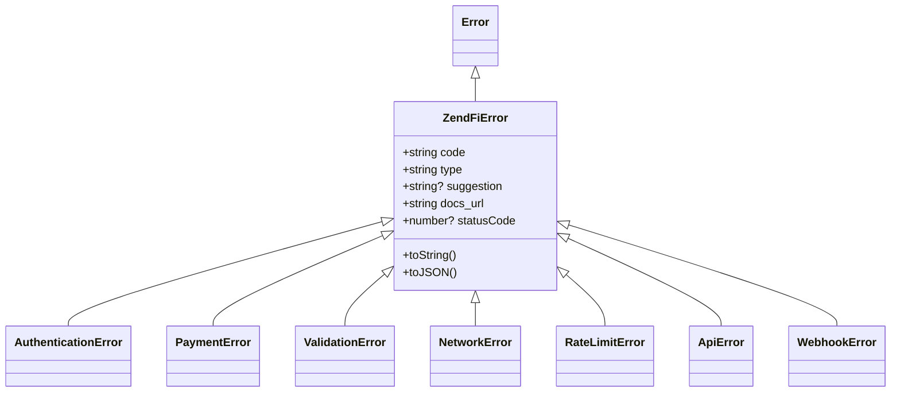

# Error Handling

The SDK throws structured error objects with error codes, suggestions, and documentation links. Every error extends `ZendFiError` and can be caught with standard try/catch.

## Error Hierarchy



## Error Properties

Every `ZendFiError` includes:

| Property | Type | Description |
|----------|------|-------------|
| `code` | `string` | Machine-readable error code |
| `type` | `string` | Error category |
| `message` | `string` | Human-readable description |
| `suggestion` | `string?` | Actionable fix recommendation |
| `docs_url` | `string` | Link to error documentation |
| `statusCode` | `number?` | HTTP status code (0 for network errors) |
| `response` | `unknown` | Raw API response body |

## Error Types

### AuthenticationError

Thrown when the API key is invalid, expired, or revoked.

```typescript
try {
  await zendfi.createPayment({ amount: 10 });
} catch (error) {
  if (error instanceof AuthenticationError) {
    // error.code: 'authentication_failed'
    // error.statusCode: 401
    // error.suggestion: 'Check your API key in the dashboard...'
    console.error(error.toString());
  }
}
```

### PaymentError

Thrown for payment-specific issues like insufficient balance or declined transactions.

```typescript
// error.code: 'payment_failed' | 'insufficient_balance' | 'payment_declined'
// error.statusCode: 400 | 402
```

### ValidationError

Thrown when request parameters are invalid.

```typescript
// error.code: 'validation_failed' | 'missing_required_field' | 'invalid_parameter'
// error.statusCode: 400
```

### NetworkError

Thrown for connection failures, timeouts, and server errors.

```typescript
// error.code: 'network_error' | 'timeout'
// error.statusCode: 0 (client-side) or 500+ (server-side)
```

### RateLimitError

Thrown when you exceed the API rate limits.

```typescript
// error.code: 'rate_limit_exceeded'
// error.statusCode: 429
// error.suggestion: 'Wait 42 seconds before retrying'
```

### WebhookError

Thrown during webhook signature verification failures.

```typescript
// error.code: 'webhook_signature_invalid' | 'webhook_timestamp_too_old'
// error.statusCode: 400
```

---

## Handling Patterns

### Catch Specific Errors

```typescript
import {
  ZendFiError,
  AuthenticationError,
  PaymentError,
  RateLimitError,
  isZendFiError,
} from '@zendfi/sdk';

try {
  const payment = await zendfi.createPayment({ amount: 49.99 });
} catch (error) {
  if (error instanceof AuthenticationError) {
    // Re-authenticate or alert the admin
    console.error('API key issue:', error.suggestion);
  } else if (error instanceof RateLimitError) {
    // Back off and retry
    console.warn('Rate limited:', error.suggestion);
  } else if (error instanceof PaymentError) {
    // Show customer-friendly message
    console.error('Payment failed:', error.message);
  } else if (isZendFiError(error)) {
    // Generic ZendFi error
    console.error(`[${error.code}] ${error.message}`);
  } else {
    // Non-ZendFi error
    throw error;
  }
}
```

### Type Guard

Use `isZendFiError()` to check if any error is a ZendFi error:

```typescript
import { isZendFiError } from '@zendfi/sdk';

try {
  await zendfi.createPayment({ amount: 10 });
} catch (error) {
  if (isZendFiError(error)) {
    console.log(error.code);       // 'payment_failed'
    console.log(error.docs_url);   // 'https://docs.zendfi.com/errors/payment_failed'
    console.log(error.toJSON());   // structured JSON
  }
}
```

### Error Display

The `toString()` method formats errors with suggestions and docs links:

```typescript
try {
  await zendfi.createPayment({ amount: -1 });
} catch (error) {
  console.error(error.toString());
}
// Output:
// [validation_failed] Amount must be positive
// Suggestion: Provide a positive number for the amount field
// Docs: https://docs.zendfi.com/errors/validation_failed
```

---

## Error Codes Reference

| Code | Type | Description |
|------|------|-------------|
| `invalid_api_key` | Authentication | API key not recognized |
| `api_key_expired` | Authentication | API key has expired |
| `api_key_revoked` | Authentication | API key was revoked |
| `insufficient_balance` | Payment | Wallet balance too low |
| `payment_declined` | Payment | Payment was rejected |
| `payment_expired` | Payment | Payment window elapsed |
| `invalid_amount` | Validation | Amount is invalid |
| `invalid_currency` | Validation | Currency not supported |
| `missing_required_field` | Validation | Required field not provided |
| `invalid_parameter` | Validation | Parameter value invalid |
| `network_error` | Network | Connection failed |
| `timeout` | Network | Request timed out |
| `rate_limit_exceeded` | Rate Limit | Too many requests |
| `webhook_signature_invalid` | Webhook | HMAC signature mismatch |
| `webhook_timestamp_too_old` | Webhook | Signature expired (>5 min) |

## Automatic Retries

The SDK retries automatically for transient errors:

- **5xx server errors**: Retried up to `config.retries` times
- **Network failures**: Retried with exponential backoff
- **4xx client errors**: Never retried

The backoff formula is $2^n \times 1000$ ms, where $n$ is the attempt number.

---

## Utility Exports

### `createZendFiError()`

Factory function that creates the appropriate error subclass based on HTTP status code:

```typescript
import { createZendFiError } from '@zendfi/sdk';

const error = createZendFiError(401, { message: 'Invalid key' });
// Returns an AuthenticationError

const error2 = createZendFiError(429, { retry_after: 30 });
// Returns a RateLimitError with suggestion "Wait 30 seconds before retrying"
```

Mapping:

| Status Code | Error Class |
|-------------|-------------|
| 401 | `AuthenticationError` |
| 429 | `RateLimitError` |
| 400, 422 | `ValidationError` |
| 402 | `PaymentError` |
| 0, 500+ | `NetworkError` |
| Other | `ApiError` |

### `ERROR_CODES`

Const object mapping all SDK error code strings:

```typescript
import { ERROR_CODES } from '@zendfi/sdk';

ERROR_CODES.INVALID_API_KEY;       // 'invalid_api_key'
ERROR_CODES.RATE_LIMIT_EXCEEDED;   // 'rate_limit_exceeded'
ERROR_CODES.PAYMENT_DECLINED;      // 'payment_declined'
ERROR_CODES.WEBHOOK_SIGNATURE_INVALID; // 'webhook_signature_invalid'
```

### Types

```typescript
import type { ZendFiErrorType, ZendFiErrorData } from '@zendfi/sdk';

// ZendFiErrorType:
// 'authentication_error' | 'payment_error' | 'validation_error'
// | 'network_error' | 'rate_limit_error' | 'api_error'
// | 'webhook_error' | 'unknown_error'

// ZendFiErrorData: Constructor input for ZendFiError
interface ZendFiErrorData {
  code: string;
  message: string;
  type: ZendFiErrorType;
  suggestion?: string;
  statusCode?: number;
  response?: unknown;
}
```
