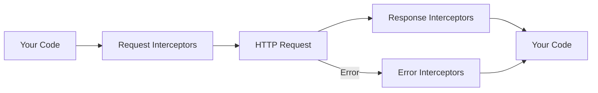

# Interceptors

Interceptors let you hook into the request/response lifecycle to add logging, inject headers, transform data, or handle errors globally. The API is inspired by Axios interceptors.

## Overview



The SDK exposes three interceptor chains:

| Chain | When | Use Case |
|-------|------|----------|
| `request` | Before every HTTP request | Add headers, log requests, transform payloads |
| `response` | After every successful response | Transform data, log responses, collect metrics |
| `error` | After every failed request | Global error handling, reporting, retry logic |

## Request Interceptors

Add custom headers or log outgoing requests:

```typescript
const zendfi = new ZendFiClient({ apiKey: 'zfi_test_...' });

// Add a correlation ID to every request
const id = zendfi.interceptors.request.use((config) => {
  config.headers['X-Correlation-ID'] = crypto.randomUUID();
  return config;
});

// Log all outgoing requests
zendfi.interceptors.request.use((config) => {
  console.log(`>> ${config.method} ${config.url}`);
  return config;
});
```

### RequestConfig Shape

```typescript
interface RequestConfig {
  method: string;
  url: string;
  headers: Record<string, string>;
  body?: any;
}
```

## Response Interceptors

Transform or log successful responses:

```typescript
// Collect timing metrics
zendfi.interceptors.response.use((response) => {
  metrics.recordApiLatency(response.config.url, Date.now());
  return response;
});

// Unwrap nested data
zendfi.interceptors.response.use((response) => {
  if (response.data?.data) {
    response.data = response.data.data;
  }
  return response;
});
```

### ResponseData Shape

```typescript
interface ResponseData {
  status: number;
  statusText: string;
  headers: Record<string, string>;
  data: any;
  config: RequestConfig;
}
```

## Error Interceptors

Handle errors globally before they reach your catch blocks:

```typescript
// Report all errors to your monitoring service
zendfi.interceptors.error.use((error) => {
  Sentry.captureException(error);
  return error; // must return the error
});

// Transform error messages
zendfi.interceptors.error.use((error) => {
  if (error instanceof AuthenticationError) {
    error.message = 'Please check your API key in Settings';
  }
  return error;
});
```

## Managing Interceptors

### Remove an Interceptor

The `use()` method returns an ID you can pass to `eject()`:

```typescript
const interceptorId = zendfi.interceptors.request.use((config) => {
  // ...
  return config;
});

// Later, remove it
zendfi.interceptors.request.eject(interceptorId);
```

### Clear All Interceptors

```typescript
zendfi.interceptors.request.clear();
zendfi.interceptors.response.clear();
zendfi.interceptors.error.clear();
```

### Check If Any Are Registered

```typescript
if (zendfi.interceptors.request.has()) {
  console.log('Request interceptors are active');
}
```

## Execution Order

Interceptors execute in the order they are registered:

```typescript
zendfi.interceptors.request.use((config) => {
  console.log('First');
  return config;
});

zendfi.interceptors.request.use((config) => {
  console.log('Second');
  return config;
});

// Output: "First", then "Second"
```

## Async Interceptors

Interceptors can be async. Each interceptor waits for the previous one to resolve:

```typescript
zendfi.interceptors.request.use(async (config) => {
  const token = await getServiceToken();
  config.headers['X-Service-Token'] = token;
  return config;
});
```
