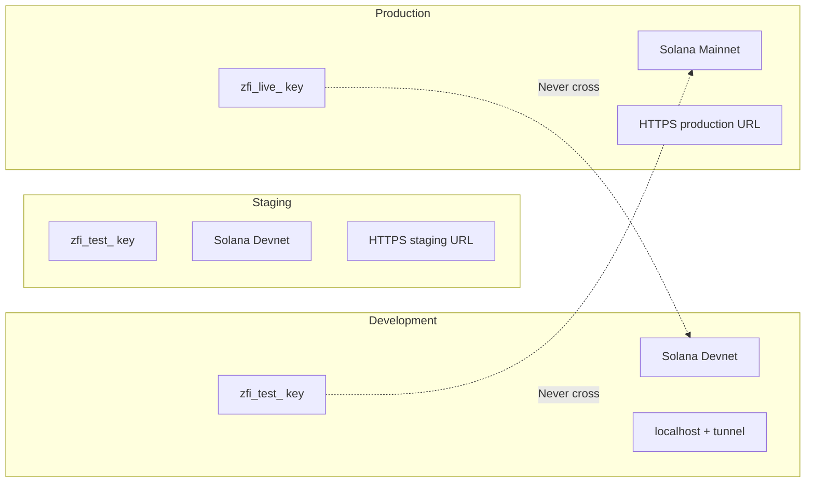

This page consolidates security best practices for running ZendFi in production. Use it as a checklist before your first live deployment and as a reference for ongoing security reviews.

## Production Readiness Checklist

### API Keys

- [ ] **Use live keys for production only.** Never use `zfi_test_` keys in production or `zfi_live_` keys in development.
- [ ] **Store keys in a secrets manager.** Use AWS Secrets Manager, Google Secret Manager, Azure Key Vault, or your platform's built-in secrets (Vercel, Railway, etc.).
- [ ] **Never commit keys to version control.** Add `.env` to `.gitignore`. Use GitHub's secret scanning to catch accidental commits.
- [ ] **Scope keys to minimum permissions.** If a service only reads payments, give it a `payments_read` key instead of `full_access`.
- [ ] **Rotate keys on a schedule.** Quarterly rotation is a reasonable baseline. Rotate immediately if compromise is suspected.
- [ ] **Use separate keys per environment.** Development, staging, and production should each have their own API key.

### Webhooks

- [ ] **Verify every signature.** Use the SDK webhook handlers which do this automatically. If building a custom handler, follow the [Webhook Security](/security/webhooks) guide.
- [ ] **Implement deduplication.** Track processed event IDs to prevent double-processing if a webhook is retried.
- [ ] **Use HTTPS endpoints.** Required for production webhook delivery.
- [ ] **Return 200 on receipt.** Acknowledge the webhook immediately, then process asynchronously if the operation is slow.
- [ ] **Set a webhook secret.** Configure `ZENDFI_WEBHOOK_SECRET` and do not reuse your API key as the webhook secret.

### Network

- [ ] **Enforce HTTPS everywhere.** Your API, webhook endpoints, and frontend should all use HTTPS.
- [ ] **Restrict CORS.** In Express or similar frameworks, limit CORS origins to your frontend domain:
  ```typescript
  app.use(cors({ origin: 'https://yourapp.com' }));
  ```
- [ ] **Set security headers.** Use Helmet.js or equivalent:
  ```typescript
  import helmet from 'helmet';
  app.use(helmet());
  ```

### Payments

- [ ] **Use idempotency keys.** For every payment creation request, include an `Idempotency-Key` header to prevent duplicate charges on network retries.
- [ ] **Validate amounts server-side.** Never trust amounts from the client. Calculate pricing on the server.
- [ ] **Use metadata for tracking.** Attach order IDs, user IDs, and other references to payments via the `metadata` field. This makes reconciliation straightforward.

### Application

- [ ] **Keep the SDK updated.** Run `npm update @zendfi/sdk` regularly to pick up security patches.
- [ ] **Handle all error types.** Implement error handling for `AuthenticationError`, `ValidationError`, `RateLimitError`, `PaymentError`, and `NetworkError`.
- [ ] **Log appropriately.** Log payment IDs, statuses, and error codes. Never log full API keys, webhook secrets, or customer PII in plaintext.
- [ ] **Implement rate limiting on your endpoints.** Even though ZendFi rate-limits API calls, you should also rate-limit your own customer-facing endpoints.

## Environment Isolation



Test and live modes are completely isolated. Data created with a test key is invisible to live keys and vice versa. This isolation is enforced at the platform level -- you cannot accidentally cross environments even if you misconfigure your application.

## Secrets Management Patterns

### Per-Environment .env Files

```bash
# .env.development
ZENDFI_API_KEY=zfi_test_dev_key
ZENDFI_WEBHOOK_SECRET=whsec_dev_secret

# .env.staging
ZENDFI_API_KEY=zfi_test_staging_key
ZENDFI_WEBHOOK_SECRET=whsec_staging_secret

# .env.production (should be set via deployment platform, not committed)
ZENDFI_API_KEY=zfi_live_prod_key
ZENDFI_WEBHOOK_SECRET=whsec_prod_secret
```

### Runtime Validation

Validate that required secrets exist at startup:

```typescript
function validateEnvironment() {
  const required = ['ZENDFI_API_KEY', 'ZENDFI_WEBHOOK_SECRET'];

  for (const key of required) {
    if (!process.env[key]) {
      throw new Error(`Missing required environment variable: ${key}`);
    }
  }

  // Warn if using test key in production
  if (
    process.env.NODE_ENV === 'production' &&
    process.env.ZENDFI_API_KEY?.startsWith('zfi_test_')
  ) {
    console.warn('WARNING: Using test API key in production environment');
  }
}

validateEnvironment();
```

## Error Handling Strategy

Never expose internal details in error responses to your customers:

```typescript
// Bad: leaks internal information
app.use((err, req, res, next) => {
  res.status(500).json({ error: err.message, stack: err.stack });
});

// Good: structured, safe error responses
app.use((err, req, res, next) => {
  console.error('Internal error:', err);

  if (err instanceof AuthenticationError) {
    return res.status(401).json({ error: 'unauthorized' });
  }

  if (err instanceof ValidationError) {
    return res.status(400).json({
      error: 'validation_error',
      message: err.message,
    });
  }

  // Generic fallback -- no internal details
  return res.status(500).json({ error: 'internal_error' });
});
```

## Monitoring

Track these metrics to detect security issues early:

| Metric | Alert Threshold | Indicates |
|---|---|---|
| Failed webhook verifications | > 0 | Possible spoofing attempt |
| 401 error rate | Spike above baseline | Key compromise or misconfiguration |
| 429 rate limit hits | > 50/hour | Abuse or integration bug |
| Payment failure rate | > 20% | Integration issue or attack |
| Unprocessed webhook events | Growing over time | Handler failure |

## Dependency Security

Keep your supply chain clean:

```bash
# Audit dependencies regularly
npm audit

# Use exact versions in production
npm install --save-exact @zendfi/sdk@latest

# Check for outdated packages
npm outdated
```

Consider using `npm audit signatures` to verify package provenance and tools like Socket or Snyk for continuous monitoring.

## Incident Response Plan

Have a plan ready before you need it:

1. **Detect:** Monitor error rates, failed verifications, and unusual API activity.
2. **Contain:** Rotate the compromised key immediately (`zendfi keys rotate <id>`).
3. **Assess:** Check the audit log for unauthorized actions.
4. **Remediate:** Update all services with the new key, patch the vulnerability.
5. **Review:** Conduct a post-incident review and update procedures.

Keep the ZendFi support team informed at security@zendfi.tech if you suspect a platform-level issue.
