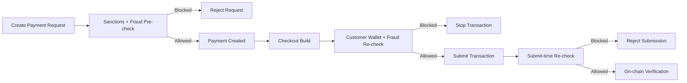

ZendFi runs layered fraud and compliance controls across payment creation, checkout, and submission. This page explains what users should expect, what can trigger additional review, and how to operate safely in production.

## What ZendFi Protects Against

ZendFi risk controls are designed to reduce:

- rapid payment abuse from a single wallet
- high-velocity traffic from a single IP
- unusual spend spikes over short windows
- suspicious first-time high-value wallet behavior
- payment flows involving sanctioned wallets at enforced checkpoints

<Note>
To keep detection effective, ZendFi does not publicly disclose all rule internals or exact production thresholds.
</Note>

## How Risk Evaluation Works

Fraud and sanctions checks happen in multiple stages:

### Stage 1: Payment creation

At creation time, ZendFi performs:

- sanctions screening on the **merchant wallet**
- blocked IP checks
- fraud pre-check scoring for the current create request

Possible outcomes:

- **Allow**: payment is created normally
- **Allow with review**: payment is created and marked `flagged_for_review`
- **Block**: request is rejected before payment creation

### Stage 2: Checkout transaction build

Before a transaction is built, ZendFi screens the **customer payer wallet** for sanctions and re-evaluates fraud risk. This prevents high-risk transactions from advancing to signature flow.

### Stage 3: Submission gates

During both standard and gasless submission, ZendFi applies a fraud-score gate and a submit-time fraud re-check to prevent stale-risk bypasses.

<Note>
Current implementation enforces sanctions checks at payment creation (merchant wallet) and transaction build (customer wallet). Submission-stage enforcement is fraud-based.
</Note>

## Risk Outcomes You May See

ZendFi can apply one of three actions:

| Outcome | What it means | Typical user experience |
|---|---|---|
| Allowed | Low risk | Checkout proceeds normally |
| Flagged for review | Elevated but non-blocking risk | Payment is created as `pending` with a review flag |
| Blocked | High risk or sanctions hit | Request or submission is rejected |

<Warning>
A blocked response does not always mean malicious intent. It can also be a protective false positive. Merchants should have an escalation path for legitimate customers.
</Warning>

## Sanctions Screening (OFAC)

ZendFi sanctions controls include:

- in-memory wallet screening for fast lookups
- daily background refresh from OFAC publication exports
- optional compliance-managed seed list at startup for baseline protection

### Recommended production policy

- Use a compliance-approved startup seed list for sanctioned Solana wallets.
- Keep daily refresh enabled.
- Enable strict startup mode once your approved seed list is operational.

Environment controls:

- `OFAC_SOL_SEED_LIST_JSON`: compliance-approved JSON list of sanctioned Solana addresses
- `OFAC_REQUIRE_SEED_LIST`: when `true`, startup fails if no valid seed list is loaded

## Merchant Best Practices

To reduce friction and false positives:

1. Use realistic payment amounts and avoid unusual one-off spikes.
2. Attach stable order metadata so support teams can investigate quickly.
3. Keep customer checkout flows consistent (wallet, session, and network behavior).
4. Retry responsibly with idempotency and clear UX when a payment is blocked.
5. Define an internal review process for high-value or first-time customers.

## Customer Messaging Guidance

When a payment is blocked or held for review, customer-facing copy should be clear and neutral:

- avoid accusatory language
- ask customer to retry or contact support
- provide a reference ID (payment ID) for faster resolution

Suggested support message:

> "Your payment needs additional review for security checks. Please contact support with your payment ID."

## Operational Checklist

- Monitor blocked and flagged payment rates.
- Track sanctions list refresh status and freshness.
- Review recurring blocked wallets and IPs for abuse patterns.
- Audit manual overrides and unblock actions.
- Re-tune thresholds using observed false-positive and fraud-loss rates.

## Need Help?

If your team needs help tuning fraud controls or compliance rollout, contact support with:

- payment IDs affected
- timestamps and environment (`test` or `live`)
- expected customer behavior vs observed outcome
- whether sanctions seed mode is enabled
