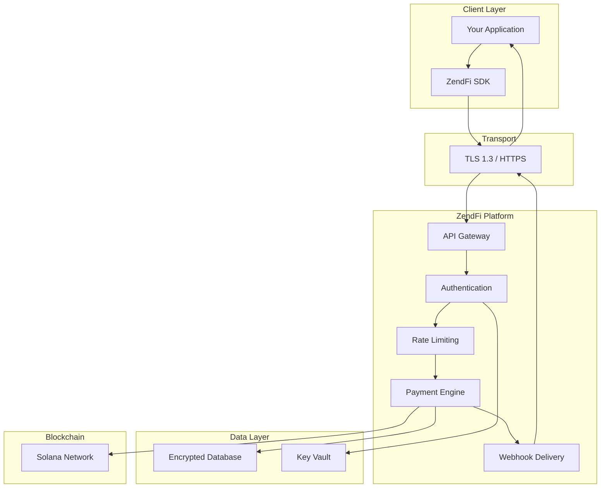

ZendFi is built with security at every layer -- from API key management and webhook verification to on-chain transaction validation and MPC wallet custody. This section covers the security architecture and your responsibilities as an integrator.

## Security Architecture

## Core Security Principles

### API Key Security

API keys are the primary authentication mechanism. ZendFi applies defense-in-depth:

- **Hashing:** Keys are hashed with SHA-256 for fast lookup, then verified with Argon2id for brute-force resistance. The raw key is never stored.
- **Mode isolation:** Test keys (`zfi_test_`) and live keys (`zfi_live_`) operate in completely separate environments. A test key cannot access production data or create real transactions.
- **Prefix identification:** The key prefix (`zfi_test_` or `zfi_live_`) tells you the mode at a glance without exposing the secret portion.
- **Rotation:** Keys can be rotated instantly through the API or CLI. The old key is invalidated immediately.

### Webhook Verification

Every webhook includes an HMAC-SHA256 signature in the `X-ZendFi-Signature` header. This guarantees:

1. **Authenticity** -- The event came from ZendFi, not a spoofed source.
2. **Integrity** -- The payload has not been tampered with in transit.
3. **Freshness** -- The timestamp prevents replay attacks.

### Transport Security

All communication with the ZendFi API is over HTTPS (TLS 1.3). The SDK and CLI enforce HTTPS and will reject plaintext connections.

### On-Chain Security

Payments are settled on Solana, which provides:

- **Immutability** -- Confirmed transactions cannot be reversed.
- **Transparency** -- Every transaction is publicly verifiable on the blockchain.
- **Gasless transactions** -- ZendFi sponsors gas fees so customers do not need SOL for token transfers.

## Threat Model

| Threat | Mitigation |
|---|---|
| API key theft | SHA-256 + Argon2 hashing, key rotation, mode isolation |
| Webhook spoofing | HMAC-SHA256 signature verification |
| Replay attacks | Timestamp validation, idempotency keys |
| Man-in-the-middle | TLS 1.3 enforced on all endpoints |
| Brute-force attacks | Rate limiting (100 req/min general, 10/min for key operations) |
| Duplicate payments | Idempotency keys with 24-hour window |
| Unauthorized access | Bearer token authentication on every request |

## Your Responsibilities

While ZendFi handles platform-level security, you are responsible for:

<CardGroup cols={2}>

<Card title="API Key Storage" icon="lock">
  Store keys in environment variables or a secrets manager. Never hardcode keys in source code or commit them to version control.
</Card>

<Card title="Webhook Verification" icon="shield-check">
  Always verify webhook signatures before processing events. The SDK handlers do this automatically.
</Card>

<Card title="HTTPS Endpoints" icon="lock">
  Ensure your webhook endpoint uses HTTPS. ZendFi will not deliver webhooks to plaintext HTTP URLs in production.
</Card>

<Card title="Access Control" icon="users">
  Implement proper authorization in your application. ZendFi authenticates the API request, but you must authorize user actions.
</Card>

</CardGroup>

## Security Sections

<CardGroup cols={2}>

<Card title="API Key Security" icon="key" href="/security/api-keys">
  Key lifecycle, storage best practices, rotation, and scoping.
</Card>

<Card title="Webhook Security" icon="webhook" href="/security/webhooks">
  Signature verification, replay prevention, and handler security.
</Card>

<Card title="Best Practices" icon="list-check" href="/security/best-practices">
  Production security checklist and operational guidelines.
</Card>

</CardGroup>
