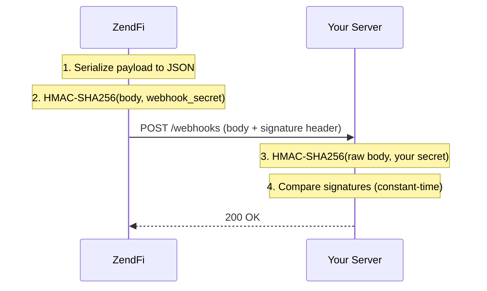

Webhook security ensures that the events your application receives genuinely come from ZendFi and have not been tampered with. Every webhook includes a cryptographic signature that you must verify before processing.

## Signature Verification

Each webhook request includes these headers:

| Header | Description |
|---|---|
| `X-ZendFi-Signature` | HMAC-SHA256 signature of the request body |
| `X-ZendFi-Event` | Event type (e.g., `payment.confirmed`) |

### How Signatures Work



The SDK handlers do all of this automatically. If you need to verify manually, here is the algorithm:

### Manual Verification

<Tabs>

<Tab title="Node.js">
```typescript
import crypto from 'crypto';

function verifyWebhookSignature(
  payload: string,
  signature: string,
  secret: string
): boolean {
  // Compute expected signature from the raw body
  const expected = crypto
    .createHmac('sha256', secret)
    .update(payload, 'utf8')
    .digest('hex');

  // Constant-time comparison to prevent timing attacks
  const sigBuffer = Buffer.from(signature, 'utf8');
  const expectedBuffer = Buffer.from(expected, 'utf8');

  if (sigBuffer.length !== expectedBuffer.length) {
    return false;
  }

  return crypto.timingSafeEqual(sigBuffer, expectedBuffer);
}
```
</Tab>

<Tab title="Python">
```python
import hmac
import hashlib

def verify_webhook_signature(
    payload: str,
    signature: str,
    secret: str
) -> bool:
    # Compute expected signature from the raw body
    expected = hmac.new(
        secret.encode('utf-8'),
        payload.encode('utf-8'),
        hashlib.sha256
    ).hexdigest()

    # Constant-time comparison
    return hmac.compare_digest(signature, expected)
```
</Tab>

</Tabs>

### Using the SDK

The SDK handles verification automatically in the webhook handlers:

```typescript
import { createNextWebhookHandler } from '@zendfi/sdk/nextjs';

export const POST = createNextWebhookHandler({
  secret: process.env.ZENDFI_WEBHOOK_SECRET!,
  // Signature is verified before any handler is called
  handlers: {
    'payment.confirmed': async (payment) => {
      // This only executes if the signature is valid
    },
  },
});
```

Or verify manually with the client:

```typescript
const isValid = zendfi.verifyWebhook(rawBody, signatureHeader, secret);
```

## Replay Prevention

An attacker could intercept a valid webhook and re-send it to your endpoint. Protect against this with two mechanisms:

### 1. Timestamp Validation

Check that the webhook timestamp is within an acceptable window (typically 5 minutes):

```typescript
const timestamp = parseInt(req.headers['x-zendfi-timestamp'] as string);
const now = Math.floor(Date.now() / 1000);
const tolerance = 300; // 5 minutes

if (Math.abs(now - timestamp) > tolerance) {
  return res.status(400).json({ error: 'Webhook timestamp too old' });
}
```

### 2. Idempotency / Deduplication

Track which events you have already processed and skip duplicates:

```typescript
// In-memory (good for single-instance servers)
const processedEvents = new Set<string>();

handlers: {
  'payment.confirmed': async (payment) => {
    if (processedEvents.has(payment.id)) {
      return; // Already processed
    }

    processedEvents.add(payment.id);

    // Process the event
    await fulfillOrder(payment.id);
  },
}
```

For multi-instance deployments, use a shared store:

```typescript
// Redis-based deduplication
import { createClient } from 'redis';

const redis = createClient();
const DEDUP_TTL = 86400; // 24 hours

handlers: {
  'payment.confirmed': async (payment) => {
    const key = `webhook:${payment.id}`;
    const already = await redis.set(key, '1', { NX: true, EX: DEDUP_TTL });

    if (!already) {
      return; // Already processed by another instance
    }

    await fulfillOrder(payment.id);
  },
}
```

## Webhook Secret Management

Your webhook secret (`whsec_...`) is used to verify signatures. Protect it with the same care as your API key:

- Store it in environment variables, not in code
- Do not commit it to version control
- Rotate it if you suspect it has been compromised

To rotate your webhook secret:

1. Generate a new secret in the ZendFi Dashboard
2. Update your application's `ZENDFI_WEBHOOK_SECRET` environment variable
3. Deploy the update
4. ZendFi starts signing with the new secret immediately

## Error Handling in Webhooks

Your webhook endpoint should always return a `200` status code to acknowledge receipt, even if processing fails. This prevents ZendFi from retrying the delivery unnecessarily.

```typescript
// Good: Return 200, handle errors internally
handlers: {
  'payment.confirmed': async (payment) => {
    try {
      await fulfillOrder(payment.id);
    } catch (error) {
      // Log the error for investigation
      console.error('Failed to fulfill order:', error);

      // Queue for retry in your own system
      await retryQueue.add({ paymentId: payment.id, error: error.message });

      // Still return 200 to ZendFi -- you are handling it
    }
  },
}
```

If your endpoint returns a non-2xx status, ZendFi retries with exponential backoff:

| Attempt | Delay |
|---|---|
| 1 | Immediate |
| 2 | 1 minute |
| 3 | 5 minutes |
| 4 | 30 minutes |
| 5 | 2 hours |
| 6 | 12 hours |
| 7+ | Dead letter queue |

After all retries are exhausted, the event moves to the dead letter queue where it can be manually replayed from the dashboard.

## HTTPS Requirement

<Warning>
ZendFi only delivers webhooks to HTTPS endpoints in production. Plaintext HTTP endpoints will not receive events. During local development, use the CLI webhook tunnel which provides HTTPS automatically:

```bash
zendfi webhooks --forward-to http://localhost:3000/api/webhooks/zendfi
```
</Warning>

## Verification Checklist

Before going to production, verify:

- [ ] Webhook secret is stored in environment variables
- [ ] Signature verification is enabled (automatic with SDK handlers)
- [ ] Timestamp tolerance is set (SDK default: 5 minutes)
- [ ] Event deduplication is implemented
- [ ] Endpoint returns `200` for all received webhooks
- [ ] Endpoint uses HTTPS
- [ ] Error handling does not leak sensitive information in responses
- [ ] Webhook events are logged for debugging and audit
